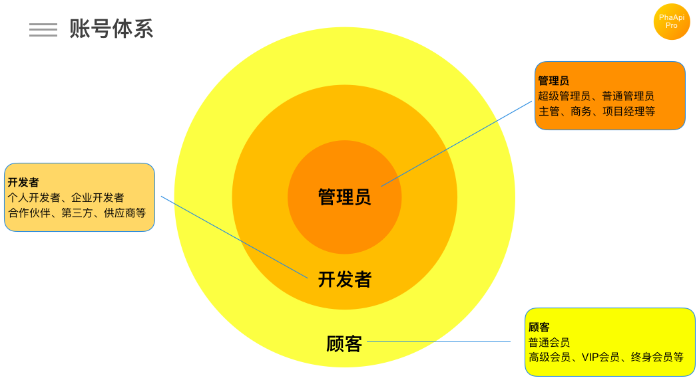
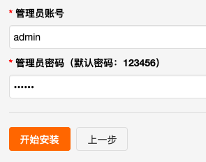

# 账号体系

PhalApi Pro 提供了全面的账号体系，以满足企业、开发者和最终顾客不同层级的账号需求。  

## 账号层级

账号层级，主要分为三大类，权限从高到低，分别是：  

 + **管理员**：内部管理员，默认分为普通管理员、超级管理员（最高权限），可以扩展更多管理员等级。
 + **开发者**：内部或外部开发者，例如个人开发者、企业开发者、合作伙伴、供应商、分销等，可以扩展更多开发者等级。
 + **顾客**：最终的顾客，例如普通会员、高级会员、VIP会员、终身会员等。  
 
   


## 账号体系汇总

下面表格，系统罗列了不同账号的区别、权限以及使用的产品。  

账号分类|账号等级(0~255)|权限|默认账号类型|使用产品|API接口|备注
---|---|---|---|---|---|---
管理员|200~255|高|200表示普通管理员，255表示超级管理员，201~254之间可自定义|Admin管理后台、Platform开放平台|可以使用```Admin.*.*```和```Platform.*.*```系列接口|适合内部人员使用
开发者|100~199|中|100表示个人开发者，101表示企业开发者，102~199之间可自定义|Platform开放平台|可以使用```Platform.*.*```系列接口|适合内部或外部开发者使用
顾客|0~99|低|0表示普通会员，1~99间可自定义|由开发者开发的应用|可以使用```App.*.*```系列开放接口|最终的顾客人群


默认情况下，权限从高到低，已提供以下账号类型：  
 + **管理员**：超级管理员(255)
 + **管理员**：普通管理员(200)
 + **开发者**：企业开发者(101)
 + **开发者**：个人开发者(100)
 + **顾客**：普通会员(0)
 
括号的数字表示账号等级，范围是0~255，权限越高等级越大，不可重复。  
 
## 管理员

管理员，是企业内部的管理员，是开放平台管理员，默认分为普通管理员、超级管理员（最高权限），可以扩展更多管理员等级。  
可以为内部的技术研发团队、信息部或职能部门创建管理员账号。

### 如何创建超级管理员账号？
在首次安装时会创建超级管理员账号。  
  

安装并登录管理后台，只有超级管理员账号才可以创建超级管理员账号，超级管理员拥有最高的操作权限。

### 如何创建普通管理员账号？
普通管理员，权限比超级管理员低，只有管理员的账号才能登录Admin管理后台。  

登录管理后台，可以创建普通管理员账号。  

### 如何创建其他管理员等级及账号？  

PhalApi Pro默认提供了普通管理员和超级管理员，如果需要添加其他更多管理员等级，可以修改```./config/app.php```配置文件的member_level_map配置，添加更多管理员等级。  

例如，添加一个新的等级，主管，等级为201。  
```php
        // 0,100,101,200,201为系统自带等级，不宜更改。可扩展追加
        'member_level_map' => array(
            // 200~255区间表示内部管理员
            200 => array(
                'name' => '普通管理员',
                'is_register' => false, // 是否允许注册
            ),
            
            // 例如：添加一个新的等级
            201 => array(
                'name' => '主管',
                'is_register' => false, // 是否允许注册
            ),
            
            255 => array(
                'name' => '超级管理员',
                'is_register' => false, // 是否允许注册
            ),
        ),
```

随后，进入管理后台创建账号，然后选择新的等级即可。  

## 开发者

开发者，可以是内部或外部开发者，默认提供了：个人开发者、企业开发者两个等级，可以根据需要配置合作伙伴、供应商、分销等更多开发者等级。  

### 如何注册开发者账号？
通过开放平台，可以进行开发者账号的注册。  

### 如何添加开发者账号？
通过管理后台，可以在后台添加开发者账号。  

## 顾客
顾客，是指最终的顾客，例如电商行业的消费者、交通行业的乘客、旅游行业的游客、教育行业的学员等，可以根据业务需要分为普通会员、高级会员、VIP会员、终身会员等。默认提供了普通会员，可自行扩展。如果不需要新的会员体系，或企业系统原来已经有顾客账号体系，可忽略此部分。  

### 如何注册会员账号？
通过开发者应用，或者内部提供的产品、客户端，调用API接口进行注册。  

### 如何添加会员账号？
也可以通过管理后台，在后台添加会员账号。  


