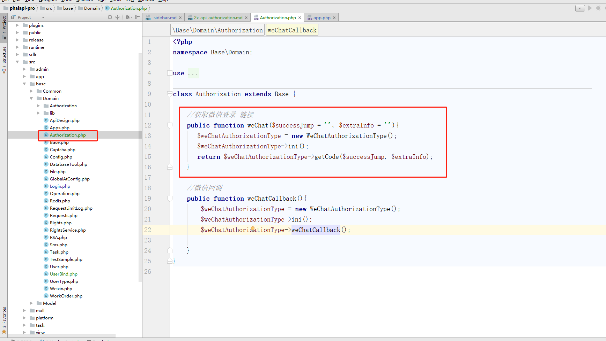
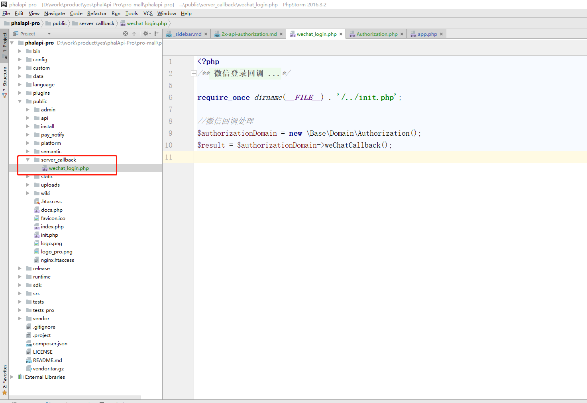
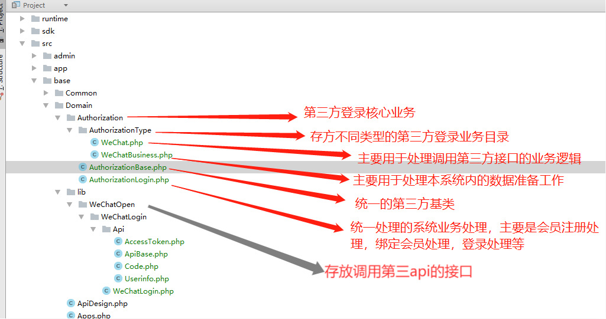
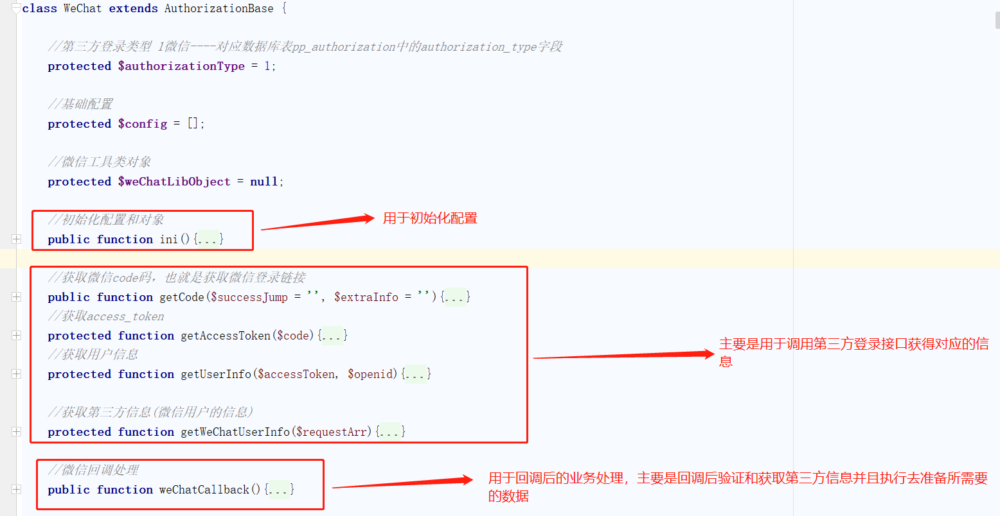
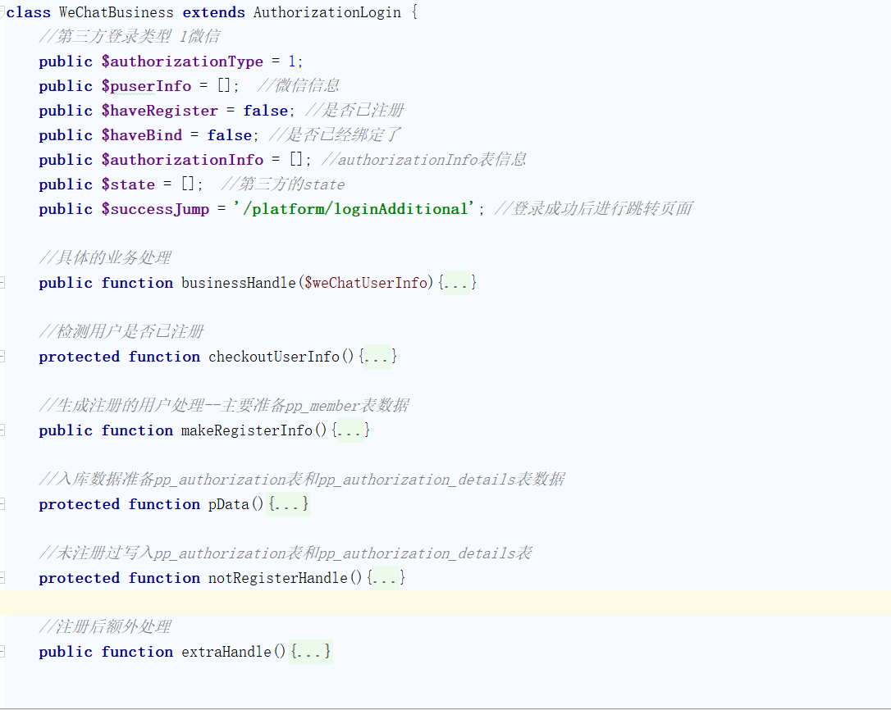
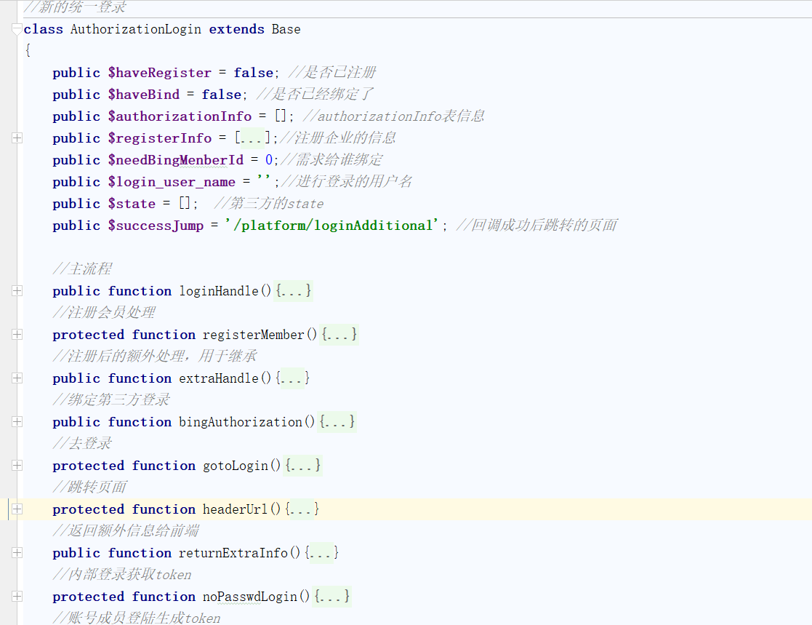

# 4.0 第三方登录接入流程
以下已做好的微信登录为例
## 第一步，配置微信第三方登录
修改 根目录的config/app.php文件，找到authorization_app填写需要接入的第三方登录：  
```php
              //第三方登录总开关
              'authorization_app'=>array(
                  //自己编写获取第三方登录链接对应的方法
                  'weChat'=>[
                      'icon' => '/images/login_wechat.png', // 第三方应用的图标
                      'app_callback_url'=>'\Base\Domain\Authorization',  //自己编写获取第三方微信登录链接的类---包含命名空间
                      'desc'=>'微信',  //第三方应用的描述
                      'sort_id'=>1,   //排序字段
                      'type'=>1,      //用于解绑的
                      'can_unbind'=>1,  //可以解绑的
                      'authorization_type'=>1,
          
                      'can_bing'=>1,  //可以在个人中心进行绑定
                      'can_bing_url_class'=>'\Base\Domain\Authorization',//自己编写获取第三方登录绑定链接的类--包含命名空间
                      'can_bing_url_fun'=>'weChat', //自己编写获取第三方登录绑定链接的类对应的方法
          
                      //以下根据自己申请得到的资料进行填写
                      'appid'=>'wx9b33877e791de406',  //appid
                      'secret'=>'04b99c4526076e6d8ffbc6a5e6619bd2',  //密钥
                      'login_redirect_uri'=>'http://www.yesdev.cn/server_callback/wechat_login.php', //登录回调地址配置
                  ],
              ),
```
### 下面是详细配置步骤：
一般第三方登录都涉及了几个配置：
注：每个配置合起来是上面的配置，为清晰，把每个配置单独分开，便于理解

#### 1、配置生成用于第三方登录的url的类和方法：
```php
                   //key是自己编写用于获取第三方登录链接对应的方法
                  'weChat'=>[
                      'app_callback_url'=>'\Base\Domain\Authorization',  //自己编写获取第三方登录链接的类---包含命名空间
              ),

```


#### 2、填写配置申请到第三方登录得到的资料：
```php
                   //key是自己编写用于获取第三方登录链接对应的方法
                  'weChat'=>[
                      //以下根据自己申请得到的资料进行填写
                     'icon' => '/images/login_wechat.png', // 第三方应用的图标
                     'desc'=>'微信',  //第三方应用的描述
                     'appid'=>'',  //appid
                     'secret'=>'',  //密钥
                     'login_redirect_uri'=>'http://*****', 
              ),
```

#### 3、填写用于个人中心进行绑定所生成的url的类和方法：
```php
                   //key是自己编写用于获取第三方登录链接对应的方法
                  'weChat'=>[
                       'can_bing'=>1,  //可以在个人中心进行绑定
                       'can_bing_url_class'=>'\Base\Domain\Authorization',//自己编写获取第三方登录绑定链接的类--包含命名空间
                       'can_bing_url_fun'=>'weChat', //自己编写获取第三方登录绑定链接的类对应的方法 
              ),
```

#### 4、其它配置：
```php
                   //key是自己编写用于获取第三方登录链接对应的方法
                  'weChat'=>[
                       'type'=>1,      //用于解绑的，值跟下面的authorization_type值一样
                       'authorization_type'=>1,//对应于pp_authorization表中的authorization_type类型
              ),
```

## 第二步，根据配置新建或者编写对应的文件类和方法

### 1、根据配置编写用于第三方登录的url的类和方法：
如：配置编写了
```php
                   //key是自己编写用于获取第三方登录链接对应的方法
                  'weChat'=>[
                      'app_callback_url'=>'\Base\Domain\Authorization',  //自己编写获取第三方登录链接的类---包含命名空间
              ),

```

那么需要在路径/Base/Domain/下新建Authorization.php文件及编写weChat方法：

  


### 2、根据配置编写用于个人中心进行绑定所生成的url的类和方法： 

如：配置编写了
```php
             'weChat'=>[
                          'can_bing'=>1,  //可以在个人中心进行绑定
                          'can_bing_url_class'=>'\Base\Domain\Authorization',//自己编写获取第三方登录绑定链接的类--包含命名空间
                          'can_bing_url_fun'=>'weChat', //自己编写获取第三方登录绑定链接的类对应的方法
                 ),
```

那么需要在路径Base/Domain/下新建Authorization.php文件及编写weChat方法：
 

### 3、根据配置编写用于回调地址及业务逻辑

如：配置编写了

```php
                   //key是自己编写用于获取第三方登录链接对应的方法
                  'weChat'=>[
                     'login_redirect_uri'=>'http://www.xxx.cn/server_callback/wechat_login.php', //登录回调地址配置
              ),
```
那么需新建/public/server_callback/wechat_login.php 进行回调业务逻辑编写



### 第四步，编写具体业务逻辑前，先进行第三方登录数据库分析

以下是涉及第三方登录的三张表数据结构：

```SQL
CREATE TABLE `pp_authorization` (
  `id` int(11) NOT NULL AUTO_INCREMENT,
  `openid` varchar(10000) NOT NULL DEFAULT '0' COMMENT '第三方平台对应用户的唯一id',
  `unionid` varchar(1000) NOT NULL DEFAULT '0' COMMENT '微信开放平台对应的unionidid',
  `authorization_type` int(11) NOT NULL DEFAULT '0' COMMENT '第三登录类型：0无 1微信 2微信小程序 3qq 4是短信 5程序员客栈 等等',
  `member_id` int(11) NOT NULL DEFAULT '0' COMMENT '版本的用户id',
  `add_time` datetime DEFAULT NULL,
  PRIMARY KEY (`id`)
) ENGINE=InnoDB AUTO_INCREMENT=357 DEFAULT CHARSET=utf8mb4 COMMENT='第三方授权表';

CREATE TABLE `pp_authorization_details` (
  `id` int(11) NOT NULL AUTO_INCREMENT,
  `nickname` varchar(255) NOT NULL DEFAULT '' COMMENT '昵称',
  `sex` tinyint(2) unsigned NOT NULL DEFAULT '0' COMMENT '性别：1未知 2男 3女',
  `headimgurl` varchar(10000) NOT NULL DEFAULT '' COMMENT '用户头像url',
  `province` varchar(255) NOT NULL DEFAULT '' COMMENT '省',
  `city` varchar(255) NOT NULL DEFAULT '' COMMENT '城市',
  `country` varchar(255) NOT NULL DEFAULT '' COMMENT '国家',
  `privilege` varchar(1000) NOT NULL DEFAULT '' COMMENT '用户特权信息',
  `add_time` datetime DEFAULT NULL,
  `authorization_id` int(11) NOT NULL DEFAULT '0' COMMENT '关联第三方表',
  PRIMARY KEY (`id`)
) ENGINE=InnoDB AUTO_INCREMENT=355 DEFAULT CHARSET=utf8mb4 COMMENT='授权详情表';

CREATE TABLE `pp_member` (
  `id` bigint(20) unsigned NOT NULL AUTO_INCREMENT,
  `username` varchar(50) NOT NULL COMMENT '账号',
  `salt` varchar(64) NOT NULL COMMENT '盐值',
  `password` varchar(64) DEFAULT NULL COMMENT '密码',
  `register_time` datetime DEFAULT NULL COMMENT '注册时间',
  `avatar` varchar(500) DEFAULT '' COMMENT '头像',
  `nickname` varchar(100) DEFAULT '' COMMENT '昵称',
  `email` varchar(100) DEFAULT '' COMMENT '邮箱',
  `sex` varchar(10) DEFAULT '' COMMENT '性别，0未知1男2女',
  `mobile` varchar(20) DEFAULT '' COMMENT '手机号',
  `ip` varchar(30) DEFAULT '' COMMENT '注册IP',
  `uuid` varchar(64) DEFAULT '' COMMENT 'UUID，全局唯一ID',
  `member_level` smallint(4) NOT NULL DEFAULT '0' COMMENT '用户等级(0~99区间表示用户,100~199区间表示开发者, 200~255区间表示内部管理员)',
  `member_status` tinyint(4) NOT NULL DEFAULT '1' COMMENT '用户状态(0表示禁止,1表示正常)',
  `wx_openid` text COMMENT '微信openid  ',
  `wx_type` tinyint(1) unsigned NOT NULL DEFAULT '0' COMMENT '0微信公众号 1是微信小程序',
  `balance` decimal(10,2) NOT NULL DEFAULT '0.00' COMMENT '余额',
  `from_channel` varchar(100) NOT NULL DEFAULT '' COMMENT '来源',
  PRIMARY KEY (`id`),
  UNIQUE KEY `username` (`username`) USING BTREE
) ENGINE=InnoDB AUTO_INCREMENT=50 DEFAULT CHARSET=utf8mb4 COMMENT='用户表';


```
第三方登录主要业务逻辑是：
  首次进行登录把第三方信息写入pp_authorization表和pp_authorization_details表
  
  个人绑定主要是pp_authorization表中的字段member_id对应pp_member的id

## 第三步，本框架的第三方登录业务编写规范
如有更成熟的编写规范可以自行编写，可以不往下看，只要配置正确就可以。

下面提供本框架的接入的三方登录规范

### 1、本框架第三方登录核心目录结构介绍

 核心目录结构路径在/src/base路径下的Authorization目录和lib目录
 
 


### 2、WeChat.php 代码分析



### 3、WeChatBusiness.php 代码分析


### 4、WeChatBusiness.php 代码分析
主要是准备数据，如何首次登录写入


### 4、AuthorizationLogin.php 代码分析
主要是进行成员注册或绑定登逻辑


### 5、借鉴并进行开发
  到这里就可以借鉴想应的写法进行开发了
  
  