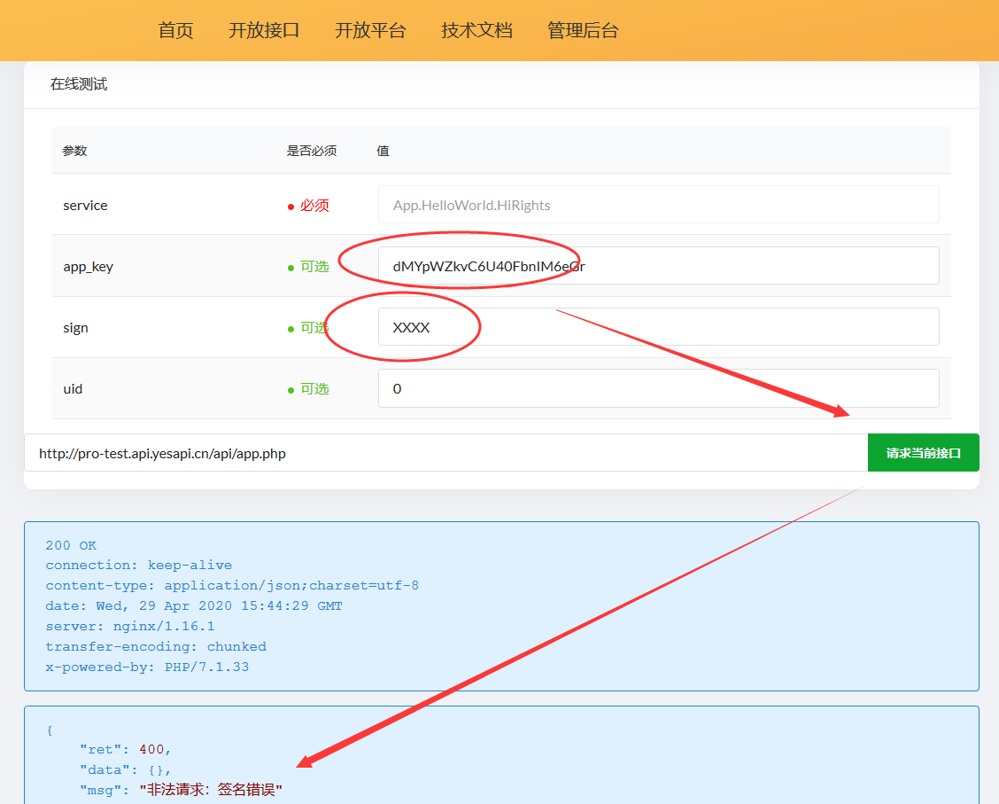

# 第二套接口验签方案

以下是第二套接口签名算法的介绍，如果项目不适合使用第一套access_token的验证方式，或者有其他需要可选择第二套接口验签方案。 

## 动态签名方案介绍

access_token的验证方式，是客户端先凭借明文的app_key和app_secret密钥，申请获得access_token的验证方式，然后就可以使用分配的access_token令牌调用其他接口。  

其缺点在于第一次授权时容易泄露app_key和app_secret密钥，并且access_token泄露后容易被第三方使用。此方案不适合客户端使用，因此容易造成被抓包。但好处在于，调用方只需要申请一次令牌，就可以方便调用其他接口。  

而动态签名方案，则是每一次调用接口，都要根据既定的加密方案进行签名的验证。一旦任何一个参数发生变化，那么就需要重新生成接口签名。这意味着，客户端在服务端进行接口通信时安全性相对更高。缺点是：客户端每次都要按算法生成签名，提高了API接入成本，同时相同的接口链接参数是一样的，可以对相同的接口链接重复调用。此时可以在服务端进行业务层的限制，例如每个用户每天只能投5票，或者追加当前时间戳的误差核对。  

小结一下，动态签名方案特点： 
 + 每次都要根据参数生成动态签名
 + 不需要对外暴露app_secret密钥  

## 如何开启第二套接口验签方案

注意，PhalApi Pro 专业版，默认提供的是access_token令牌验签方案。这套方案已经被Platform开放平台和Admin管理后台使用，因此默认的第一套接口验签方案不能被关掉。  

> 注意：需要保留第一套access_token令牌验签方案。  

在保留原来默认第一套接口验签方案的同时，你可以开启第二套接口验签方案。并且，第二套接口验签方案，仅适合用于对外提供的开放接口，包括App命名空间下的全部接口，以及自定义添加的新的接口命名空间，但不包括Admin、Platform。  

下面将来介绍如何开启第二套接口验签方案。  

## 第1步：切换filter服务
打开 ./public/api/app.php这个入口文件，添加以下新代码，目的是为了重新注册fitler服务。  
```php
require_once dirname(__FILE__) . '/../init.php';

// 如果你需要使用第二套加密算法，请开启以下服务
$di->filter = new \App\Common\SignFilter();
```

这样，就可以针对./public/api/app.php这个入口的接口，对应App接口命名空间和自定义的接口命名空间的接口，切换到第二套接口验签方案。  

## 第2步：配置默认接口参数
打开./config/app.php配置文件，将原来的：
```php
    /**
     * 应用接口层的统一参数
     */
    'apiCommonRules' => array(
        'accessToken' => array('name' => 'access_token', 'default' => '', 'desc' => '访问令牌，仅当开启签名验证时需要传递，生成令牌可使用App.Auth.ApplyToken接口'),

        /** ----- 如果你需要使用第二套加密算法，请开启以下参数规则 ----- **/

        // 'app_key' => array('name' => 'app_key', 'default' => '', 'desc' => 'app_key，用于区分客户端应用，首次接入需要创建应用并等待管理员审核通过'),
        // 'sign' => array('name' => 'sign', 'desc' => '动态签名，签名算法是：<br/><ul><li>1、全部参数（排除sign），按key进行字典排序</li><li>2、全部参数值，把原始值按字符串进行拼接，并在最后加上app_secret密钥</li><li>3、对第2步结果，拼接密钥后，进行MD5加密</li><li>4、对第3步结果，转成大写，得到sign签名</li></ul>'),
        // 'uid' => array('name' => 'uid', 'type' => 'int', 'default' => 0, 'desc' => ''),
        // 'accessToken' => array('name' => 'access_token', 'default' => '', 'desc' => '访问令牌，保留使用但不需要在文档上展示', 'is_doc_hide' => true),
     ),
```
改成：
```php
    /**
     * 应用接口层的统一参数
     */
    'apiCommonRules' => array(
        // 'accessToken' => array('name' => 'access_token', 'default' => '', 'desc' => '访问令牌，仅当开启签名验证时需要传递，生成令牌可使用App.Auth.ApplyToken接口'),

        /** ----- 如果你需要使用第二套加密算法，请开启以下参数规则 ----- **/

        'app_key' => array('name' => 'app_key', 'default' => '', 'desc' => 'app_key，用于区分客户端应用，首次接入需要创建应用并等待管理员审核通过'),
        'sign' => array('name' => 'sign', 'desc' => '动态签名，签名算法是：<br/><ul><li>1、全部参数（排除sign），按key进行字典排序</li><li>2、全部参数值，把原始值按字符串进行拼接，并在最后加上app_secret密钥</li><li>3、对第2步结果，拼接密钥后，进行MD5加密</li><li>4、对第3步结果，转成大写，得到sign签名</li></ul>'),
        'uid' => array('name' => 'uid', 'type' => 'int', 'default' => 0, 'desc' => ''),
        'accessToken' => array('name' => 'access_token', 'default' => '', 'desc' => '访问令牌，保留使用但不需要在文档上展示', 'is_doc_hide' => true),
     ),
```

注意，原来的access_token参数还是保留，但进行了隐藏，避免在线文档上显示出来，误导开发者。  

保存后，刷新在线接口文档，可以看到以下3个新增加的公共接口参数。  

  

> 温馨提示：熟悉后，你可根据项目的需要调整公共参数的规则，例如是否必须。  

## 第3步：测试调用接口

完成上面两步，就可以实现第二套接口验签方案的开启了。  

接下来，你可以进行接口的测试，验证新的加密方案是否已生效。  

例如，故意填写错误的签名sign参数。  
  

会如期得到“签名错误”的返回结果。  

```
{
    "ret": 400,
    "data": {},
    "msg": "非法请求：签名错误"
}
```

## 如何查看正确的sign签名？
你可以通过查看日志来查看正确的签名是什么。  

查看当天的运行日记，例如： 
```bash
$ tailf ./runtime/log/202004/20200429.log 

2020-04-29 23:44:29');|{"request":{"service":"App.HelloWorld.HiRights","need_sign":"dMYpWZkvC6U40FbnIM6eGr","sign":"XXXX","uid":"0"}}
```
从上面日志可以看到需要的正确签名应该是：```dMYpWZkvC6U40FbnIM6eGr```，但客户端实际提供的签名是：```XXXX```。  

## 如何临时去掉签名验证？  

在调试模式下，可以去掉签名验证，并且可以通过app_key和uid参数手动设置当前的应用和顾客ID。  

## 动态签名算法及示例

以下是动态签名的算法，也是一种很主流很流行的签名方式。  

动态签名，签名算法是：

 + 1、全部参数（排除sign），按key进行字典排序
 + 2、全部参数值，把原始值按字符串进行拼接，并在最后加上app_secret密钥
 + 3、对第2步结果，拼接密钥后，进行MD5加密
 + 4、对第3步结果，转成大写，得到sign签名

以下是一个示例。  

假设app_key是dMYpWZkvC6U40FbnIM6eGr，同时app_secret密钥是Eb8LgJGSA2juKjmND6R3XuHdqe3n5xEEjPx。  

待请求的API接口链接是：  
```
http://你的域名/api/app.php?service=App.HelloWorld.HiApp&app_key=dMYpWZkvC6U40FbnIM6eGr&uid=1
```

那么：  


 + 1、全部参数（排除sign），按key进行字典排序
 得到：
```
app_key=dMYpWZkvC6U40FbnIM6eGr
service=App.HelloWorld.HiApp
uid=1
```
 + 2、全部参数值，把原始值按字符串进行拼接
 得到：
```
dMYpWZkvC6U40FbnIM6eGrApp.HelloWorld.HiApp1Eb8LgJGSA2juKjmND6R3XuHdqe3n5xEEjPx
```
 + 3、对第2步结果，拼接密钥后，进行MD5加密
 得到：
```
175113721BD679F455D15F96CB2CDCA0
```

 + 4、对第3步结果，转成大写，得到sign签名（32位大写）
 得到：  
```
175113721BD679F455D15F96CB2CDCA0
```

最后，得到sign=175113721BD679F455D15F96CB2CDCA0，从而得到完整的接口请求链接是：  
```
http://你的域名/api/app.php?service=App.HelloWorld.HiApp&app_key=dMYpWZkvC6U40FbnIM6eGr&uid=1&sign=175113721BD679F455D15F96CB2CDCA0
```

请求后，得到结果（接口签名通过）：  
```
{
    "ret": 200,
    "data": {
        "content": "Hello app: dMYpWZkvC6U40FbnIM6eGr"
    },
    "msg": ""
}
```
