# 基础配置部署

## 一、环境准备

安装步骤：

 + 1、准备一台centos7服务器
 + 2、安装docker
 + 3、安装docker-compose


<a href="./file/yesapi_project.tar.gz" target="_blank">docker配置文件下载</a>


## 二、部署教程

把收到的 yesapi_project.tar.gz（参考）放到要部署服务器的根路径

  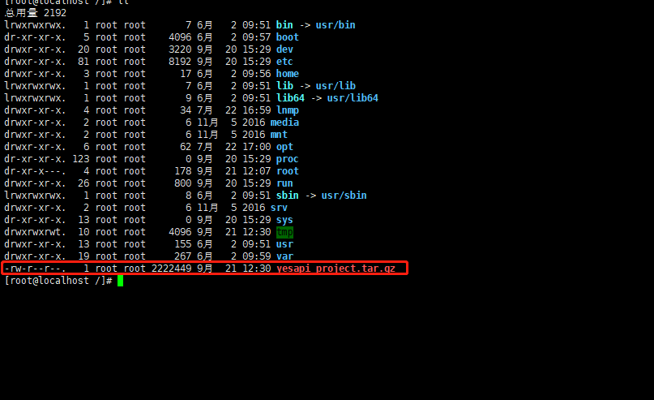

并解压生成yesapi_project目录,

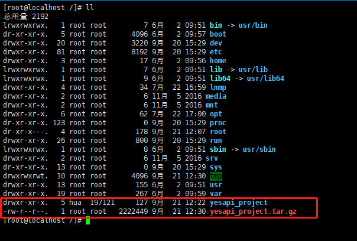
把收到的yesapi源码项目放到目录yesapi_project/yesapi_lnmp/project/目录下，解压后的文件夹需要名为phalapi-pro

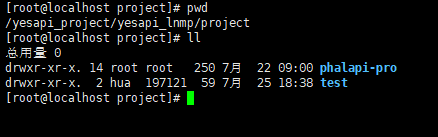
把项目里的config文件夹复制到yesapi_project/yesapi_lnmp/projectData目录下

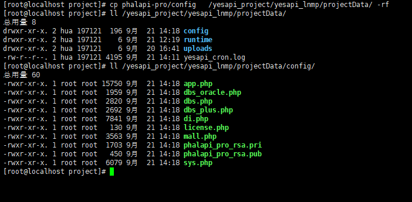

给需要映射的数据目录权限

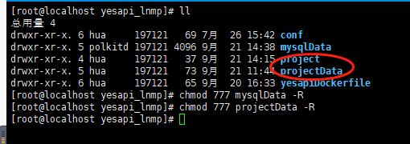

## 三、进行部署操作

进入到执行安装命令

```bash
# docker-compose up -d
```

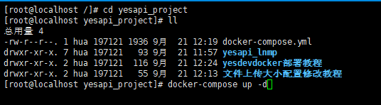

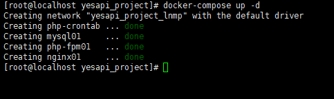

查容器启动结果
```bash
# docker ps -a
```

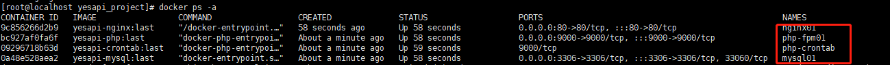

## 四、环境验证
验证lnmp环境是否正常

### 验证nginx环境

访问：<http://ip/test/index.html>

这里以ip192.168.92.131为示例：

<http://192.168.92.131/test/index.html>

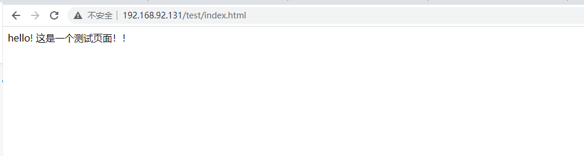

### 验证php环境

访问：[http://ip/test/index.php](http://ip/test/index.html)

这里以ip192.168.92.131为示例：

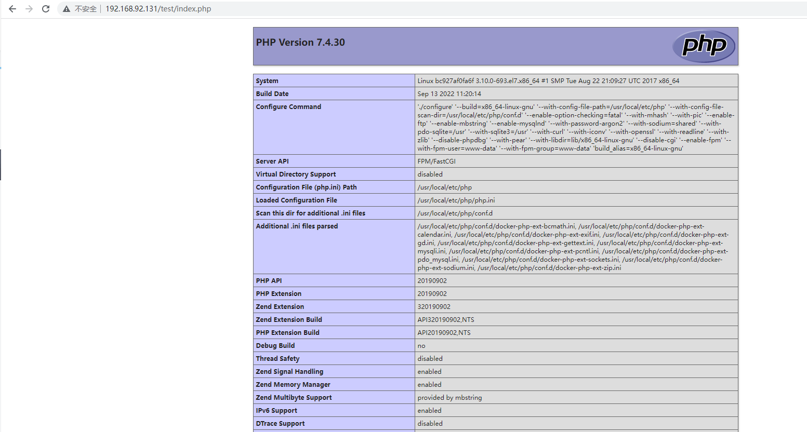
### 验证mysql环境

访问：[http://ip/test/dbtest.php](http://ip/test/index.html)

这里以ip192.168.92.131为示例：

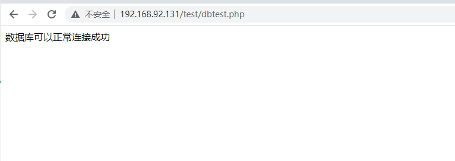

环境安装成功后，可参考【安装】文档继续进行接口大师的首次安装。
