# 接口大师私有部署

## 环境准备
部署准备：

安装步骤：

1、准备一台centos7服务器
2、按要求正常启动了相关需要使用的环境容器

### 部署教程

一、完成 上一章节的所有步骤

二、nginx配置域名及项目项目路径

（一）、配置域名及项目相关目录

### 1.在 /yesapi_lnmp/conf/nginx/conf.d/ 下新建配置文件：

例如：配置的域名为openapi.conf

新建配置文件：openapi.conf

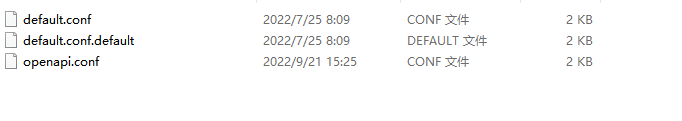

修改配置文件内容：

分别为指定配置域名，指定项目根目录：
注：如果是自己更改的php的容器，下图的php-fpm01需要更改为自己设置的php容器名

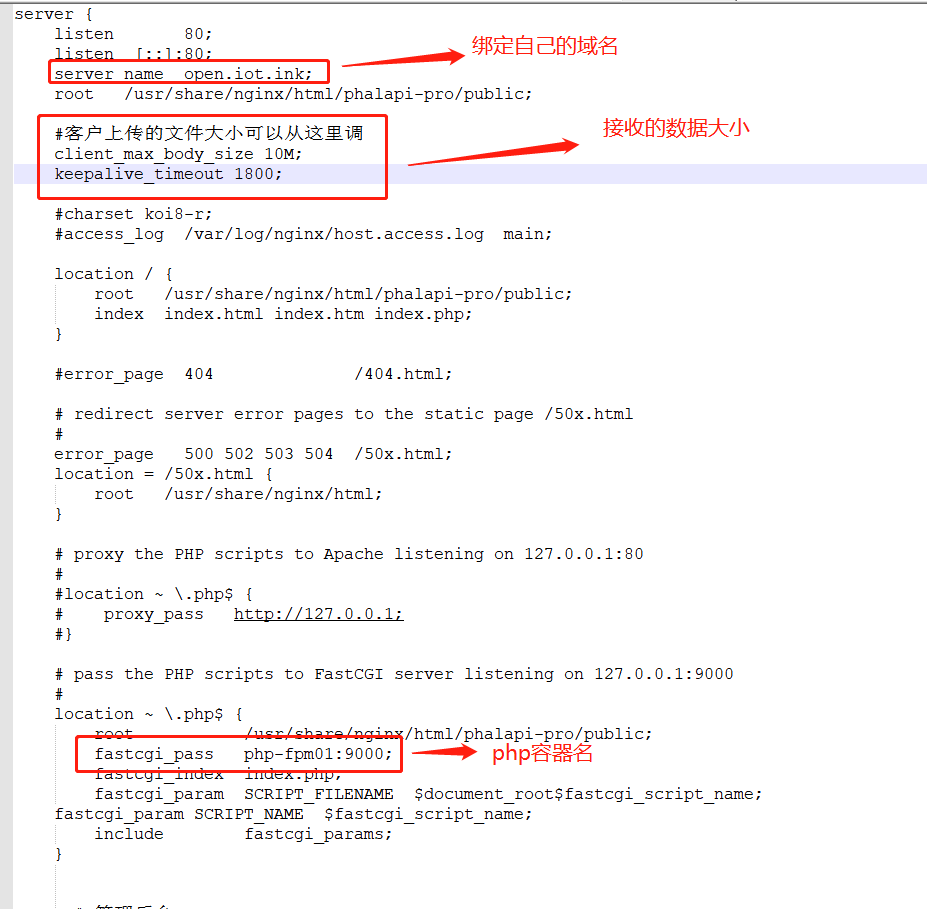
### 2.nginx配置文件相关更新需求重启运行容器，因为是打到镜像里面的

需求先给文件项目目录和数据库保存目标777权限


先删除相关容器服务

```bash
# docker-compose down
```

进到目录里重新编译安装docker相关容器内服务
```bash
# cd yesapi_project
# docker-compose up -d --build
```


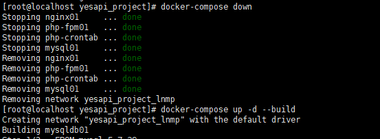

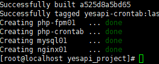


## 访问项目并且安装


1.  访问首页

    例如：http://open.iot.ink/

    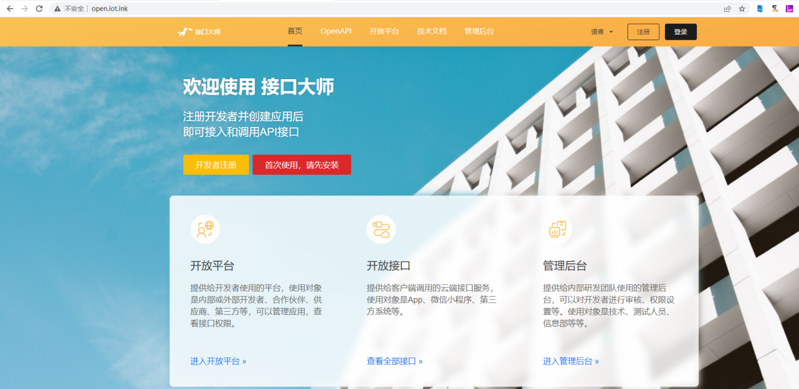

2.  点击首次使用，请先安装，然后按步骤填写-----注意mysql服务器填写的是容器名

    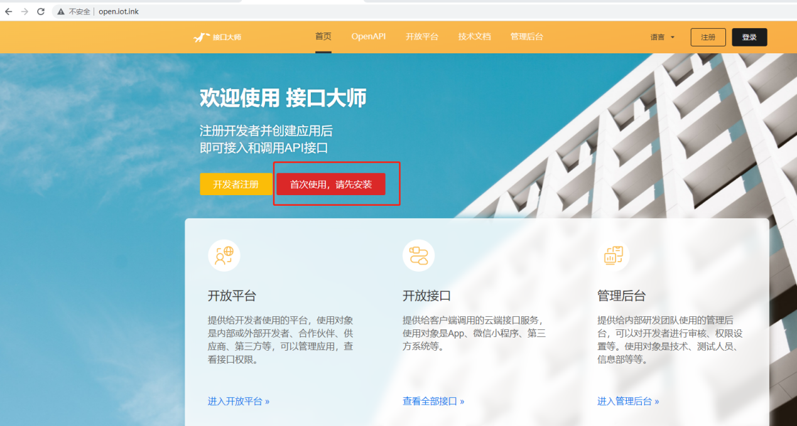

    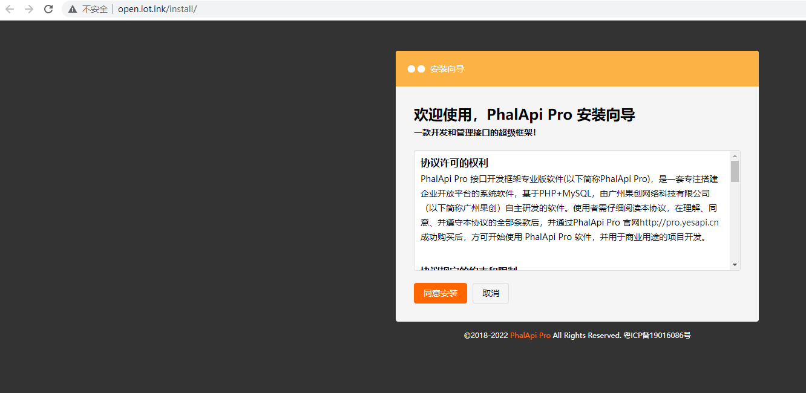

    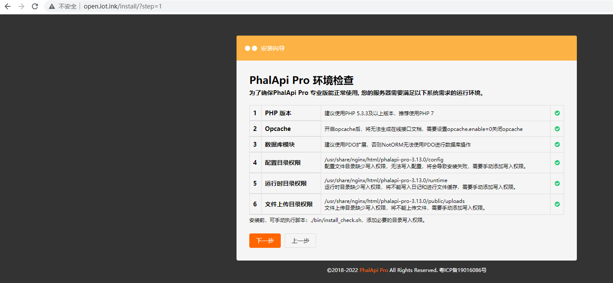

    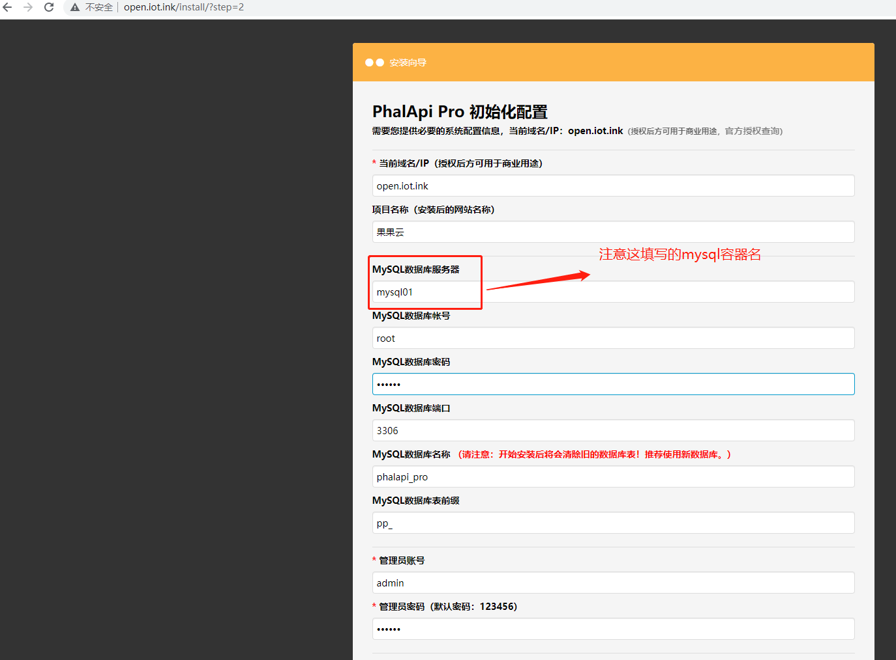

    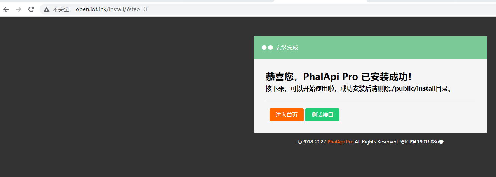

2.  、安装完成后进入首页，然后点击管理后台

    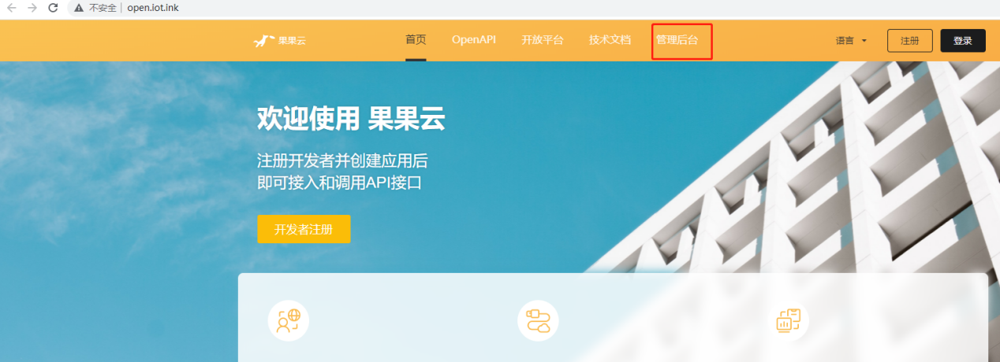

    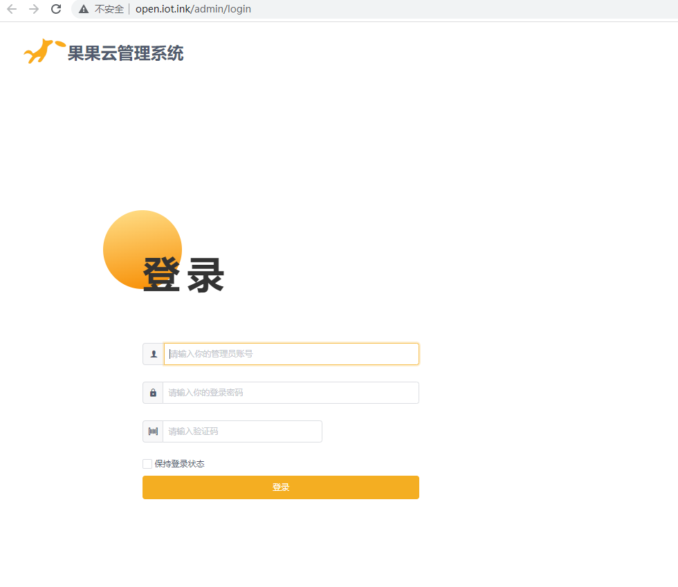
