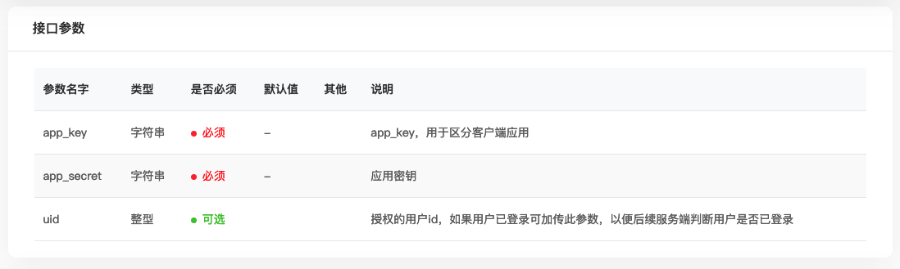
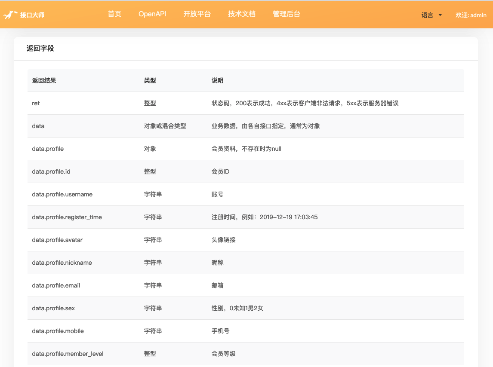
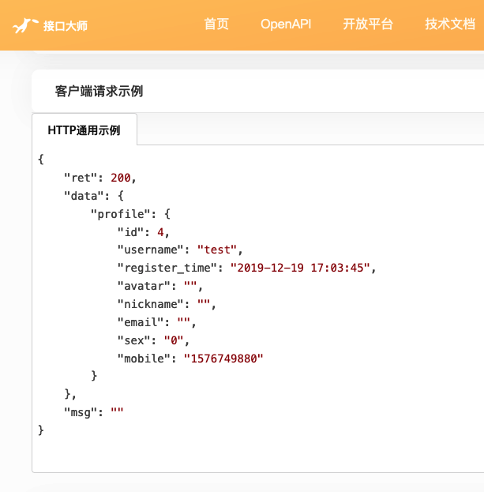

# 如何调用接口

以下将通过简明的方式，介绍客户端如何调用接口。 

## API入口
假设您的域名是：http://open.phalapi.net，则：  

 + App开放接口API入口：http://open.phalapi.net/api/app.php 
 + Platform开放平台接口API入口：http://open.phalapi.net/api/app.php 
 + Admin管理后台接口API入口：http://open.phalapi.net/api/admin.php
 + Task计划任务接口API入口：http://open.phalapi.net/api/admin.php

首先，不同系列的接口，必须要找到对应的API入口。因为不同的入口处理的方式、权限判断和场景都不相同，并且方便分别进行个性化控制而不相互影响。  

## 请求方式

通过HTTP/HTTPS协议，便可以请求接口。  

例如对于默认的接口服务：http://open.phalapi.net/api/app.php?s=App.HelloWorld.Say，直接用浏览器打开访问，可以得到结果：  
```
{
  "ret": 200,
  "data": {
    "content": "Hello PhalApi Pro!"
  },
  "msg": ""
}
``` 

如果通过CURL方式请求，则结果为：  
```
$ curl http://open.phalapi.net/api/app.php\?s\=App.HelloWorld.Say
{"ret":200,"data":{"content":"Hello PhalApi Pro!"},"msg":""}
```

通常情况下，可以使用GET或POST方式请求接口，但推荐使用POST方式请求接口。原因有几点： 
 + 1、GET方式容易存在编码问题导致参数解析失败，但POST方式不会；
 + 2、GET参数有最大长度限制，当GET参数过长过大时会提示错误，但POST方式不会；
 + 3、GET方式容易被抓包或在服务器存在日志，容易导致密码等敏感信息泄露，POST方式相对安全。

## 指定接口

和PhalApi开源版一样，通过```s```参数（完整参数名是```service```，两者等效），可以指定调用哪一个接口服务。  

关于全部的接口，可以通过在线接口文档查看。当未指定接口时，默认接口服务是```App.Site.Index```。  

例如：  
```
# 请求默认接口
http://open.phalapi.net/api/app.php

# 请求会员注册接口
http://open.phalapi.net/api/app.php?s=App.User.Register

# 请求获取文件列表接口（需要切换到后台API入口）
http://open.phalapi.net/api/admin.php?s=Admin.File.GetList
```

需要注意的是，不同接口的访问入口不同，需要注意区分。

## 请求参数

如你所见，s或service参数用于指定接口服务。除此之外，公共的接口参数目前有：  

 + access_token：token令牌，用于接口验证，后面会继续讲解。

每个接口的参数，可以通过接口文档查看，例如：  


如无特殊说明，接口参数均可使用GET或POST。  

## 返回结构

如前文所述，以及遵循PhalApi开源版的格式，接口返回的是JSON格式。例如：  
```
{"ret":200,"data":{"title":"Hello PhalApi Pro","version":"1.0","time":1577697960},"msg":""}
```
格式后是：  
```
{
    "ret": 200,
    "data": {
        "title": "Hello PhalApi Pro",
        "version": "1.0",
        "time": 1577697960
    },
    "msg": ""
}
```

全部接口，返回的接口结果结构分为三部分：  

 + ret：状态码，整型，200表示成功，4xx表示客户端非法请求，5xx表示服务器错误
 + data：成功时返回的业务数据，通常为对象类型，具体由接口服务而定
 + msg：失败时的错误提示信息，字符类型

具体每个接口返回的结果，可以访问接口文档，查看指定接口服务文档的**返回结果**说明。例如：  


也可以查看接口返回示例：  



## 验证方式

PhalApi专业版使用的是access_token令牌验证的方式，在开始使用接口时，需要先申请令牌。申请令牌有两种方式：  

 + 方式一：通过应用来申请令牌：根据开发者应用的app_key和app_secret申请access_token令牌
 + 方式二：通过会员来申请令牌：结合已获得的应用access_token令牌，根据会员账号和密码进行登录并获取新的access_token令牌
  

## 获取令牌

### 方式一：通过应用来申请令牌

这种方式，要求：  

 + 应用存在：首先需要创建应用，并且审核通过
 + 密钥正确：应用app_key和app_secret正确
 + 正常状态：应用处于正常状态（若为禁用则不可用）
 + 接口权限：应用在调用指定接口时需要拥有相应接口的权限

需要使用的接口是：```App.Auth.ApplyToken```。  

### 方式二：通过会员登录来申请令牌

方式二，要求：  

 + 注册账号：已经有注册的会员账号
 + 密码正确：会员账号和密码正确
 + 正常状态：会员处于正常状态（若为禁用则不可登录）
 + 指定应用：通过方式一获得有有效令牌

需要使用的接口是：```App.User.UserLogin```。  

通过access_token参数传递成功申请到的令牌，若令牌过期或无效，接口将会返回ret=406，例如：  
```
{
    "ret": 406,
    "data": {},
    "msg": "非法请求：access_token校验不通过"
}
```
若令牌有效，则可以正常请求接口。  

## 刷新令牌

令牌过期时间默认为30天，可以通过./config/app.php配置文件的jwt里的exp来自行修改，如设置为7天：  
```
/**
 * JWT令牌
 */
'jwt' => array(
        'key' => '1j7zo53mnsLK', // 用于加密的key（安装时自动生成，不能修改！）
        'exp' => 7 * 86400, // 令牌生成后多少秒内有效，可自行修改
),
```
在令牌过期前，可以通过```App.Auth.RefreshAccessToken```接口刷新令牌，从而延长有效期。刷新后有效期会重新延长到jwt里面exp指定的时间。  

## 开放平台与管理后台的身份校验

对于内部，可以通过登录开发者账号，或者通过登录管理员账号来获得令牌。此时使用的接口是```Platform.User.UserLogin```。


