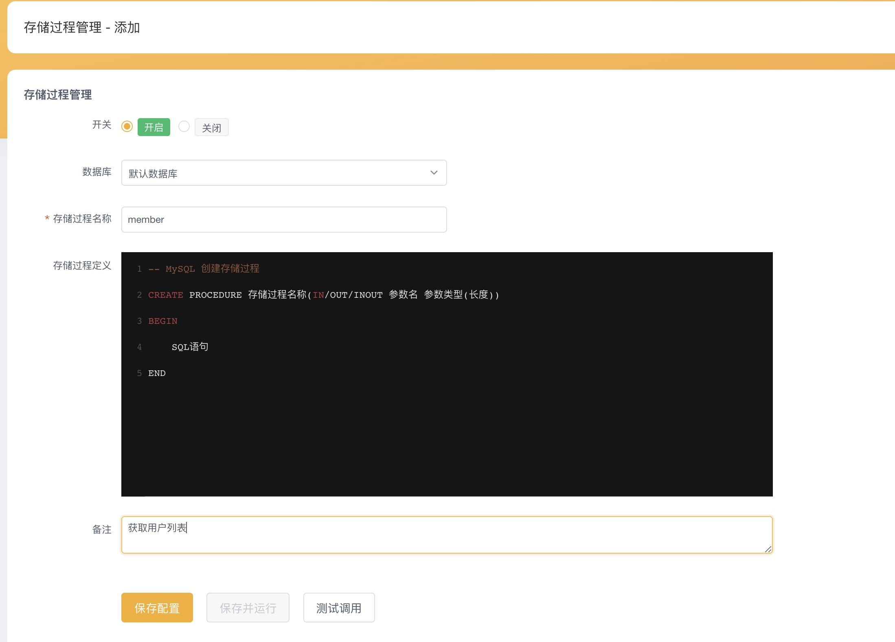
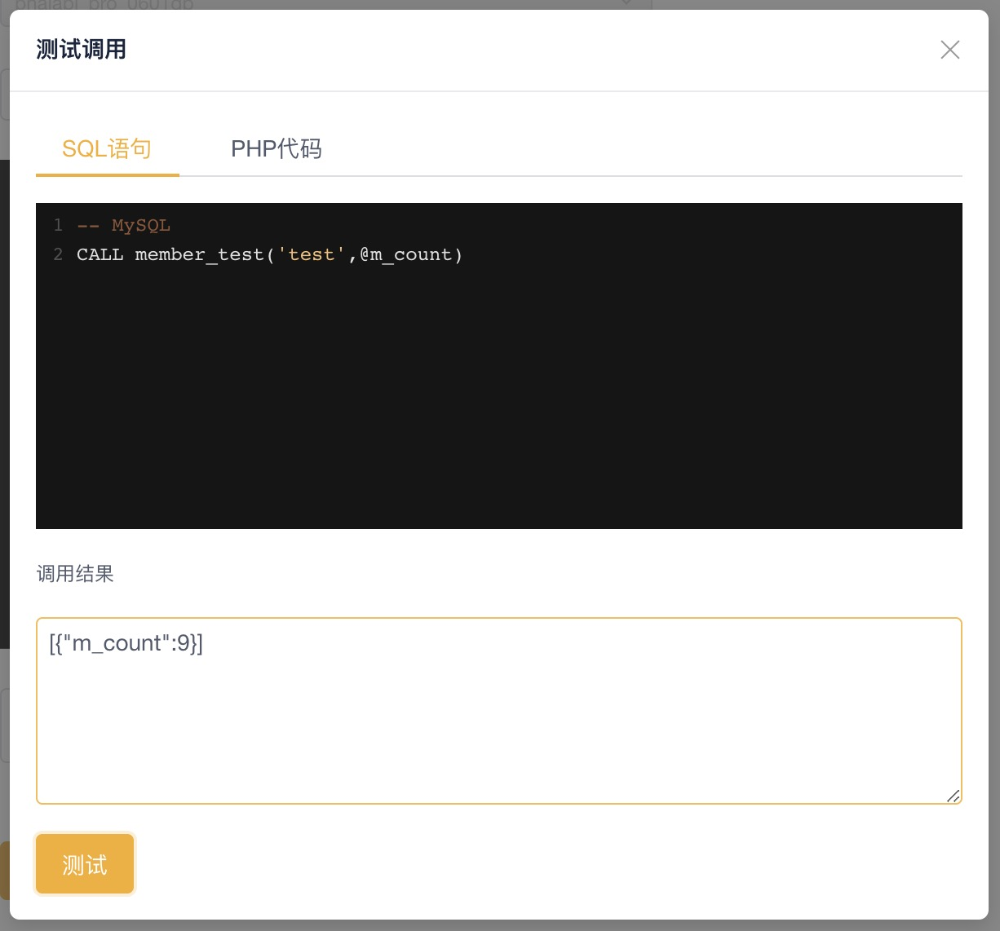
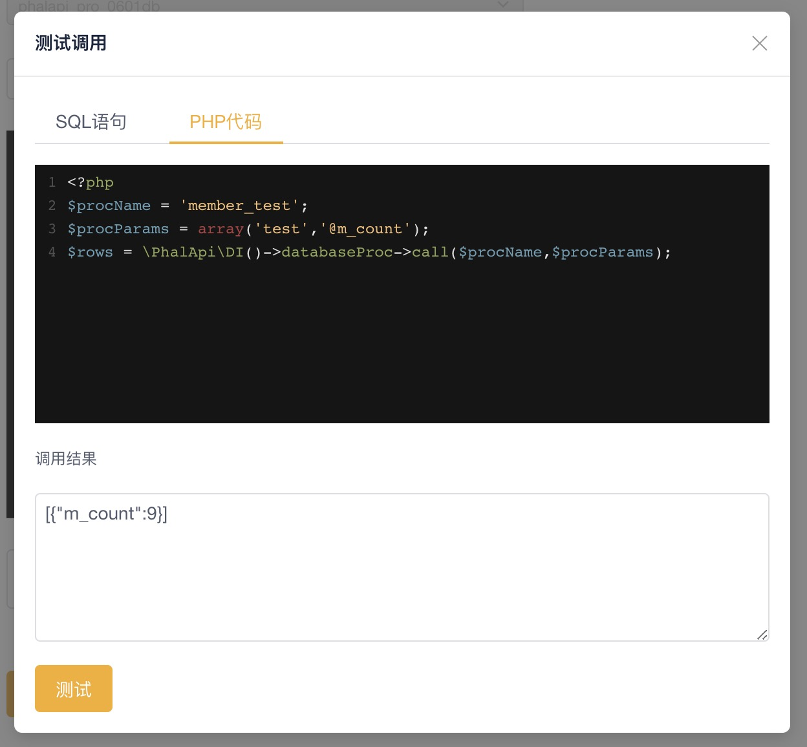
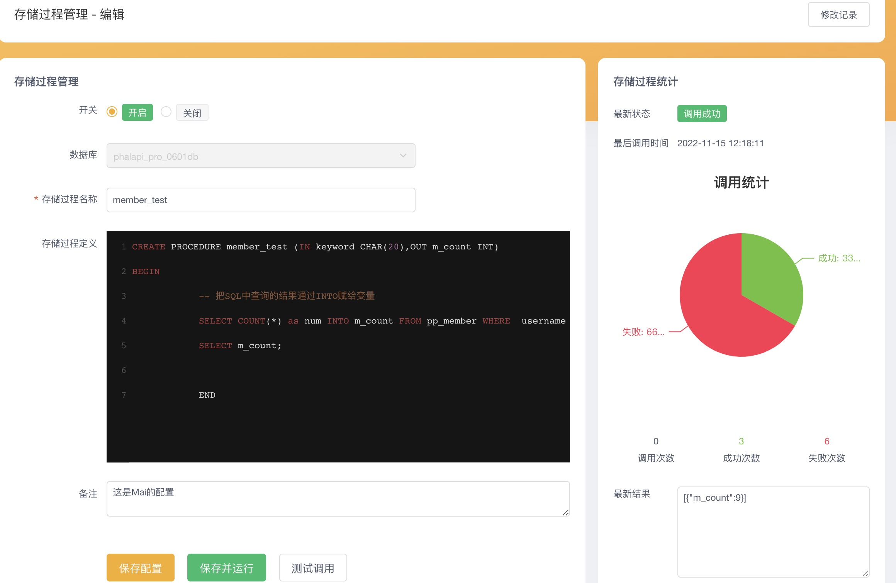
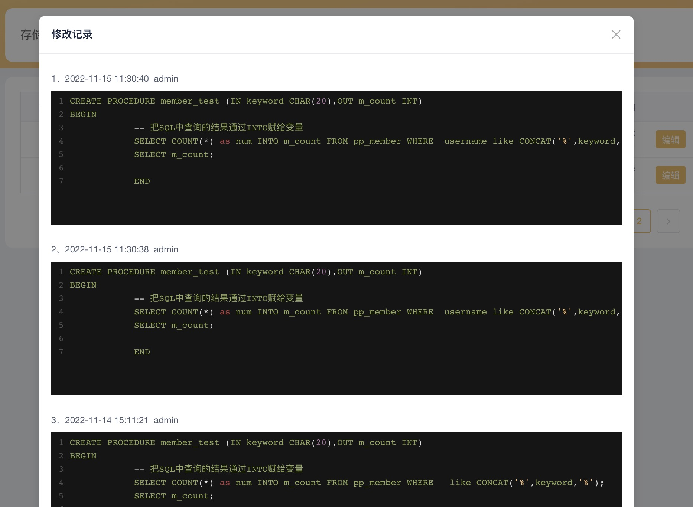

# 如何使用存储过程

支持的数据库
* MySQL
* Sql Server

## 添加存储过程配置
> ** 管理后台 > 数据库管理 > 存储过程管理 > 添加 **

> ** 注意：表单中存储过程名称必须与存储过程定义内容里的名称保持一致 **



* 保存配置：仅保存存储过程的配置信息，比如开关、备注等
* 保存并运行：保存存储过程的配置信息+执行存储过程定义的内容（如果强制覆盖，会先删除原有的存储过程，再新建）
* 测试调用：执行调用存储过程语句（详见下方：管理后台测试调用）

## 管理后台测试调用
> 测试调用分为SQL语句和PHP代码
> * SQL语句：编写并且执行SQL语句进行调用
> * PHP代码：通过接口大师封装好的代码，只需要编写少量的PHP代码，进行调用

### SQL语句
** 注意：不要用分号（;）结束语句 **
``` sql
//如果是输出类型的变量，则不需要单引号
-- MySQL
CALL member_test('test',@m_count)

```


### PHP代码

``` php
<?php
$procName = 'member_test'; //存储过程名称
$procParams = array('test','@m_count'); //存储过程传参
$rows = \PhalApi\DI()->databaseProc->call($procName,$procParams);

```



## 接口中的使用

### 编写SQL语句调用

```php
<?php
namespace App\Api;
use App\Common\Api;
// use App\Domain\ProcTest as ProcTestDomain;
/**
 * Proc
 */
class ProcTest extends Api {
    /**
     * 接口参数规则配置
     */
    public function getRules() {
        $rules = parent::getRules();
        $curRules = array(
            'Call' => array(
                // 接口参数规则
            ),
        );
        return array_merge($rules, $curRules);
    }
    /**
     * 存储过程测试
     * @desc 请输入接口功能描述
     * @version 1.0
     *
     */
    public function Call() {
        // 接口参数获取

        // 结果返回
        $rs = array();

        $db = \PhalApi\DI()->databaseManager->init('phalapi_pro');
        $rs = $db->table->queryAll("CALL member_test('test',@m_count)");

        return $rs;
    }

}
```

> 返回结果

```json
{
    "ret": 200,
    "data": [
        {
            "m_count": 9
        }
    ],
    "msg": ""
}
```

### 用封装好的PHP调用

```php
<?php
namespace App\Api;
use App\Common\Api;
// use App\Domain\ProcTest as ProcTestDomain;
/**
 * Proc
 */
class ProcTest extends Api {
    /**
     * 接口参数规则配置
     */
    public function getRules() {
        $rules = parent::getRules();
        $curRules = array(
            'Call' => array(
                // 接口参数规则
            ),
        );
        return array_merge($rules, $curRules);
    }
    /**
     * 存储过程测试
     * @desc 请输入接口功能描述
     * @version 1.0
     *
     */
    public function Call() {
        // 接口参数获取

        // 结果返回
        $rs = array();
        $procName = 'member_test';
        $procParams = array('test','@m_count');
        $rs = \PhalApi\DI()->databaseProc->call($procName,$procParams);

        return $rs;
    }

}
```
> 返回结果

```json
{
    "ret": 200,
    "data": [
        {
            "m_count": 9
        }
    ],
    "msg": ""
}
```

## 存储过程的调用统计
> 管理后台 > 数据库管理 > 存储过程管理 > 编辑(右侧)




## 修改记录
> 为了方便找回之前对存储过程的修改，我们也做了保存最近20次修改的历史记录

> 管理后台 > 数据库管理 > 存储过程管理 > 修改记录



## 注意事项
* ** 在编写调用存储过程SQL语句的时候，不要用分号（;）结束语句 **
* ** 如果SQL语句调用，OUT/INOUT类型的变量，不需要用单引号;例如下面的@m_count **
```sql
CALL member_test('test',@m_count)
```
* ** 表单中的存储过程名称必须与存储过程定义内容里的名称保持一致 **

