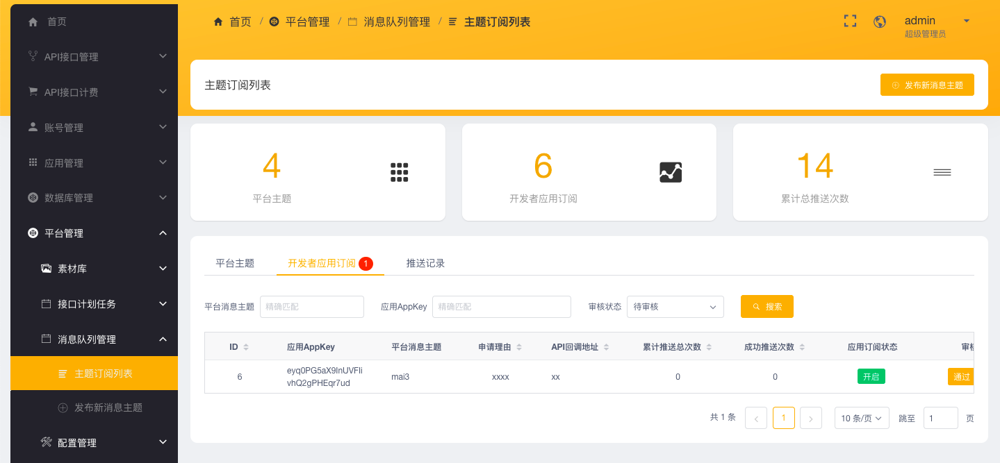
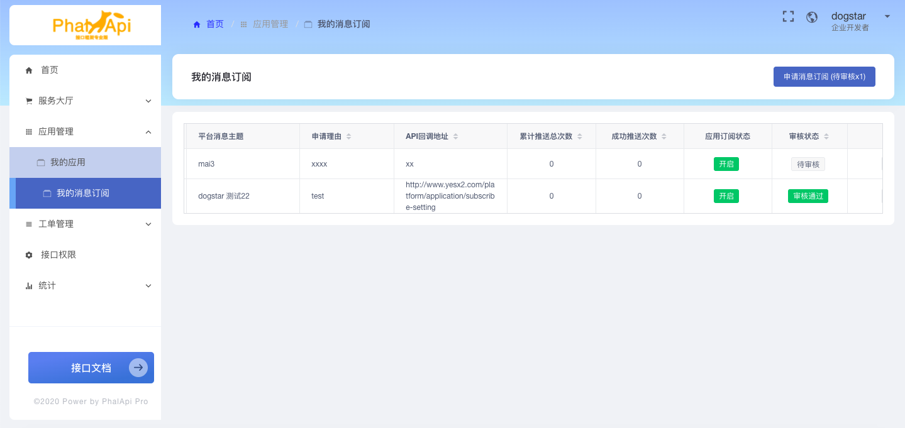
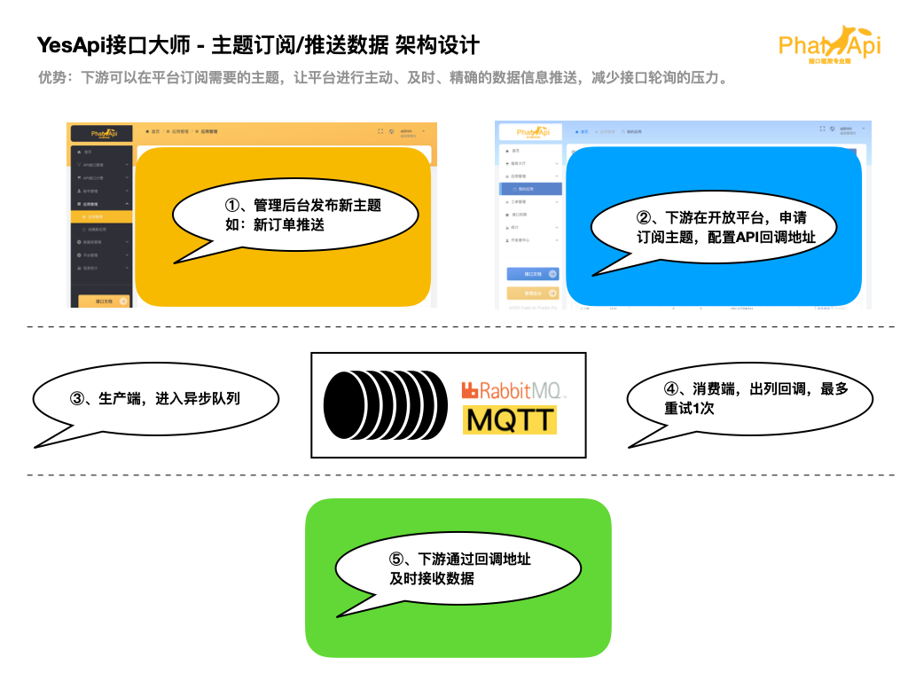

# 主题消息订阅/推送数据

通过异步队列的主题订阅，好处和优势在于：下游可以在平台订阅需要的主题，让平台进行主动、及时、精确的数据信息推送，减少接口轮询的压力。 
例如：应用在ERP系统向下游多个系统推送刚刚新增的订单数据。   

# 安装启动

## 安装RabbitMQ并启动服务

参考 [RabbitMQ官网](https://www.rabbitmq.com/) 进行安装并启动RabbitMQ服务。  

修改 ```./config/sys.php``` 系统配置文件，修改对应的RabbitMQ连接配置：  
```php
    /**
     * RabbitMQ配置
     */
    'rabbitmq' => array(
        'host' => 'localhost',
        'port' => '5672',
        'user' => 'root',
        'password' => '',
        'phalapi_pro_open_push_key' => 'phalapi_pro_open_push_key', // 修改后需要重启脚本!
    ),
```

> 温馨提示：```sys.rabbitmq.phalapi_pro_open_push_key``` 配置值可自定义，修改后需要重启脚本!  

## 启动平台推送数据服务

在根目录，手动执行：
```bash
$ ./bin/push/phalapi_pro_open_push_server.sh 
```

推荐在crontab定时任务配置守护进程：  
```bash
$ crontab -e
# phalapi_pro_open_push_server 推送数据守护进程
*/1 * * * * /path/to/phalapi-pro/bin/push/phalapi_pro_open_push_server.sh
```

# 服务端开发

## 本地开发测试

当需要进行二次开发时，可以在本地命令终端，手动运行。  

例如，手动提交数据：   

```bash
[phalapi-pro]$ php ./bin/push/phalapi_pro_open_push_example.php 
Usage: ./bin/push/phalapi_pro_open_push_example.php <push_topic> <push_data|JSON>

[phalapi-pro]$ php ./bin/push/phalapi_pro_open_push_example.php order '{"order_id":888}'
 [x] Sent order {"order_id":888}
```

例如，消费数据（可以开启多个命令终端）：  

```bash
【phalapi-pro]$ php ./bin/push/phalapi_pro_open_push_server.php 
Starting push ...
 [*] Waiting for push... To exit press CTRL+C


 [x] {"push_topic":"order","push_data":{"order_id":888}}

```

> 温馨提示：如果提示 平台消息主题不存在，则先请前往Admin管理后台发布一个新主题，例如订单推送：order。  


## 在PHP源代码中提交数据

当推送数据运行成功和稳定后，在后续开发过程中，如果需要在接口大师中进行数据的提交，可参考以下示例代码：  
```php
// 平台消息主题和待提交的数据
$publishTopic = 'order'；
$emitData = ['order_id' => 123];

// 提交到异步队列
$engine = new \Base\Domain\PushData\Engine();
$engine->emit($publishTopic, $emitData);
```

## 通过API接口在服务端内部进行提交数据

如果需要跨系统进行数据提交，可以使用 ```Task.PushData.Emit``` 接口，进行调用。  

# 下游回调

## 下游回调地址格式要求

```
推送消息格式：
// TODO：请根据业务情况填写


推送Header头部信息：
Content-Type: application/x-www-form-urlencoded
APPKEY: 开发者应用APPKEY


回调地址返回要求：
返回HTTP 200状态码，表示接收成功。

```
# 产品使用

## 管理后台
使用管理员账号，可以在Admin管理后台 - 平台管理 - 消息队列管理，发布新的消息主题并进行管理。同时对新申请的应用订阅进行审核、查看、推送成功次数和总次数的统计，以及详细的推送结果记录。  

  

## 开放平台

对于开发者，可以进入 开放平台 - 应用管理 - 我的消息订阅，申请订阅平台的主题消息。申请通过后，可以查看推送成功次数和总次数的统计。  

> 请注意：如果需要编辑订阅，则需要等待管理后台重新审核。单独 开启/关闭 订阅，不需要等待重新审核。  

  

# 技术架构设计

目前，使用RabbitMQ作为异步队列。  

 


