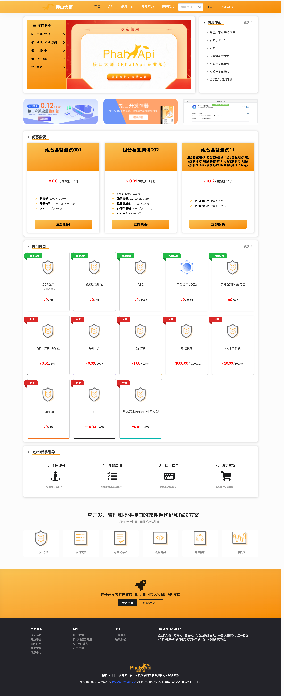
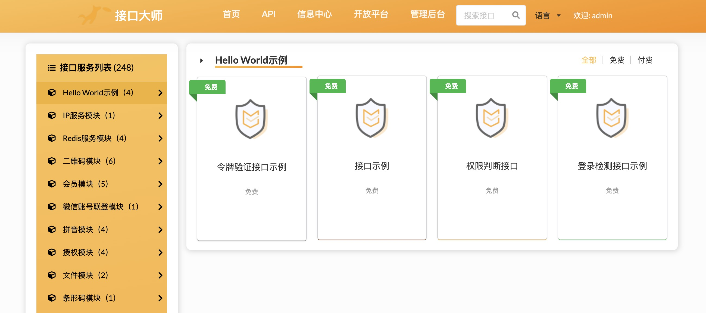
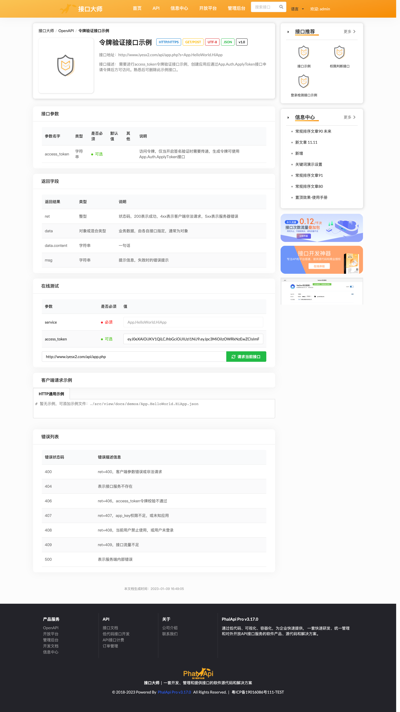
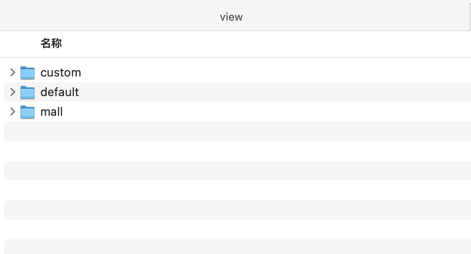
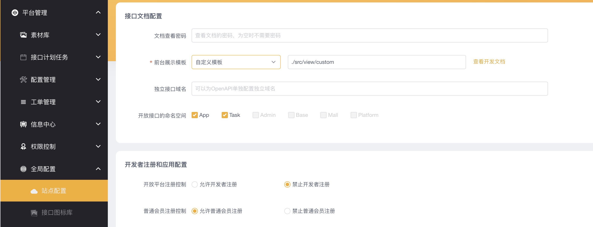
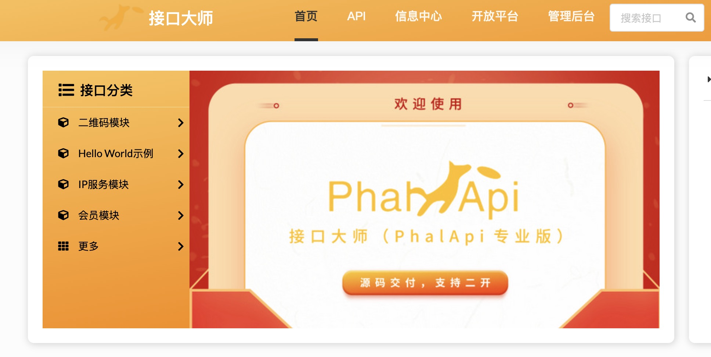
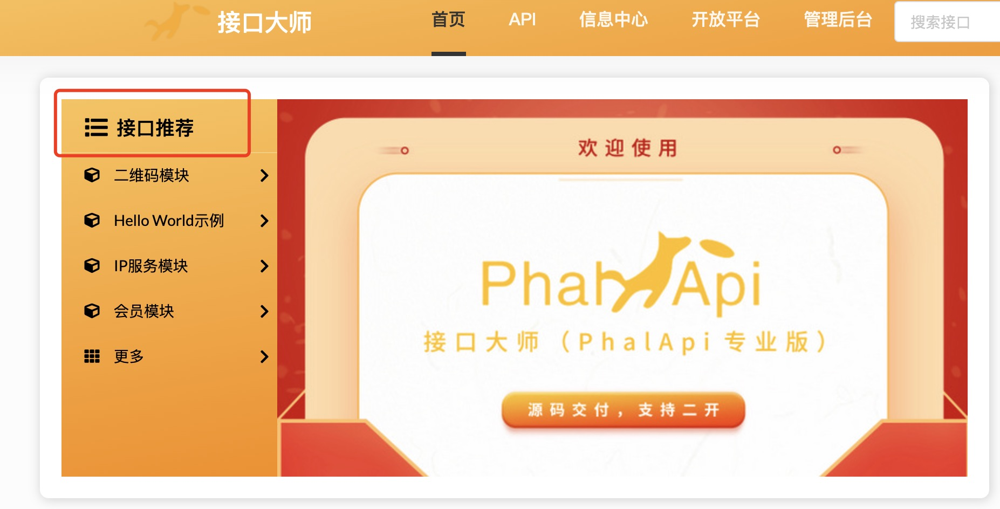

# 新增切换前台主题模板
## 商城模板示例
### 商城首页


商城首页包含接口分类、首页Banner图、信息中心、广告推荐位、优惠套餐、热门接口和3分钟新手引导等模块



### 商城列表页
全新的展示模板，新增接口付费类型的筛选功能


### 商城详情页

原先模板的基础上，进行布局调整和细节优化，新增接口推荐、信息中心和广告推荐位模块



## 如何自定义模板？
### 拷贝商城目录

将 **./src/view/mall** 复制一份，修改文件夹名称，本例子命名为custom



./src/view/custom目录文件说明
```
./src/view/custom
├── article
│   ├── articleList.php        信息中心首页
│   └── articleListContent.php 信息中心文章详情页
├── docs
│   ├── api_desc_tpl.php       商城详情页
│   ├── api_footer.php         商城公共底部页
│   ├── api_list_tpl.php       商城列表页
│   └── api_menu.php           商城公共头部页
└── site
    └── index.php              商城首页
```

### 后台配置前台展示模板
进入管理后台 - 平台管理 - 全局配置 - 站点配置，将前台展示模板改为**自定义模板**，并且填写模板路径为：**./src/view/custom**




### 自定义模板效果

例如：想将商城首页的接口分类文案改为接口推荐

原本效果：



修改：**./src/view/custom/site/index.php** 大概608行，改为：接口推荐，效果如下：




