## 低代码开发介绍

低代码的价值和优势，一方面是，通过自动生成代码、套用模板等方式减少重复代码开发的工作量；另一方面，可以通过更傻瓜式、更可视化、更直观的方式，让非技术人员也能快速根据自己的业务需求，轻松搭建自己的应用，降低开发的门槛。

今天来介绍一套低代码的完美组合工具：

**钉钉宜搭低代码开发：在线数据表单+审批流程+报表+集成钉钉办公；**

**接口大师YesAPI：API接口低代码+内部数据库接口+钉钉远程API+钉钉接口连接器。**


根据宜搭官方文档的介绍：

> 宜搭 是阿里巴巴自研的低代码应用构建平台，通过可视化拖拽的方式，传统模式下需要 2 周才能完成开发的应用，用宜搭 2 小时就能完成。


而接口大师，则是通过一套快速研发、统一管理和对外开放API接口服务的软件产品、源代码和解决方案。它的特点是：低代码、可视化、容器化。接口大师是基于PhalApi开源接口框架，专为小白人员设计的接口开发神器。以前可能需要2小时才能完成开发的API接口，用接口大师大约2分钟就可以了。因为它可以自动生成接口源代码、自动生成接口文档、可视化连接数据库，你只需要编写SQL语句就能快速查取数据库。

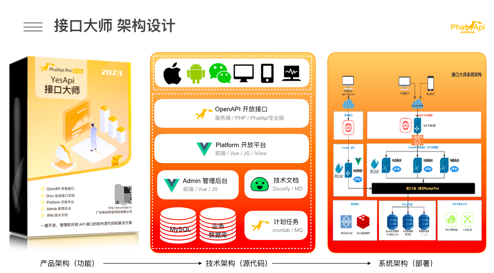


## 接口大师与宜搭的案例demo及运行效果

最终运行的钉钉应用效果截图是，

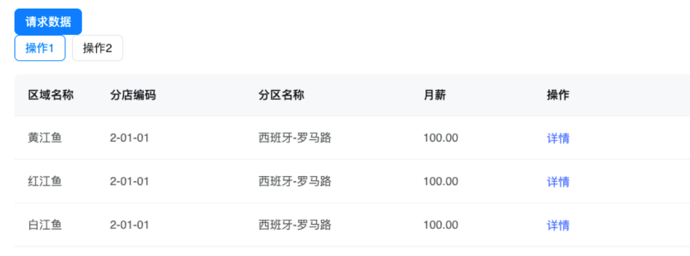


部署和使用自己的数据库，例如内部的数据库。为了演示，我们先创建以下MySQL数据库表，

```
CREATE TABLE  mother_love_e(
id int AUTO_INCREMENT  primary KEY  ,
name varchar(255),
code varchar(255),
other_name varchar(255),
sell_typ varchar(255),
sell_number float,
sell_sum float,
sell_cost float ,
profit float,
profit_margin float,
taxes_included float
)
INSERT INTO `mother_love_e` (`id`, `name`, `code`, `other_name`, `sell_typ`, `sell_number`, `sell_sum`, `sell_cost`, `profit`, `profit_margin`, `taxes_included`) VALUES (1, '黄江鱼', '0002', '西班牙-罗马路', '购销', 100, 3100, 100, 50, 0.5, 9999);
INSERT INTO `mother_love_e` (`id`, `name`, `code`, `other_name`, `sell_typ`, `sell_number`, `sell_sum`, `sell_cost`, `profit`, `profit_margin`, `taxes_included`) VALUES (2, '红江鱼', '0002', '西班牙-罗马路', '购销', 100, 3100, 100, 50, 0.5, 9999);
INSERT INTO `mother_love_e` (`id`, `name`, `code`, `other_name`, `sell_typ`, `sell_number`, `sell_sum`, `sell_cost`, `profit`, `profit_margin`, `taxes_included`) VALUES (3, '白江鱼', '0002', '西班牙-罗马路', '购销', 100, 3100, 100, 50, 0.5, 9999);
```


在插入测试数据后，进入接口大师的接口管理后台，

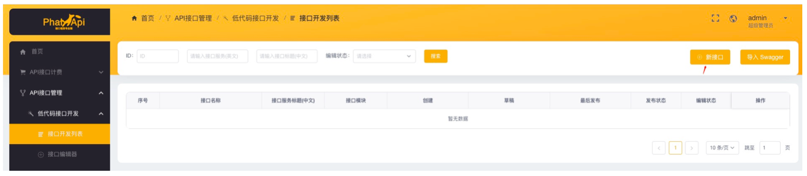

再根据表单，填写API接口的信息，


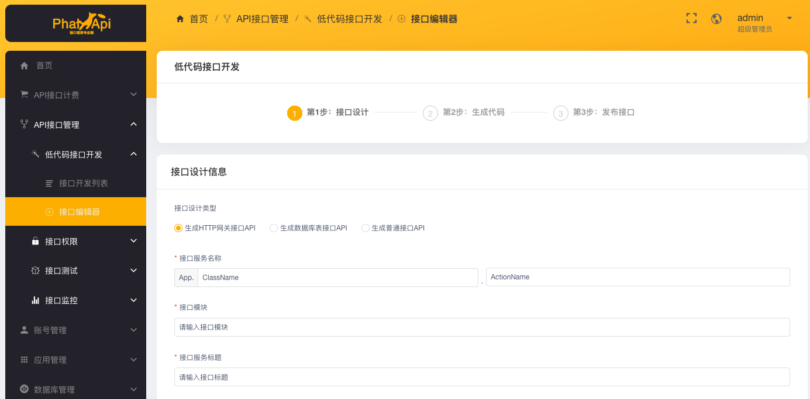


输入上数据相关的字段，生成代码并且发布（生成代码->添加草稿->保存并且发布。生成和保存成功时会提示：

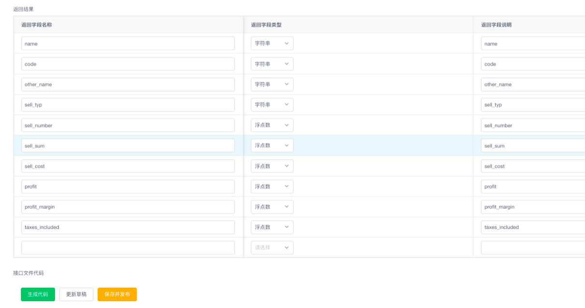


发布后，查看已经发布的API接口。

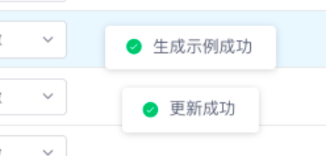


根据接口获取access_token就可以成功获取接口内容

Ps：如果内部使用可以参考文档取消权限限制。


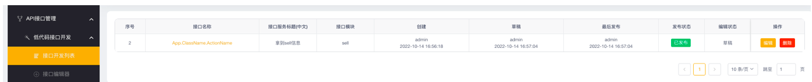


以上是接口大师即是后端低代码开发API接口的过程。

如果需要连接和使用自己的数据库，可以在接口大师管理后台进行添加数据库连接配置。

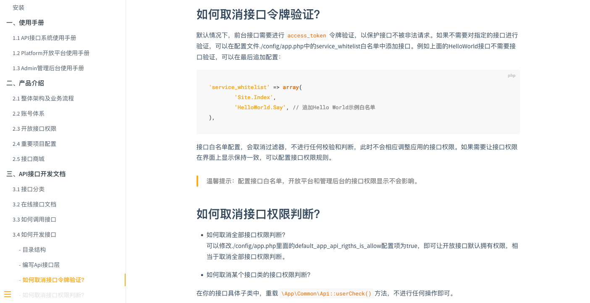


由于接口大师是可以部署在自己本地的服务器，所以可以通过内网IP和自己的数据库进行连接，更加安全。

## 在宜搭请求自己api的两种方式

第一种：先新建远程API。

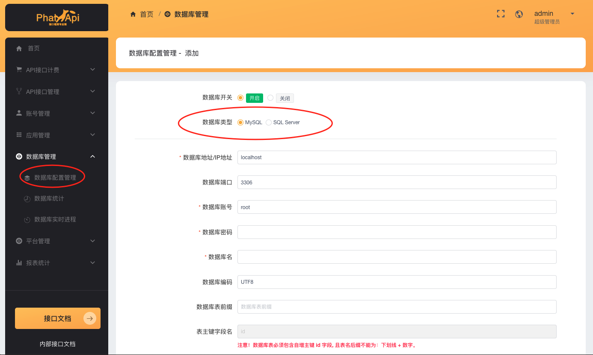

然后，填入刚才用接口大师搭建和发布好的API接口信息。例如：接口地址。

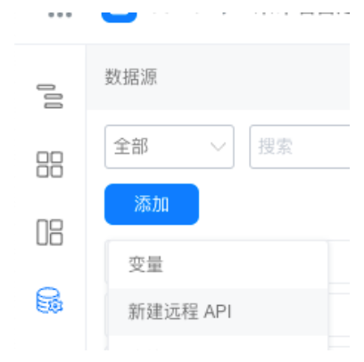


第二种：通过API连接器。

在 开发者-连接器工厂，进行添加。

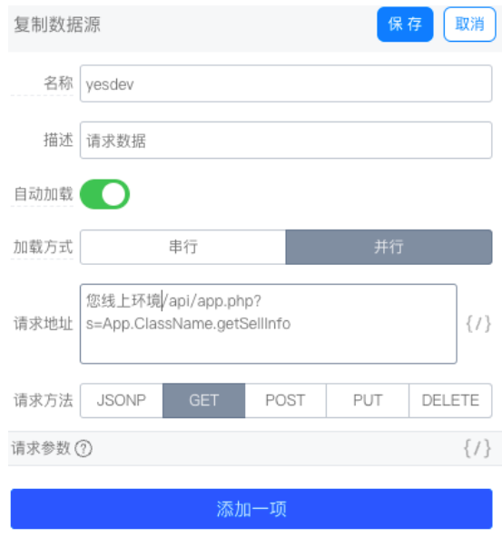


继续配置填写你自己API接口的信息。

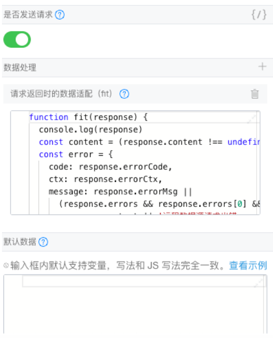


保存接口信息后，可以进行测试。

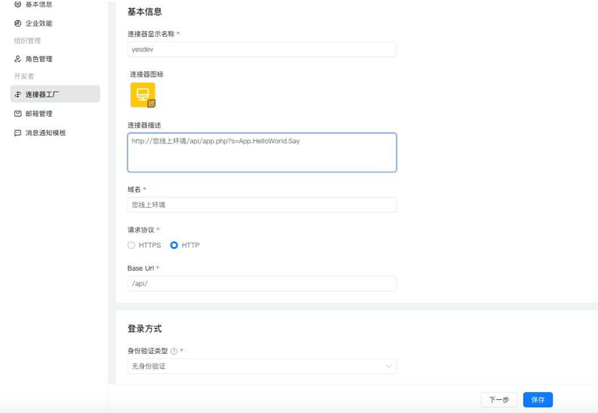


测试成功了之后，就可以开始使用API了。

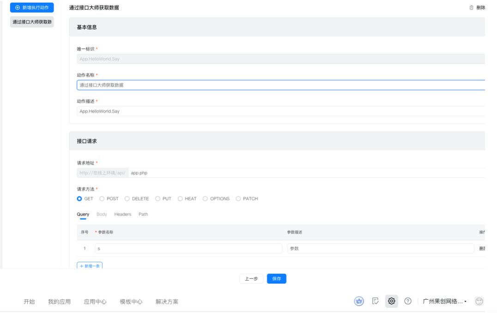


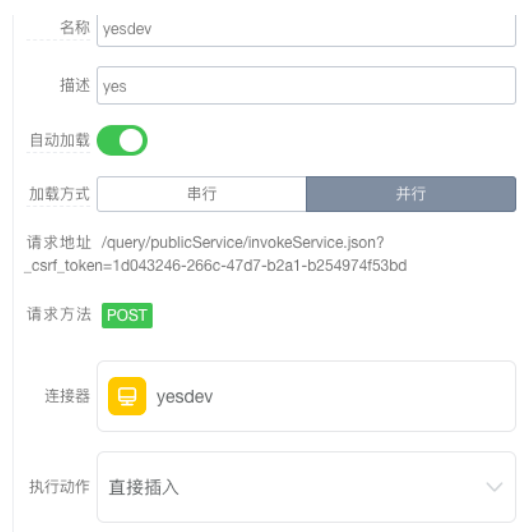


输入对应的接口参数：

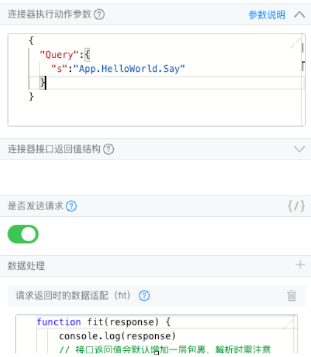


就可以正常获取数据第二种连接器方式。

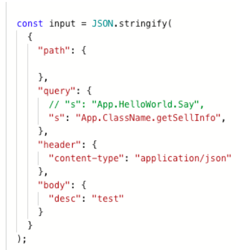


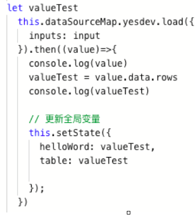


## 相关源代码

因为使用的都是低代码开发工具，所以宜搭和接口大师都会自动生成相应的代码。

其中在钉钉宜搭，通过js的方式直接获取的源代码是：

```
export function onClick() {
  // 获取姓名输入框内容


  const input = JSON.stringify(
    {
      "path": {

      },
      "query": {
        // "s": "App.HelloWorld.Say",
        "s": "App.ClassName.getSellInfo",
      },
      "header": {
        "content-type": "application/json"
      },
      "body": {
        "desc": "test"
      }
    }
  );

let valueTest
  this.dataSourceMap.yesdev.load({
    inputs: input
  }).then((value)=>{
    console.log(value)
    valueTest = value.data.rows
    console.log(valueTest)

    // 更新全局变量
    this.setState({
      helloWord: valueTest,
      table: valueTest

    });
  })

}
```

## 参考资料

如何将宜搭数据和三方系统数据打通？

[https://developers.aliwork.com/docs/guide/FAQ/q4](https://link.zhihu.com/?target=https%3A//developers.aliwork.com/docs/guide/FAQ/q4)

PhalApi Pro 技术文档

[http://www.yesx2.com/wiki/#/README](https://link.zhihu.com/?target=http%3A//www.yesx2.com/wiki/%23/README)


以上就是接口大师数据接入宜搭的过程。
