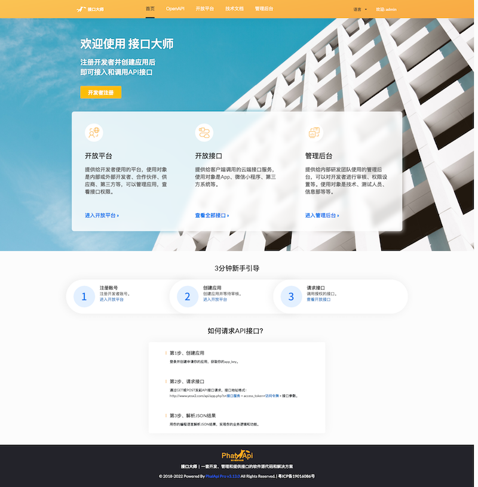
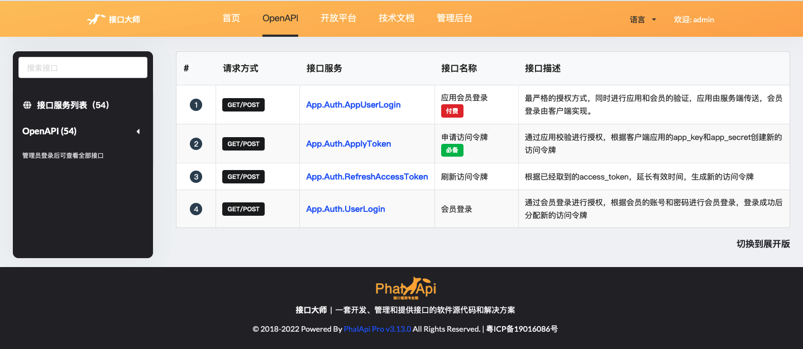
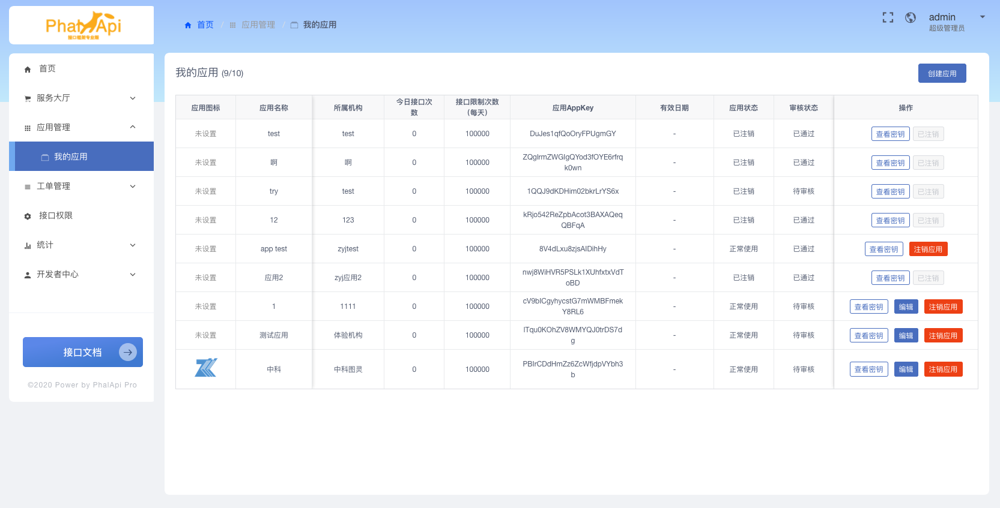
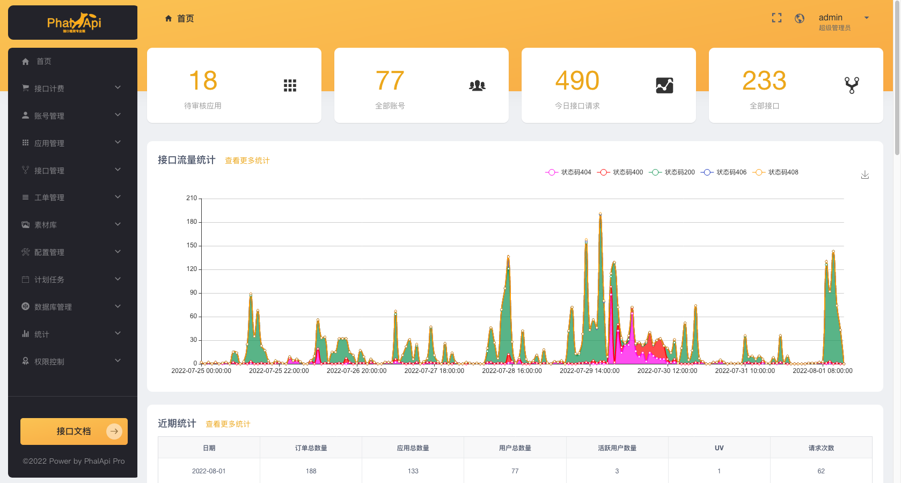
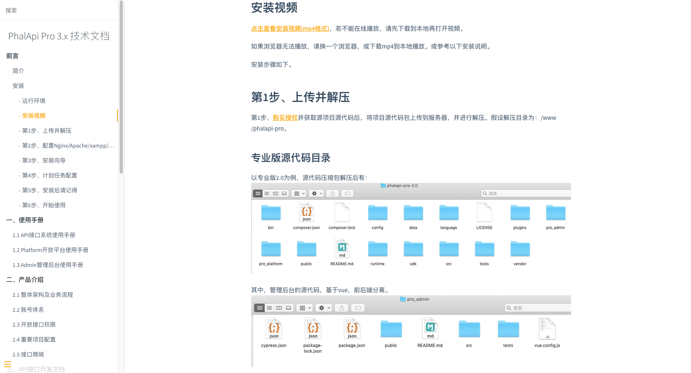

# PhalApi Pro 技术文档

## 简介

PhalApi Pro 是[PhalApi开源接口框架](https://www.phalapi.net/)的专业版， 基于主流的PHP+MySQL，可用于开发接口系统、搭建开放平台，能有效管理开发者、应用、接口和权限。通过开放平台可以快速整合资源，借助SaaS服务、Serverless、云服务、大数据和开放接口等互联网技术，连接最终顾客、开发者、合作伙伴、供应商和企业，形成商业闭环。

专业版包括API接口系统、Platform开放平台和Admin管理后台三个子系统，可快速用于接口开发管理和开放平台搭建。

由PhalApi作者dogstar及其研发团队自主设计和研发的软件系统，专业可靠，值得依赖！

## PhalApi Pro 产品介绍

PhalApi Pro 包括API接口、管理后台和开放平台三个子系统，假设您的域名是：http://open.phalapi.net，则：

 + 首页：http://open.phalapi.net/
 + API接口：http://open.phalapi.net/docs.php
 + 开放平台：http://open.phalapi.net/platform/
 + 管理后台：http://open.phalapi.net/admin/
 + 技术文档：http://open.phalapi.net/wiki/

### 1、官网首页
官网首页展示，可作为开放平台的默认首页，用于宣传推广，提供给游客访问，并且有利于SEO的优化。

### 2、API接口系统
包括全部API接口，可自动生成在线接口代码，并进行全面而灵活的接口权限分配。基于PhalApi 2.x开发，采用经典的LNMP架构，也可部署运行在Apache和Windows系统，由后端开发工程师负责开发，提供API接口给开发者、客户端使用。

全部接口，可通过在线接口文档浏览。管理员登录后可查看全部内部接口。

### 3、Platform开放平台
提供给平台的开发者使用，可进行应用管理、查看接口权限等操作。基于iView Admin开发，采用前后端分离技术方案。

### 4、Admin管理后台
提供给管理员使用，可进行全面的日常管理。基于iView Admin开发，采用前后端分离技术方案。

### 5、技术文档
技术文档，是基于Markdown格式编写的，用于提供给内部技术开发人员参考、阅读和使用。如果需要修改，可以直接编写购买后的md文件内容。

## 阅读对象

本技术文档主要面向PhalApi Pro的使用者，提供了关于技术开发、产品使用、业务介绍等内容，阅读对象包括但不限于后端开发人员、前端开发人员、测试人员、产品人员和运营人员。

