# Admin管理后台完整使用手册  

使用管理后台之前，请先配置并安装好PhalApi专业版，并创建超级管理员账号。  

> 适合阅读对象：管理员。  

# 登录   

## 访问管理后台

假设配置的域名是 [http://open.phalapi.net](http://open.phalapi.net)，那么管理后台的地址是： 

```
http://open.phalapi.net/admin/
```

或者通过网站的顶部菜单，点击【管理后台】直接进。   

> 温馨提示：出于安全考虑，建议在完成私有部署后，手动隐藏或注释管理后台的访问菜单。  

## 登录管理后台

打开管理后台，首先需要进行管理员登录，登录界面如下：  

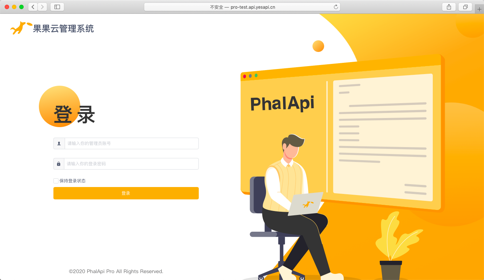  

管理员账号密码，在安装向导时，由用户自行设定。如果忘记管理员账号，可查看 ```pp_member``` 数据库表；如果忘记密码，需要重新安装。  


# 后台首页  

进入管理后台后，可以看到类似以下的后台首页。其他功能模块，按界面指引操作即可。  

在后台首页，可以快速查看诸如：待审核应用、全部账号、今日接口请求次数、全部接口数量等整体概况。以及：接口流量统计图表、近期统计表格数据、昨日活跃App和系统授权信息等。  

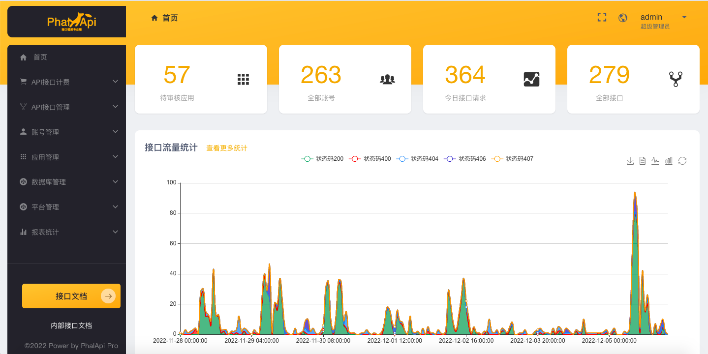  

其中，首页几个统计数据的口径是：    

 + 接口流量统计：根据接口请求日记实时统计最近30天的接口流量（排除开放平台和管理后台接口请求）  
 + 近期统计：按每日统计，包括：日期、订单总数量、应用总数量、用户总数量、活跃应用数量、UV、请求次数  
 + 昨日活跃App：包括：日期、App Key、活跃应用数量、UV、请求次数  

术语解释：  

 + 用户总数量：开发者账号数量+应用会员数量+管理员数量  
 + 活跃应用数量：当天有接口请求的App Key去重后数量    
 + UV：通过OpenAPI调用时所绑定关联的登录会员去重后数量  
 + 请求次数：指OpenAPI接口请求次数（不分成功与否，排除开放平台和管理后台接口请求）  

> 温馨提示：除了接口请求日记外，如无特殊说明，其他全部统计报表，都以 **OpenAPI接口请求** 为统计口径和范围，即 **排除开放平台和管理后台接口请求**。  

点击左侧功能菜单可以展开折叠菜单，和点击进入具体的功能界面。  

下面按功能模块简单介绍管理后台的功能和注意事项，最新的界面以最新版的为准。 

# API接口计费  

此模块主要功能有：  

 + **接口流量套餐：**  
 支持试套餐和付费套餐，接口流量套餐列表、添加套餐、修改套餐、删除套餐，支持组合套餐；  

 + **订单管理：**  
 订单列表、修改订单、套餐调整；  

 + **套餐管理：**  
 套餐列表、套餐发放、调整套餐、删除套餐；  

 + **支付配置：**  
 支付宝配置、PayPal配置、现金支付配置。  

## 接口流量套餐管理

在接口流量套餐，可以查看已经配置的接口服务套餐，主要是针对：免费试用、付费购买、组合套餐，以及对套餐的检索、编辑和删除等操作。  

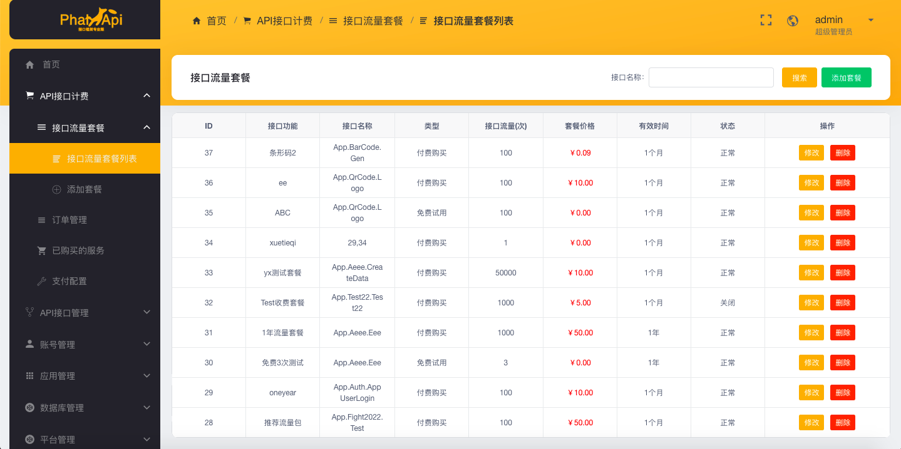  

> 特别注意：默认情况下，全部OpenAPI接口在分配接口权限后即可调用。若API接口有设置和开启 免费试用 或 付费购买 的套餐后，此接口则**必须**需要有 免费试用 或 付费购买流量 或 后台发放的流量，才可进行调用。  

> 温馨提示：删除已有的套餐，不会影响客户已经成功购买的套餐使用。  

### 添加新套餐  

当需要添加新的接口套餐，可以点击【添加套餐】菜单入口或页面按钮，进入到 添加套餐 的界面。  

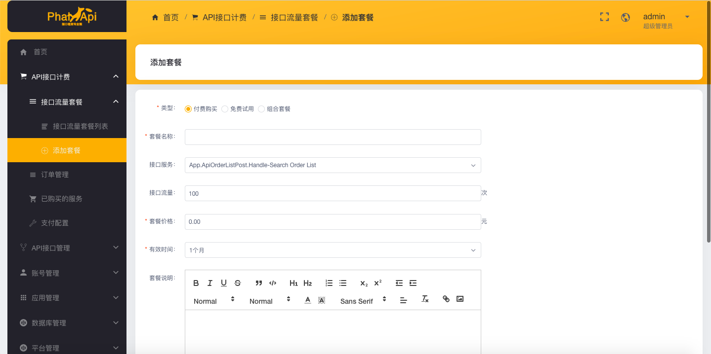  

在设置接口流量套餐时，你可以设定以下套餐信息：  

 + 类型（付费购买/免费试用/组合套餐）  
 + 套餐名称（中文展示名称）  
 + 接口服务（需要选择已经成功上架和发布的OpenAPI接口）  
 + 接口流量（单位：次，本次的接口流量的可用次数）  
 + 套餐价格（单位：元，保留两位小数点）  
 + 有效时间（可选：1个月/2个月/3个月/6个月/1年/2年，支持可配置）  
 + 套餐说明（支持富文本编辑，下单时展示给客户）  
 + 状态（正常/关闭，关闭后，前台将不会展示购买入口）  

### 套餐类型说明  

接口流量套餐，主要分为三种类型：免费试用、付费购买、组合套餐。其区别是：  

 + **免费试用：**  
 指客户不需要付费即可免费调用的次数，每份免费试用套餐按开发者账号进行自动分配，即每个开发者账号针对每一个API接口最多享受一次免费试用套餐（不区分应用）。同一个API接口，最多可设置一个免费试用套餐，也可以不设置。  

 + **付费购买：**  
 是指客户需要购买后才可以使用的接口流量套餐，价格不能为0.00元。客户可以重复购买，或提前购买。如果客户针对同一个API接口同时存在多份相同的接口流量套餐，系统将优先消耗即将过期的流量套餐。此外，付费购买的流量将比免费试用的流量优先消耗。  

 + **组合套餐：**  
 组合套餐，是出于运营和优惠活动的考虑而设定和提供的。你可以基于前面设置的多个付费购买套餐，进行再组合，以更优惠的打包价格提供给你的客户。  
 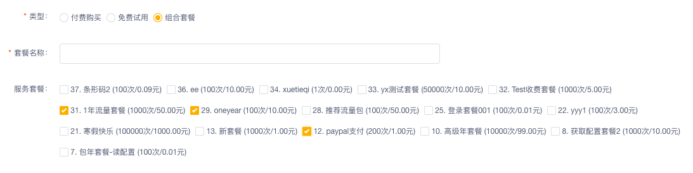  


## 订单管理

在订单管理，你可以查看平台的全部订单，修改订单信息和搜索，以及查看订单的总数量、总金额、已付金额，并进行订单编号和客户账号的搜索。    
 

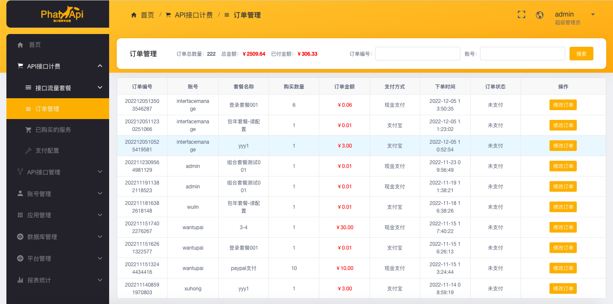   

### 人工修改订单  

何时需要进行人工修改订单？  

以下几个场景，需要管理员在后台人工修改订单。  

 + 场景1：平台设定或允许现金支付和对公转账，则需要人工修改订单状态为：已支付，和进行接口流量套餐的发放。  

 + 场景2：内部手动调整订单价格，价格调整后，前台支付时则以管理后台的订单价格为准。  

 + 场景3：手动调整接口流量的次数，例如：额外赠送更多的接口次数。 

 + 场景4：其他有关订单的修改，例如：订单备注。  

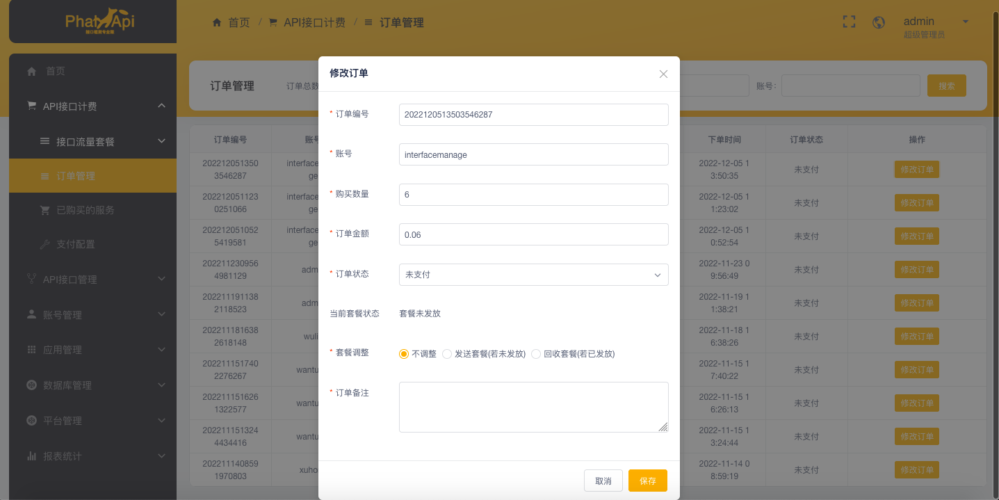  


## 管理已购买的服务

针对客户已经购买的接口服务，或者对于已经发放的流量服务，进行搜索、查看、编辑、删除和管理。  

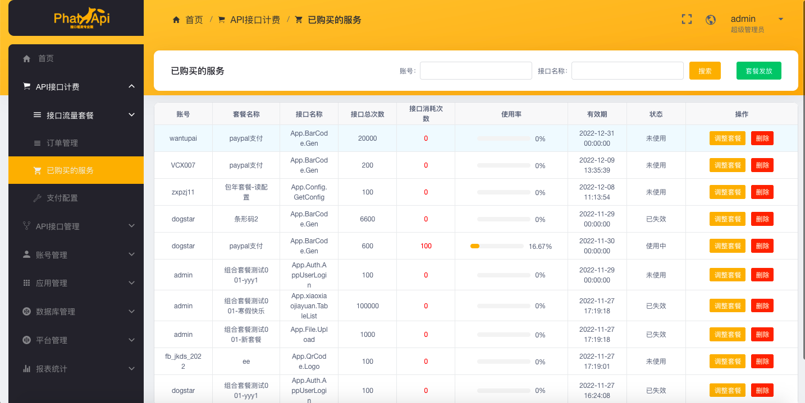  

### 调整套餐  

点击 【调整套餐】，你可以修改两个重要的信息：接口总次数和有效期。  

 + **接口总次数：**  
 要注意到调整的套餐，可能已被客户使用。若调整的新总次数大于客户已使用次数，则流量包为**使用中**；若调整后的新总次数小于等于客户已使用次数，则流量包为**已用完**。  

 + **有效期：**  
 若调整的新有效期大于当前时间，则流量包有效；若小于当前时间，则流量包过期。  

### 套餐状态说明  

已购买的服务，其套餐状态分为：未使用、使用中、已用完、已过期、已失效。  

分别表示：  

 + 未使用（可以使用）：新购买或新发放，客户从未使用；  
 + 使用中（可以使用）：客户已经使用过一次或以上，但总次数未达到；  
 + 已用完：使用次数已经大于或等于总次数；   
 + 已过期：不管总次数是否用完，有效期已到；  
 + 已失效：订单取消或回收。  


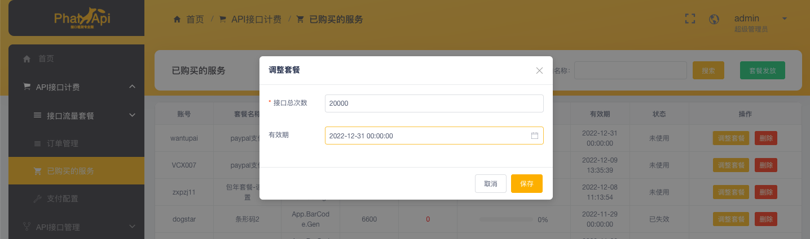  

### 套餐发放  

如果是内部测试，或客户需要在不付费情况下使用付费接口，可以通过【套餐发放】进行单独操作和发放。  

通过 套餐发放，你可以给指定的开发者账号，提供指定API接口任意的可用次数。  

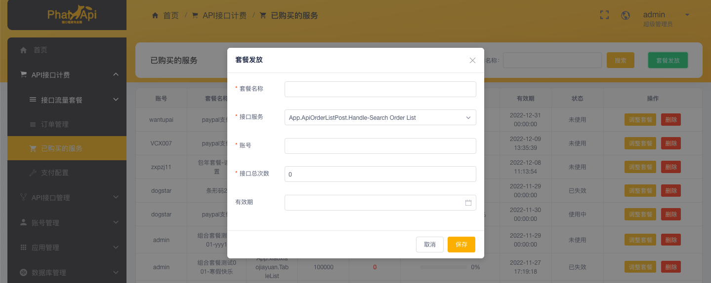  


## 支付配置

可以设置：支付宝配置、PayPal配置、现金支付配置。关于支付宝的配置，在【2.5 接口商城】有详细说明，在此不再赘述。    

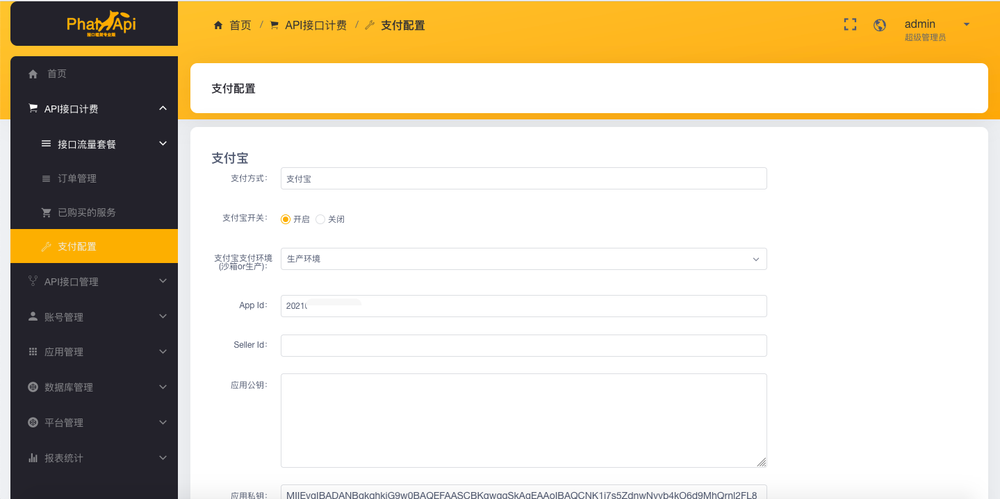  

# API接口管理  

API接口管理，是平台的核心部分。可以进行接口权限分配和管理（权限分配）、进行可视化接口设计（接口开发）、接口自动化黑盒测试（接口测试）等。    

分为四大子模块：  

 + 低代码接口开发  
 + 接口权限  
 + 接口测试  
 + 接口监控  

下面依次展开介绍。  

## 低代码接口开发  

支持：自动生成API接口源代码，接口管理、在线开发、发布、自动生成，支持网关接口、数据库接口、普通接口生成模式、支持GET/POST方法设置，生成数据API接口时可以选择数据库和数据库表，同时支持 简易代码模式和完整代码模式。  

你也可以导入接口：支持swagger批量导入API接口，支持多个接口的勾选、覆盖导入和快速发布。  

进入 低代码接口开发列表，可以对已经发布或还处于草稿状态的API接口进行管理和查看。

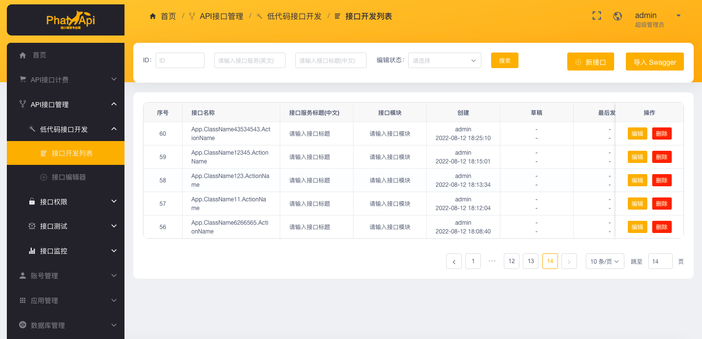  

### 添加新接口  

除了参考开发文档并且通过PHP源代码的方式编写API接口外，对于非技术编程人员，可以通过管理后台，创建新接口，完成界面化的接口低代码开发。  

接口低代码开发的步骤主要是：  

 + 第1步：接口设计  
 + 第2步：生成代码  
 + 第3步：发布接口  

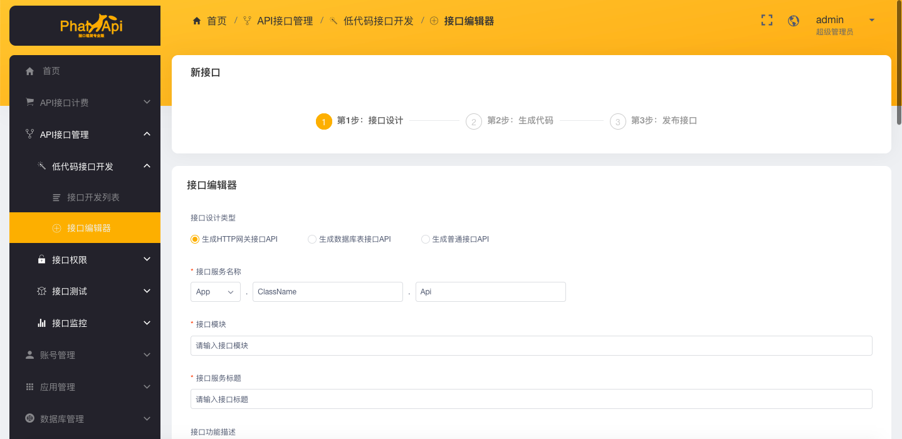  

### 接口设计

在接口编辑器界面，接口设计的信息表单，主要有：  

 + 接口设计类型（HTTP网关接口API/数据库表接口API/普通接口API）  
 + 接口服务名称（由 ```命名空间 + 接口类名 + 接口方法名``` 组成）  
 + 接口模块（对应接口文档左侧分类菜单）  
 + 接口服务标题  
 + 接口功能描述  
 + 隐藏接口文档（勾选后，前台不展示此接口文档，但依然可以正常调用API）  
 + 请求方式（支持：GET/POST）  
 + 接口参数（支持多个参数配置）  
 + 返回结果（支持多个结果配置）  
 + 简易代码模式/完整代码模式（主要区别在于：简易代码模式只维护接口核心函数，相对简单）  
 + 接口文件路径（PHP接口源文件的保存路径）  
 + 接口返回示例（用于展示）  

> 温馨提示：关于接口设计类型的说明和区别，HTTP网关接口API用于生成请求和封装上游API接口的调用，数据库表接口API可用于生成对应数据库、对应数据库表和常用CURD的基本接口生成。     

### 生成代码

在填写好上述的接口编辑器表单和接口信息后，可以点击【生成代码】来生成PHP接口代码。  

例如，简易代码模式生成的普通接口代码，类似：  

```php
    public function Api() {
        // 接口参数获取
        
        // 结果返回
        $rs = array();

        // 获取用户ID，未登录时异常返回
        // $uid = $this->tryToGetUid();

        // 获取app_key，未指定时异常返回
        // $appKey = $this->tryToGetAppKey();

        // TODO: 实现你的业务逻辑……
        // $domain = new ClassNameDomain();


        return $rs;
    }

```

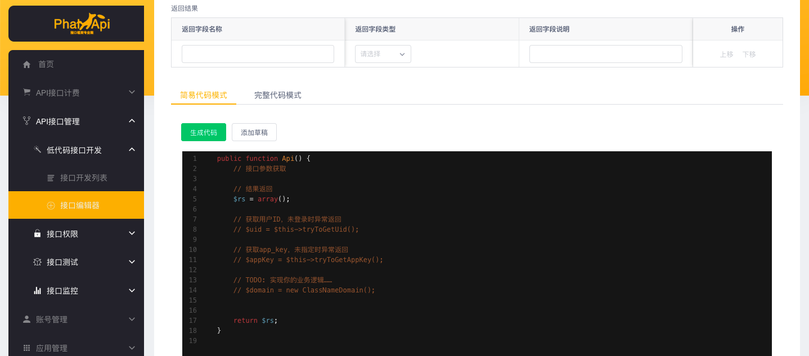  


你也可以同时切换使用或查看完整代码模式，类似：  

```php
<?php
namespace App\Api;
use App\Common\Api;
// use App\Domain\ClassName as ClassNameDomain;

/**
 * 请输入接口模块
 */
class ClassName extends Api {

    /**
     * 接口参数规则配置
     */
    public function getRules() {
        $rules = parent::getRules();
        $curRules = array(
            'Api' => array(
                // 接口参数规则
            ),
        );
        return array_merge($rules, $curRules);
    }

    /**
     * 请输入接口标题
     * @desc 请输入接口功能描述
     * @version 1.0
     * 
     */ 
    public function Api() {
        // 接口参数获取
        
        // 结果返回
        $rs = array();

        // 获取用户ID，未登录时异常返回
        // $uid = $this->tryToGetUid();

        // 获取app_key，未指定时异常返回
        // $appKey = $this->tryToGetAppKey();

        // TODO: 实现你的业务逻辑……
        // $domain = new ClassNameDomain();


        return $rs;
    }

}
```

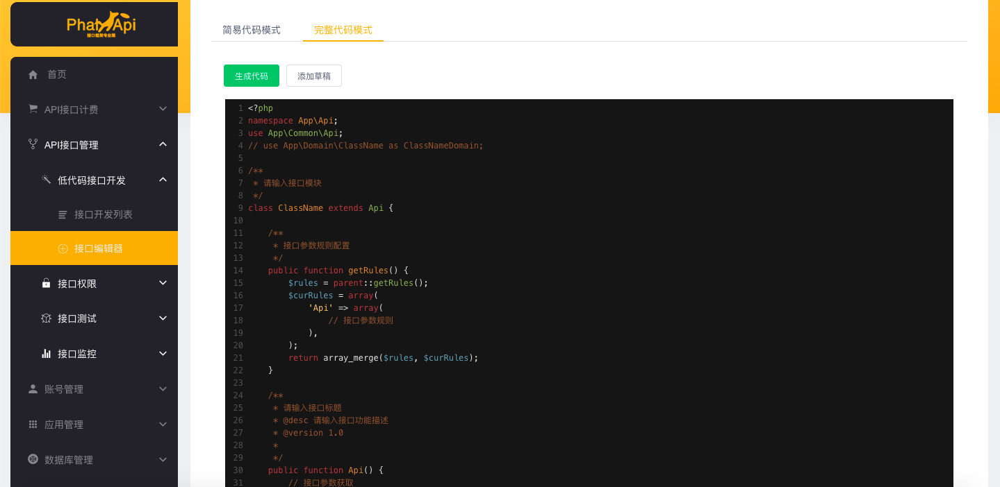  

对于生成后的接口代码，  

 + 1、你可以在生成后继续人工二次修改和调整；  
 + 2、也可以在调整接口信息后，重新生成最新的接口代码。  


### 发布接口

编辑和设计好API接口后，新接口需要先 保存草稿。  

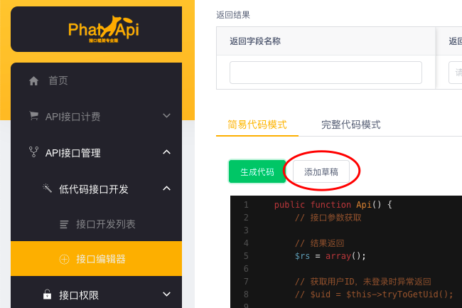  

保存草稿后，方可进行API接口的发布。如果接口有新调整，又不想先发布，可以先【更新草稿】。  

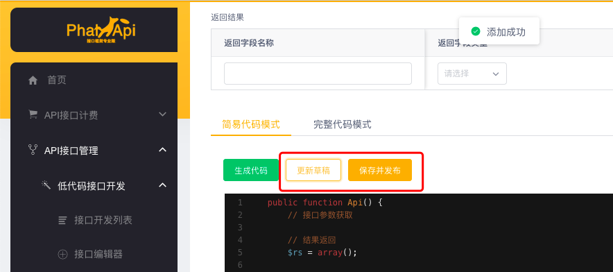  

接口发布后，可以访问前台的接口文档、在管理后台进行新接口的接口权限配置、查看发布和代码修改记录。  

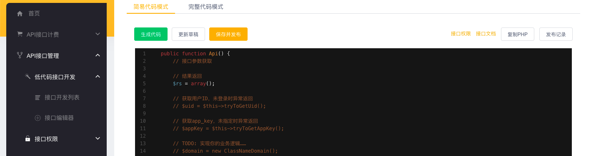  

在前台在线接口文档，会自动同步展示新的API接口，包括接口文档分类页、接口文档搜索页、接口文档详情页。  

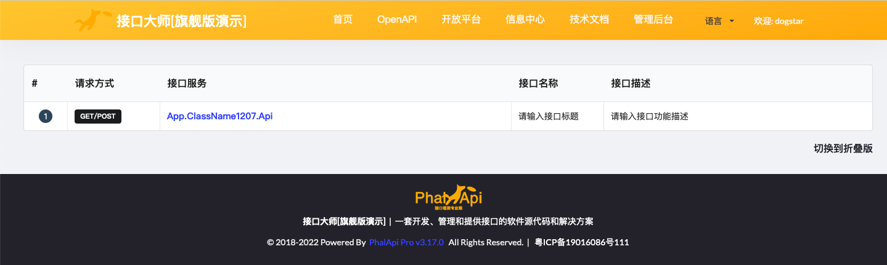  

API接口成功发布后，即可和正常接口一样，被调用和使用。  

## 从Swagger.json文件导入接口

在API接口管理后台，可以一键导入swaager.json文件，然后选择性地开放你的API接口。  

例如，导入前的swagger接口列表：  
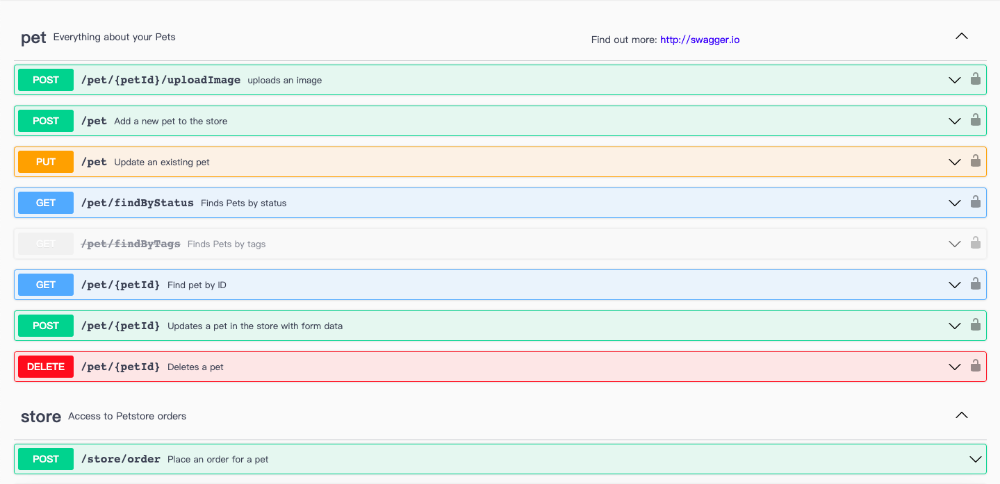  

上传导入时，可以勾选需要开放的swagger接口：  
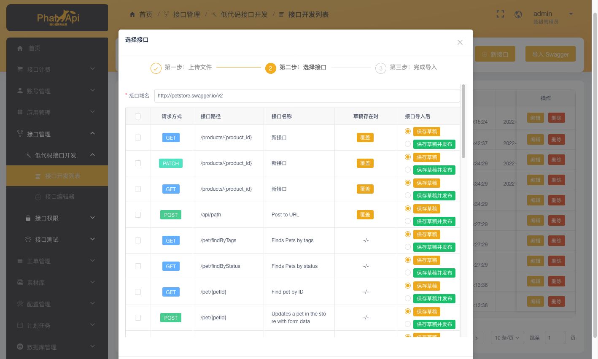  

导入后，对API接口的二次开发和调整，发布接口后即可在前台在线接口文档查看和访问使用。  

## 接口权限  

此子模块提供了：  

 + **接口权限分配：**  
 接口权限分配，自动检测API接口资产，支持快速按配置的开发者角色进行接口权限分配，列表查看
权限预览：查看、预览和搜索指定应用的接口权限。  

 + **接口权限规则设置：**  
 支持接口权限的规则配置、添加、列表查看、搜索和删除、撤销等接口，权限规则支持按开发者角色、开发者账号、开发者应用共三个维度。

 + **接口服务操作列表：**  
 支持手动添加接口服务，一般情况下不需要用，为方便未来扩展自己的接口路径，特此预留。  

在开放API接口前，需要在管理后台，提前针对开发者角色、开发者账号、开发者应用这几个维度进行接口的权限分配，否则开发者将无权访问和调用指定的API接口。  

> 值得注意：为了方便调试和内部维护，管理员拥有最高接口权限，即使不分配任何接口权限，管理者账号名下的应用都可以调用任何API接口。 

## 接口限流

### 环境要求
> Redis服务和php-redis扩展

### 代码配置

./config/sys.php文件中新增redis配置
```php
    'redis' => array(
        //Redis链接配置项
        'servers'  => array(
            'host'   => '127.0.0.1',        //Redis服务器地址
            'port'   => '6379',             //Redis端口号
            'prefix' => 'pro_',                 //Redis-key前缀
            'auth'   => 'xxxxxx',                 //Redis链接密码
        ),
        //Redis分库对应关系操作时直接使用名称无需使用数字来切换Redis库
        'DB'       => array(
        ),
        //使用阻塞式读取队列时的等待时间单位/秒
        'blocking' => 5,
    ),
```

./config/di.php文件中引入PhalApi Redis服务
```php
// redis服务
$di->redis = new \PhalApi\Cache\RedisCache($di->config->get("sys.redis.servers"));
```
./config/app.php文件修改，增加限流总开关
```php
'limit_flow'=>[
        'switch' => true
    ]

```
**到此，限流服务已经准备完成，接下来便是对限流进行可视化配置**
### 限流可视化配置
```
限流配置规则（优先级从高到低）：
    开发者应用  > 开发者账号 > 开发者角色 > 开发者全局应用

举例：对开发者账号A进行限流100次/秒，对开发者A的某个应用AK1进行20次/秒限流，优先匹配AK1（20次/秒）的限流规则
    
```
限流可视化配置在管理后台分为两个入口：
1. 【管理后台】- 【Api接口管理】- 【接口规则权限】- 【创建新规则】
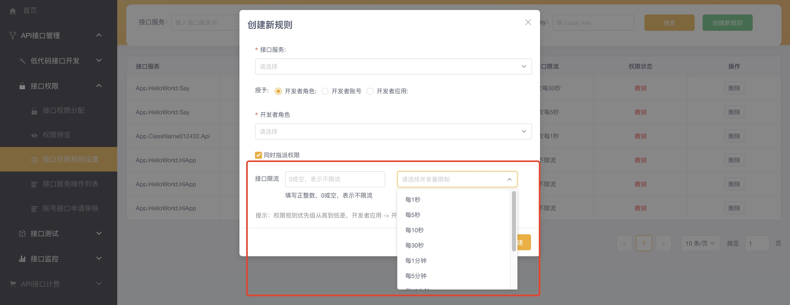

2. 【管理后台】- 【应用管理】- 【创建新应用/编辑】
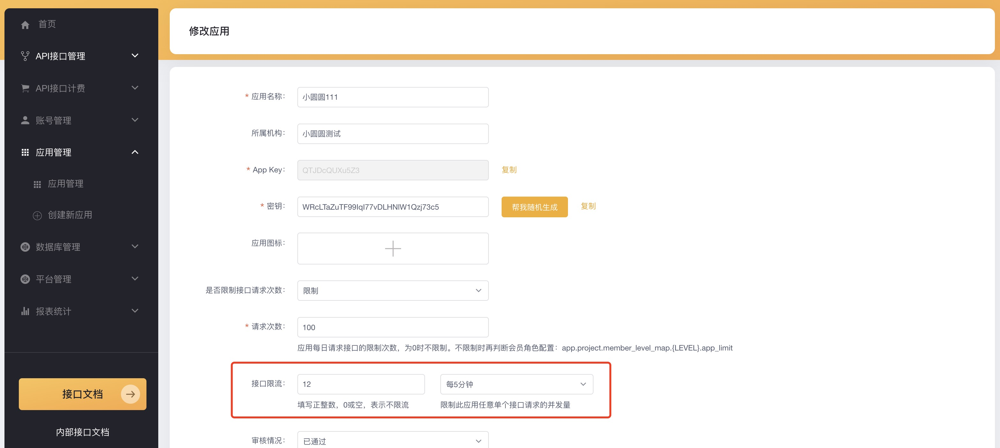


### 接口权限分配  

在 接口权限分配 界面，你可以查看全部的API接口列表，针对 开发者角色 快速进行接口的权限分配。  

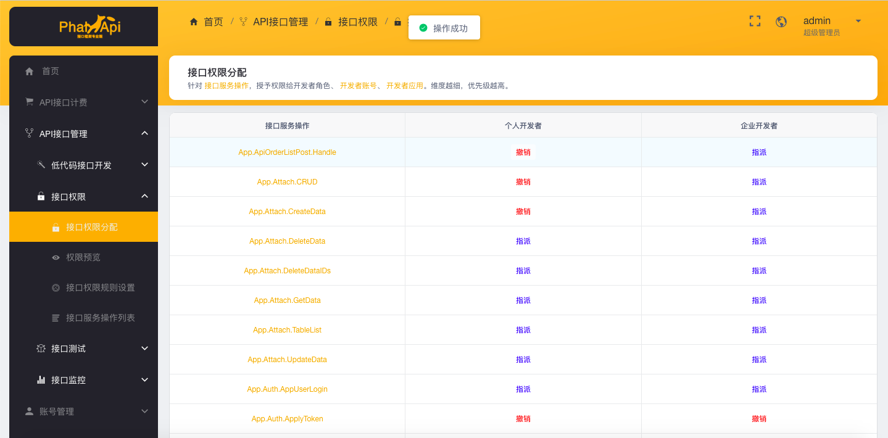  

> 温馨提示：开发者角色，支持PHP配置，可自定义添加、删除和修改开发者角色。  

### 权限预览  

为方便管理开发者应用的接口权限，你可以同步在管理后台，根据开发者应用的app_key，预览和查看当前应用的API接口权限。查询的接口权限结果和开发者在开放平台查看到的接口权限，一致。  

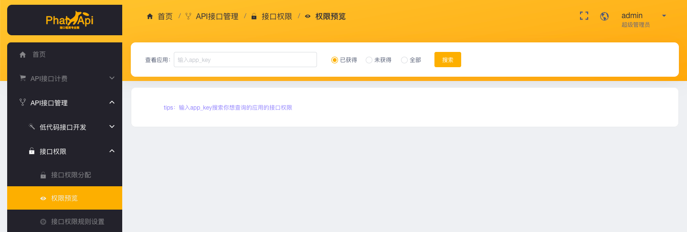  

### 接口权限规则设置

接口权限分配，可以基于现有的API接口给开发者角色（最大的维度）快速分配接口权限。  

如果需要更全面、更专业、更细致的接口权限分配，可以使用 接口权限规则设置。  

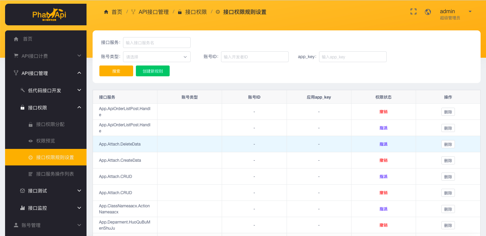  

通过创建新规则，你可以设定：  

 + 接口服务（选择现有的API接口）  
 + 授予（开发者角色/开发者账号/开发者应用）  
 + 再根据授予的维度，继续填写对应的信息  

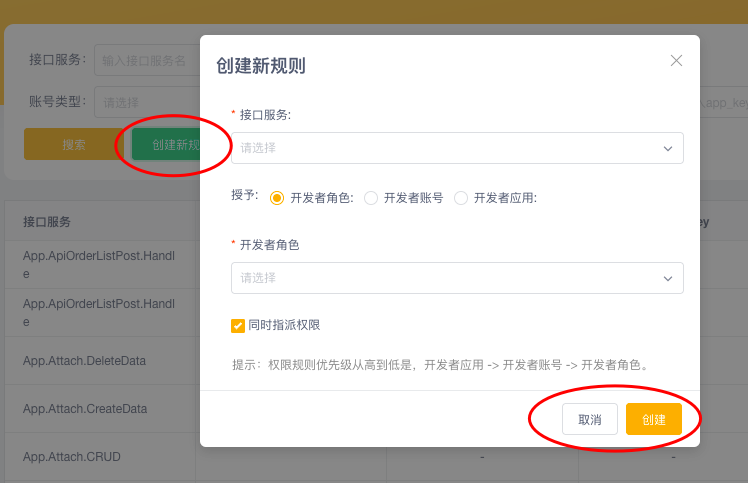  


如果规则已废弃，可以删除。  

> 温馨提示：不同维度的权限规则优先级是：开发者应用接口权限（最高） > 开发者账号接口权限 > 开发者角色接口权限（最低） > 全局默认的接口权限配置（PHP）。    

## 接口测试  

此子模块提供了：  

 + **接口测试：**  
 自动化接口测试，接口测试、全局access_token配置、搜索用例、添加新用例、运行用例、编辑查看用例、测试报告
添加新用例：添加接口新的测试用例，支持接口参数配置，接口结果验证规则配置，待测试接口选择等。  

 + **全局access_token配置：**  
 添加、删除和更新接口测试token，为配合接口自动化测试。  

### 接口测试概况

接口测试，主要是基于接口黑盒测试的方式，基于已经录入好的接口用例，进行自动化接口测试，并生成整体的测试报告和每个测试用例的详细报告。  

通过【运行全部测试用例】，你可以一键自动运行全部的测试用例。  

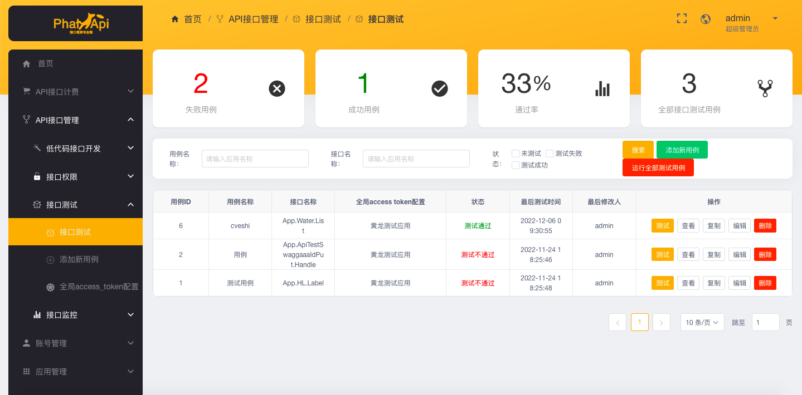  

关键的指标解释：  

 + 失败用例：指最后一次运行失败的用例个数；  
 + 成功用例：指最后一次运行成功的用例个数；  
 + 通过率：计算方式 = 成功用例 / 失败用例；  
 + 全部接口测试用例：当前用例总数量。  

### 添加新用例

通过【添加新用例】，可以添加一个新的接口测试用例。  

可以设置：  

 + 用例名称  
 + 接口路径（待测试的接口域名和路径）  
 + 接口名称（选择需要待测试的接口）  
 + access token 配置  
 + 接口参数（配置用于测试的接口参数）  
 + 期望接口返回结果（配置验证规则）  


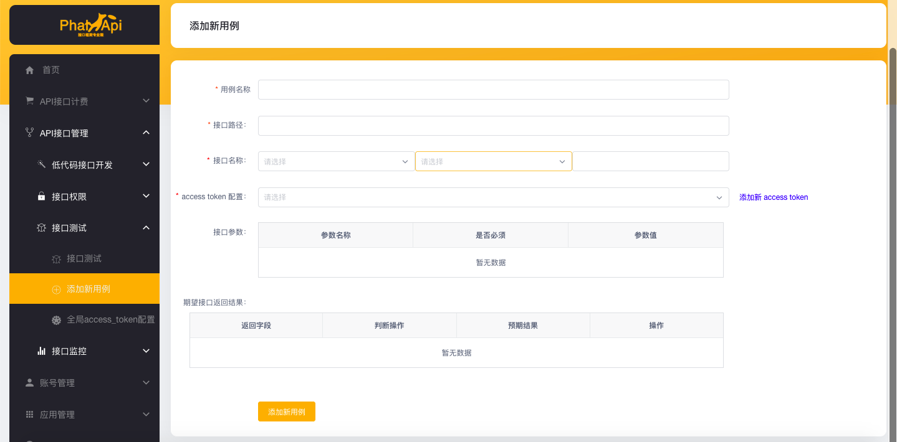  

对于重复的用例，你可以通过【复制】用例后，再快速修改和调整，减少用例的维护工作量。  

添加保存成功后，可以查看测试用例的详细情况和运行、测试通过率等。  

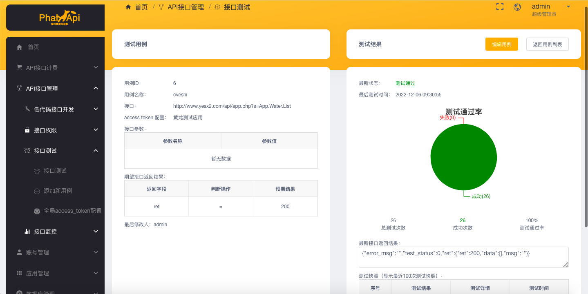  

例如，最新接口返回结果：  
```
{"error_msg":"","test_status":0,"ret":{"ret":200,"data":[],"msg":""}}
```  

又如，测试快照：  

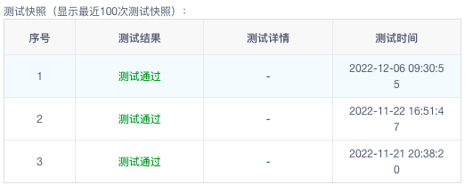  


### 全局access_token配置

在测试接口时，也需要完成接口的验证。因此需要配置全局的全局access_token。  

在添加测试用例时，你可以同步添加新的access_token。添加后，可以进行查看、维护和删除。  

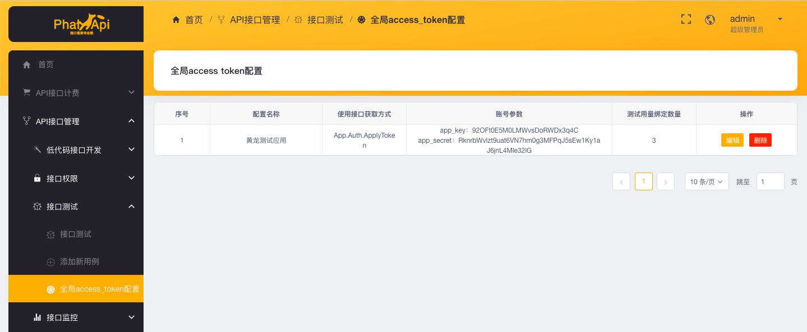  

具体配置的token表单，  

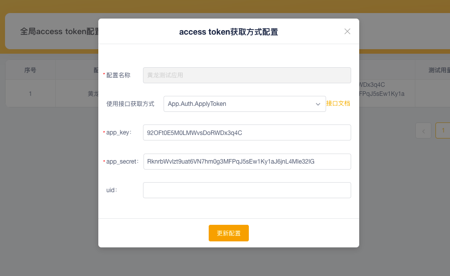  

> 温馨提示：请不要在正式环境进行接口用例的测试。如果用例未能正常运行，请检查测试用例的定时任务是否已配置。 

## 接口监控  

此子模块提供了：  

 + **实时接口流量统计：**  接口流量统计拆线叠加图，支持日期范围搜索，支持查看付费接口、试用接口、普通接口、扣费失败接口请求统计；   

 + **每日接口统计：**  
 可以查看API接口的响应时间和分析、监控；  

 + **接口访问日志：**  
 接口流量请求访问日志，支持接口或app_key搜索，付费接口类型的查询，接口参数查看。  

### 实时接口流量统计

可以实时查询最新的接口流量统计情况，包括：接口流量统计拆线叠加图，支持日期范围搜索，支持查看付费接口、试用接口、普通接口、扣费失败接口请求统计。  


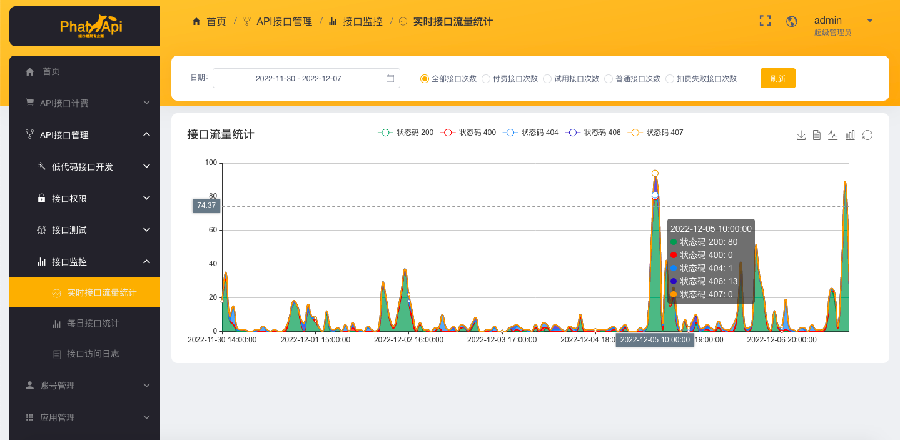  


关于接口类型的说明：  

 + 全部接口次数：全部  
 + 付费接口次数：需要付费并且扣费成功的接口请求次数  
 + 试用接口次数：免费试用接口的请求次数  
 + 普通接口次数：分配接口权限后即可调用的请求次数  
 + 扣费失败接口次数：需要付费但扣费失败的请求次数  

关于状态码的说明： 
 + 状态码200~299：表示接口正常响应  
 + 状态码400~499：表示客户端非法请求或请求错误  
 + 状态码500~599：表示服务端运行错误或内部异常  
 + 其他状态：由应用自定义或其他场景  

> 温馨提示：此接口状态码对应 ret 返回字段，不是HTTP/HTTPS的请求状态码。   

### 每日接口统计

可以查看API接口的响应时间和分析、监控。  

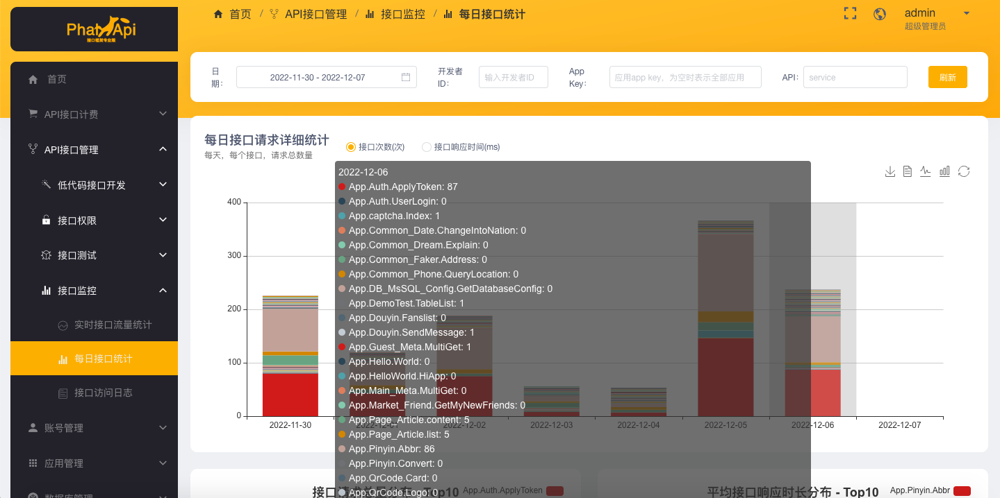  

关于接口核心的两个统计指标：接口请求次数和接口响应时间，分别对应有统计图表：接口请求总量分布、平均接口响应时长分布。  

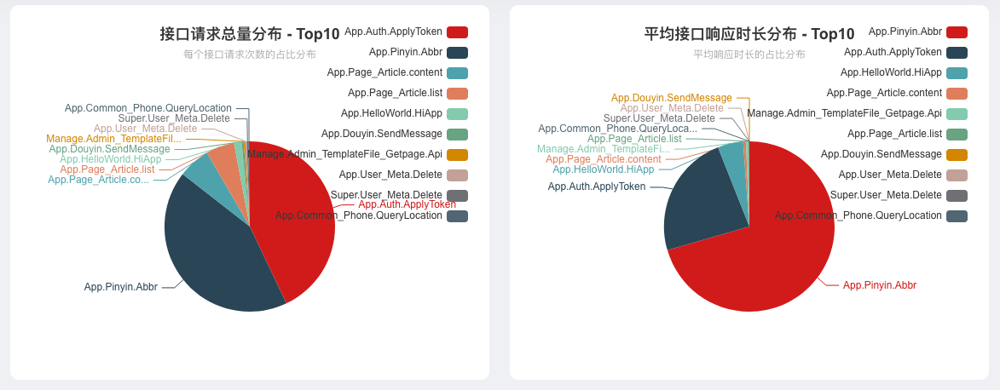  

同时，还有详细完整的表格统计数据。  


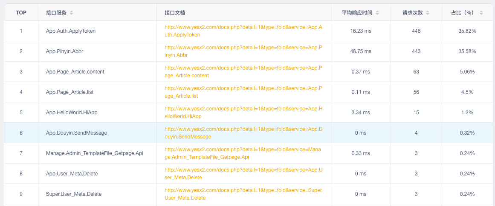  

统计指标说明：  

 + 平均响应时间：单个接口的平均响应时间，单位ms表示毫秒，s表示秒；  
 + 请求次数：在统计时间范围内的接口总请求次数；  
 + 占比（%）：接口请求次数占整体接口次数的占比。      

> 温馨提示：每日统计数据，会在次日凌晨定时统计。  


### 接口访问日志

在接口访问日志，可以实时查询原始的接口请求日志。支持：接口流量请求访问日志，支持接口或app_key搜索，付费接口类型的查询，接口参数查看。   

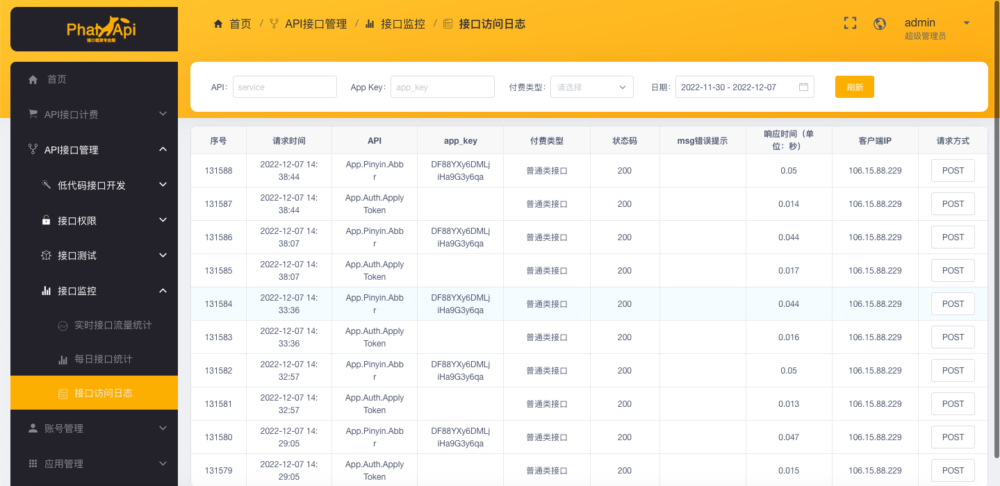  

在接口日记中，可以查看：  

 + 请求时间，例如：2022-12-07 14:38:44  
 + API，具体的接口服务名称，例如：App.Pinyin.Abbr   
 + app_key，具体调用的应用app_key  
 + 付费类型（付费类/试用类/普通类/扣费成功类/扣费失败类）  
 + 状态码  
 + msg错误提示  
 + 响应时间（单位：秒）  
 + 客户端IP  
 + 请求方式（GET/POST或其他）  
 + 请求参数（JSON格式）  

其中，接口请求参数以JSON格式存放，点击请求方式可以查看，例如：  

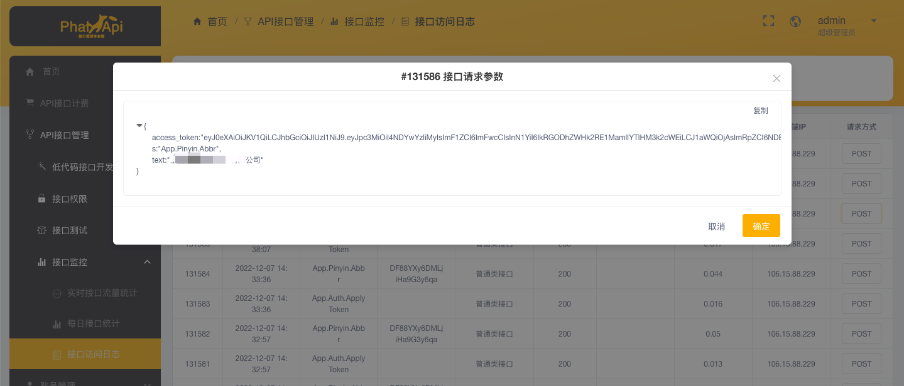  

> 温馨提示：接口日记全记录全部的接口请求日记，包括：OpenAPI开放接口、开放平台的接口、管理后台的接口，以及自定义和添加扩展的新命名空间下的接口。  

# 账号管理

## 账号列表 
管理和查看全部账号，包括管理员、开发者和会员的账号，进行账号的管理，例如修改密码、修改资料、创建账号。  

针对每个账号，有以下重要的操作：  

 + 编辑账号：修改账号信息；  
 + 禁用：禁用后，此账号不能登录开放平台，如果是管理员账号禁用，则不能再登录管理后台；  
 + 模拟登录：可以在不需要登录密码的情况下，模拟登录开发者账号进入开放平台，方便后台排查和解决客户的问题；  
 + 用户轨迹：查看此账号在开放平台和管理后台操作下所调用的API接口；  
 + 删除：彻底删除账号。  

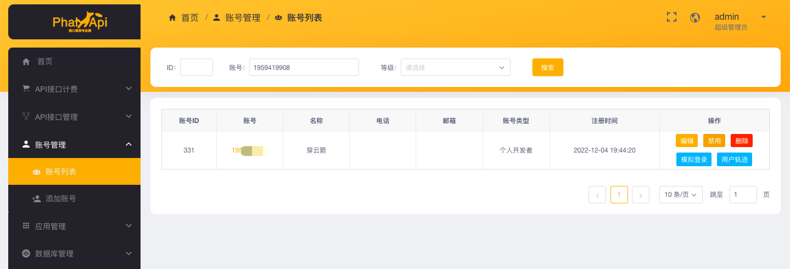  

## 添加账号

添加新账号，可以设置：  

 + 开发者类型（普通会员/开发者账号/管理员/超级管理员）  
 + 账号：登录账号  
 + 账号密码：登录密码  
 + 账号昵称  
 + 电话  
 + 邮箱  
 + 头像  


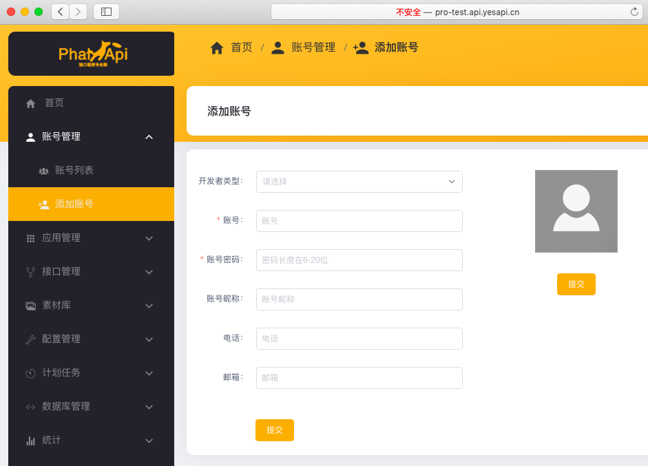  

## 编辑账号和修改密码

编辑账号时，可以进行后台密码修改。但无法修改超级管理员的密码。同时，管理员可修改普通会员密码；超级管理员可修改管理员和普通会员密码。  

如果有绑定和开放微信授权登录，还可以查看账号所绑定的微信的OpenID。  

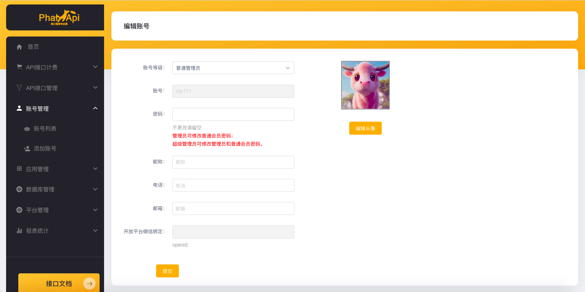  


# 应用管理

## 应用管理

可以对客户端应用进行管理，如审核开发者应用、查看应用信息、限制应用接口调用次数、禁用或恢复等。  

在应用列表，可以查看以下信息：  

 + 应用图标
 + 应用名称
 + 今日接口次数
 + 接口限制次数（每天）
 + 应用AppKey
 + 有效日期（为空时表示不限制）  
 + 应用状态（正常使用/注销/禁用）  
 + 审核状态（待审核/已通过/未通过） 
 + 申请所属机构   
 + 开发者账号  

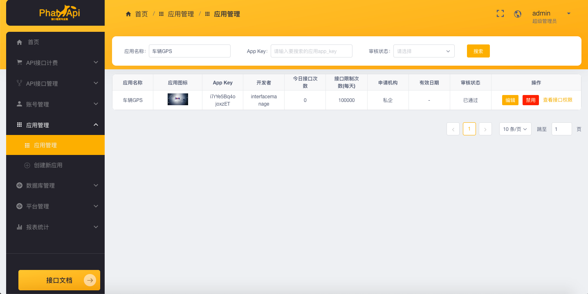  

针对开发者应用，有以下几个重要操作：  

 + 审核通过/审核失败（针对新申请的应用）  
 + 编辑应用：修改应用的资料和配置  
 + 禁用：应用禁用后，不可用调用API接口  
 + 查看接口权限：预览此应用当前的API接口权限  

> 温馨提示：默认注册的新开发者账号，为降低新开发者使用的门槛，系统会自动分配一个应用并且审核状态为已通过。如果不需要创建新应用或者默认新应用审核状态不通过，可调整PHP配置文件。   

## 创建新应用  

在管理后台，也可以人工手动添加一个新应用，并绑定到指定的任意开发者账号。  

添加新应用时，可以设置：  

 + 应用名称  
 + App Key（系统随机生成，可以手动指定，创建后不可修改，全局唯一）  
 + 密钥```app_secret```（系统随机生成，可以手动指定，创建后可重置）  
 + 应用图标  
 + 是否限制接口请求次数（不限制/限制，限制时需要额外设置每日接口请求上限次数）  
 + 账号ID（绑定的开发者账号ID）  


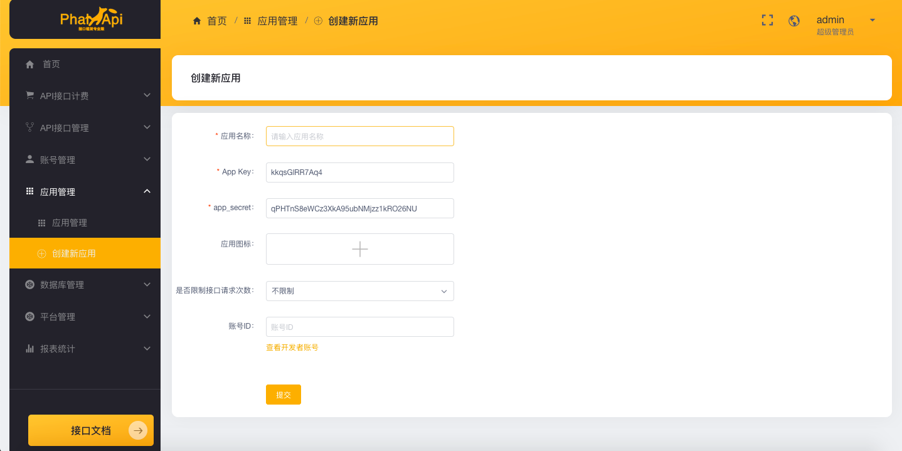  

## 修改新应用  

修改应用时，除了上述添加应用时的资料，还可以设置：  

 + 审核情况（待审核/已通过/未通过）  
 + 申请说明（由开发者填写，同步给前台展示）  
 + IP白名单（多个IP请使用英文逗号分割，为空时不限制开放接口的请求IP。优先判断全局配置：app.project.allow_ips）   
 + 有效日期（不设置时不限制，设置后超过有效日期后应用无法请求接口）  


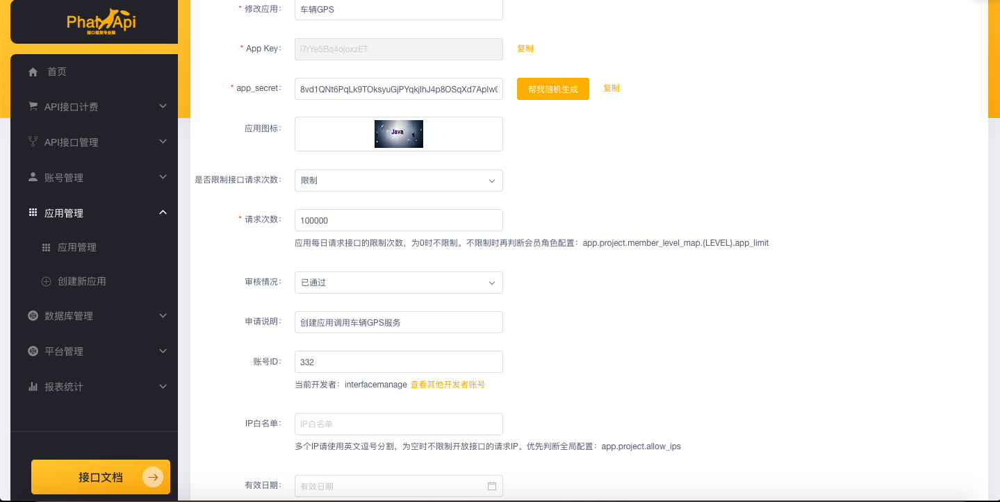  

# 数据库管理

此模块主要提供了：  

 + **数据库配置管理：**   
 支持MySQL、SQL Server等动态数据库源管理和配置、使用，DI数据库服务使用延时初始化，保证数据库连接性能 、测试数据库连接等；  

 + **存储过程管理：**  
 支持存储过程的创建、管理和在线测试，以及结合接口进行低代码开发；  

 + **数据库统计：**  
 数据库总大小、数据大小、索引大小、丙图、数据库表统计；  

 + **数据库实时进程：**  
 实时进程列表。  

下面分别依次展开介绍。  

## 动态数据库配置管理

可以查看全部动态配置的数据库连接信息，进行编辑和删除等操作和管理。  

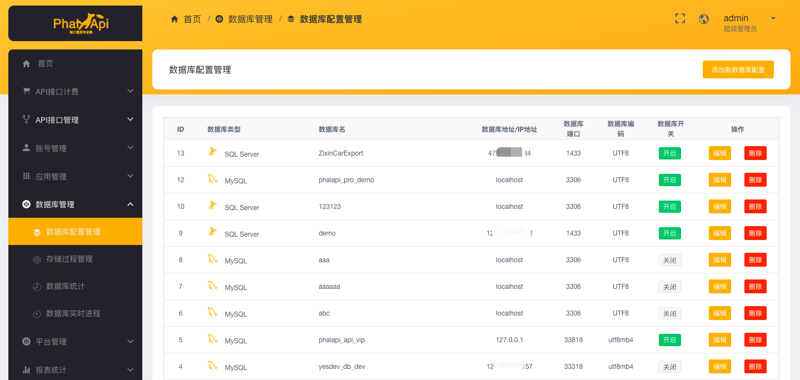  

### 添加新数据库配置  

添加新的数据库配置时，可以录入：  

 + 数据库开关（开启/关闭，关闭后不可使用）  
 + 数据库类型（MySQL/SQL Server/后续支持更多数据库类型）  
 + 数据库地址/IP地址  
 + 数据库端口  
 + 数据库账号  
 + 数据库密码  
 + 数据库名  
 + 数据库编码（UTF8/GBK/其他）  
 + 数据库表前缀（可以为空）  
 + 表主键字段名（默认为：id）  
 + 数据库 DI 服务名称（为空时由系统自动生成）  

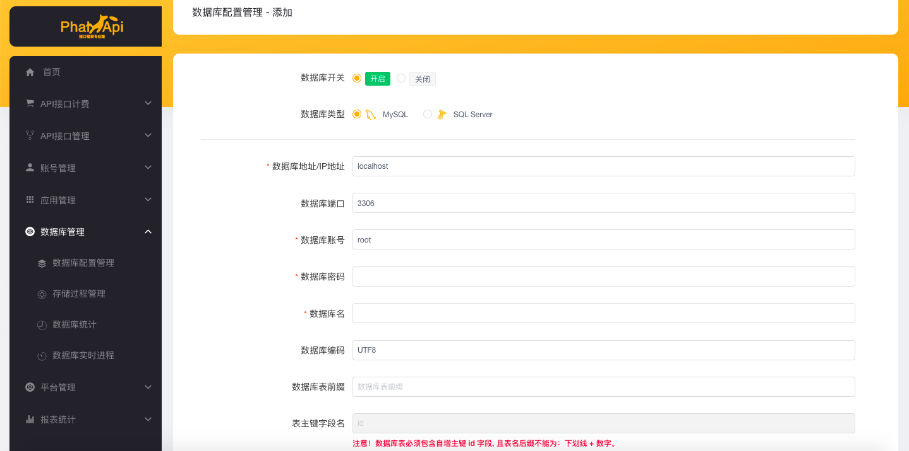  

> 特别注意，为统一数据库设计，主键必须统一有自增的主键id。  


### 测试数据库连接

保存数据库配置后，可以进行当场的数据库连接测试。  

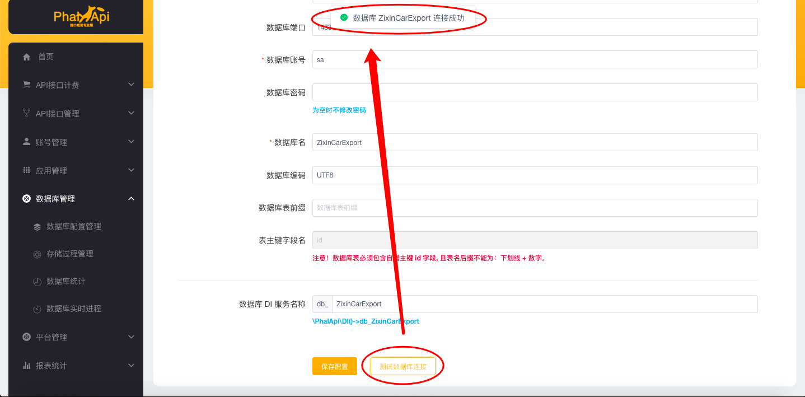  

如果连接失败，会提示错误。  

> 温馨提示：请确保你的服务器，已经成功安装并开启以下PHP扩展：pdo_mysql、pdo_sqlsrv、pdo_sqlite等。  


## 存储过程管理  

此章节，已经在【4.2 数据库存储过程】有详细介绍，在此不再赘述。  

## 数据库统计  


可以统计数据库容量，可视化直观的统计。可以切换到动态的数据库，和默认的系统数据库。  

统计指标有：  
 + 数据库总大小
 + 数据大小  
 + 索引大小  

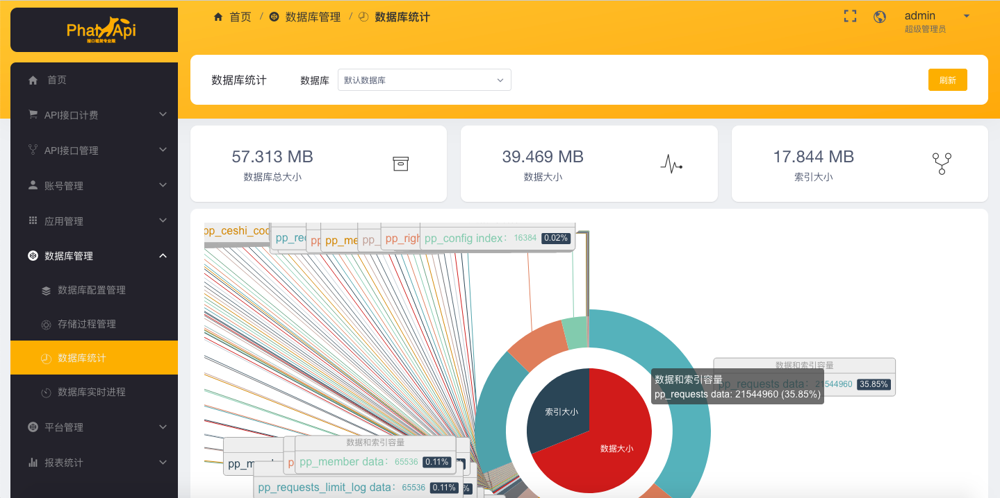  

以及每个数据库表的情况。  

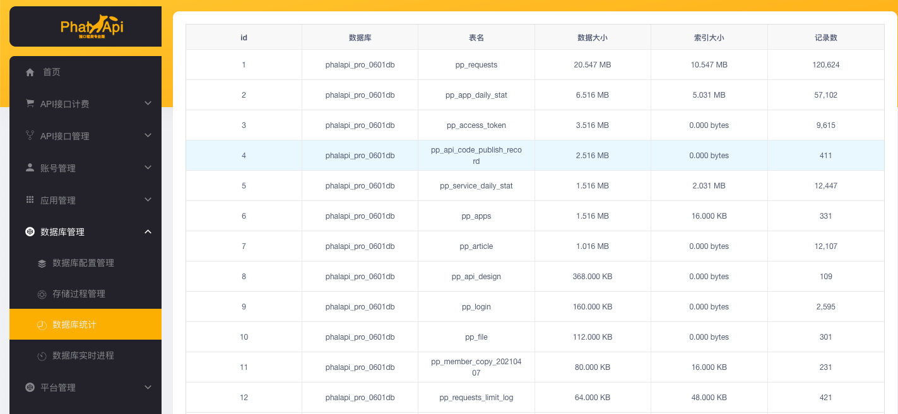  


## 数据库实时进程  


还可以查看实时数据库进程，方便知道当前有哪些查询和操作。  

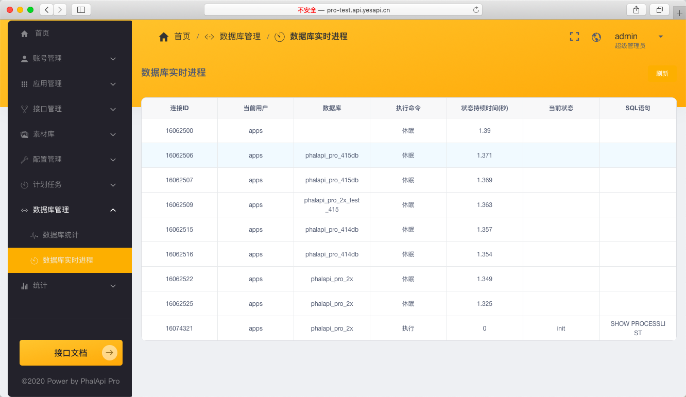  


# 平台管理

为了配合开放平台的日常管理，其他所需要用到的功能，会归到【平台管理】此模块。  

主要有：  

 + 素材库  
 + 接口计划任务  
 + 配置管理  
 + 工单管理  
 + 信息中心  
 + 权限控制  

随着系统的升级，后续会扩展更多常用的平台管理能力。  

## 素材库

对上传的图片、文档进行管理（下图仅作演示测试，如有侵权敬请告知）： 

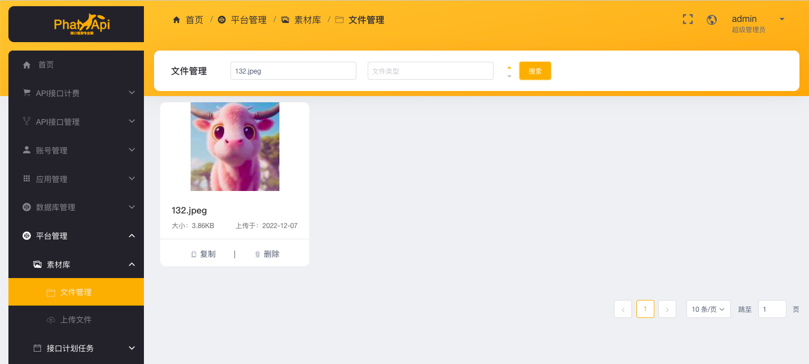   

> 温馨提示：上传的图片文件，既可以存到本地服务器，也可以上传到阿里云OSS。通过修改PHP配置文件，可以进行切换。切换后不影响旧的文件。也可以扩展自己的存储方式。  


## 接口计划任务
定时计划任务，需要添加crontab配置，启动后台任务。  

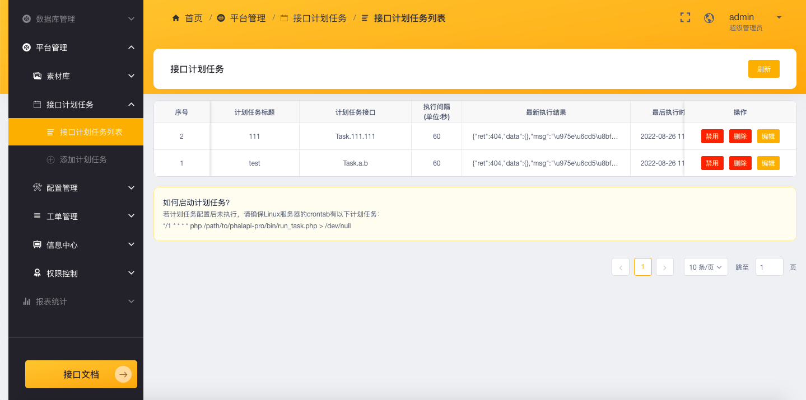  

通过crontab -e，添加以下计划任务：  

```bash
# PhalApi Pro 计划任务
*/1 * * * * php /path/to/phalapi-pro/bin/run_task.php > /dev/null
```

> 温馨提示：计划任务的接口应统一放到```Task```命名空间下，关于计划任务更多介绍，可参考文档【3.6 接口计划任务】。    

## 配置管理

在配置管理，你可以：查配置列表、配置编辑、配置删除、配置搜索。  

添加配置后，可通过API接口向开发者进行配置的读取（只读不改），或给内部使用。 

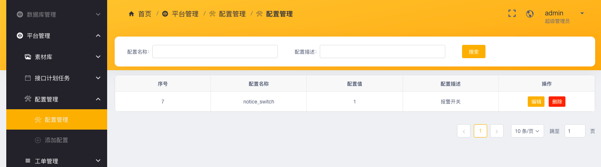   


### 添加新配置  

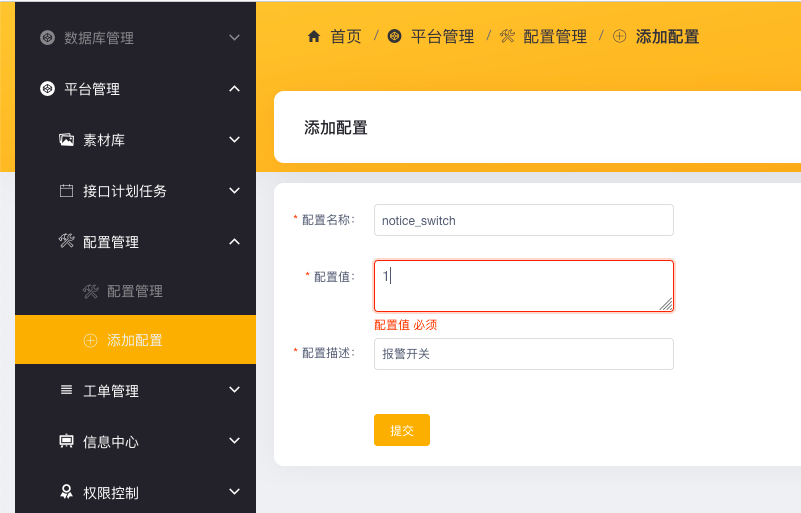  

### 前台API接口读取配置  

在前台，开发者可以通过接口```App.Config.GetConfig```读取配置。  

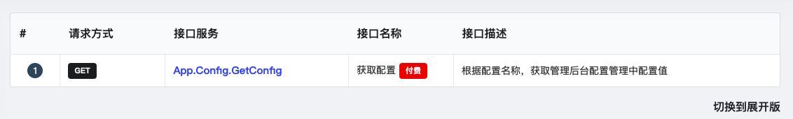  

## 工单管理 

在工单管理，你可以查看、回复和处理开发者提交的工单。包括：  

 + 工单列表：工单列表、工单过滤、工单回复和处理、工单详情查看  
 + 工单处理：回复处理工单  

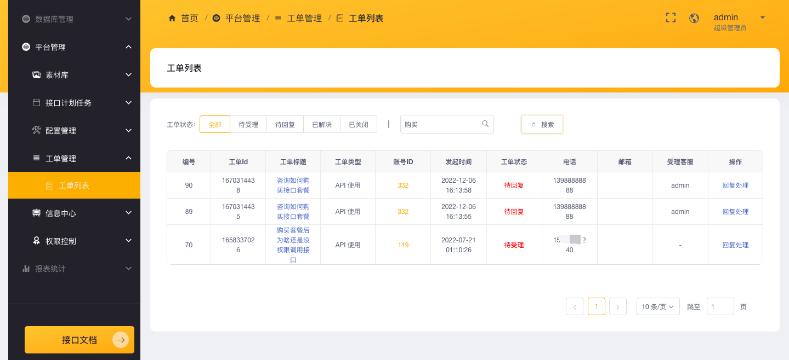  

### 回复工单  

点击工单详情，可以进行查看和回复。  

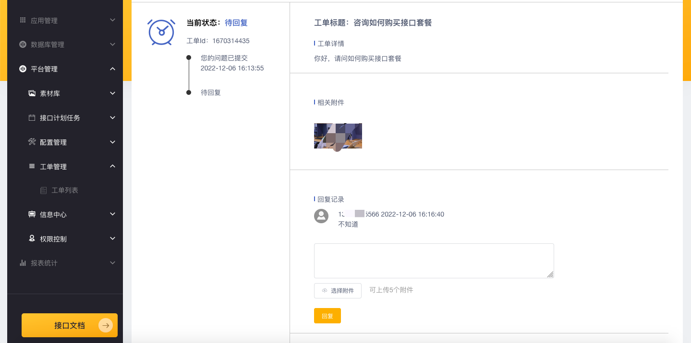  

### 新工单群通知  

在PHP配置文件```./config/chatgroup.php```可以配置接收工单通知的企业微信群或钉钉群机器人。  

其配置例如：  

```php
<?php
    return array(
        //企业微信机器人配置
        'qYWeixinGroupBot'=>[
            'qyweixin_webhook'=>'https://qyapi.weixin.qq.com/cgi-bin/webhook/send?key=679f72f5-0f85-4fd4-aae8-6dcf7423ff4b',
            'qyweixin_secret'=>'',
        ],
        //钉钉机器人配置
        'dingDingGroupBot'=>[
            'dingbot_webhook'=>'https://oapi.dingtalk.com/robot/send?access_token=4d7a79e1ad273ba147fbca998c6ee2942287150e36f614a71a3cf3abbf281fa9',
            'dingbot_secret'=>'SECa2653ea9a65d5d81e8daf87ed103005fe9c1f685bd64a3943b03001176c3f009',
        ],
    );
```


企业微信群通知效果类似：  

  

钉钉各通知的效果类似：  

  

## 信息中心 

信息中心，主要是可以在管理后台发布文章信息，并且在前台进行展示。  

此模块提供了：  

 + **文章列表：**  
 文章的列表展示，检索，前台访问、编辑和删除等操作；  

 + **发布新文章：**  
 支持管理后台可视化编辑发布文章，设置文章标题、文章摘要、文章关键词、封面、内容、查看权限（游客/会员/隐藏/下架）、排序、发布时间等信息。  


### 文章列表

在文章列表，可以对文章进行检索，也可以进行以下重要操作：  

 + 前台访问  
 + 编辑文章  
 + 删除文章（如果需要隐藏文章，推荐优先使用：下架）  
 + 取消置顶/文章置顶  

在文章列表，可查看以下文章信息： 

 + 文章封面  
 + 文章标题 
 + 文章摘要  
 + 查看权限  
 + 阅读次数（前台访问次数）  
 + 置顶  
 + 排序（从大到小）  
 + 发布时间  


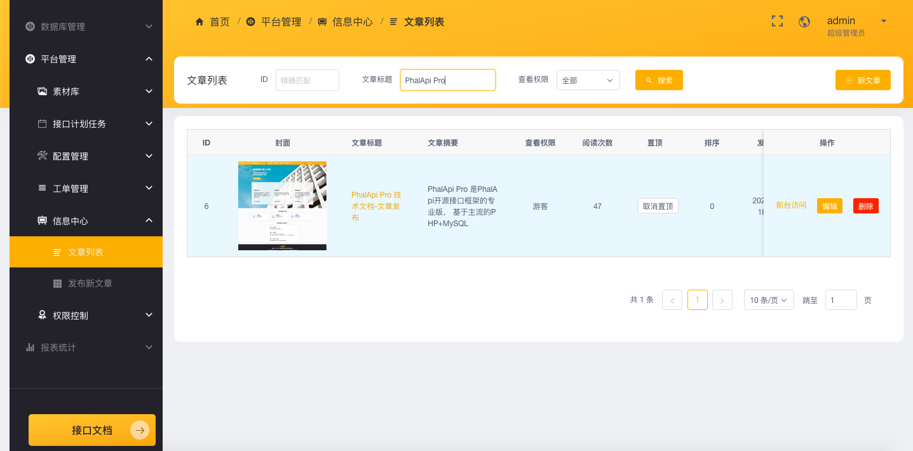  

### 发布新文章

进入 发布新文章，可以编辑和发布新的文章。  

以下是文章发布需要填写的字段及说明：  
 
 + 文章标题（必填，并对应SEO的标题部分） 
 + 文章封面（前台展示会自动伸缩） 
 + 文章关键词（对应SEO的keywords，多个用英文逗号分割，利于SEO优化）
 + 文章摘要（对应SEO的description）  
 + 查看权限（游客/开发者/隐藏/下架）  
 + 置顶（是否文章置顶）  
 + 排序（从大到小，默认0，整数）  
 + 发布时间（时间为未来时，需要到点才会展示） 
 + 文章内容（支持富文本编辑）   

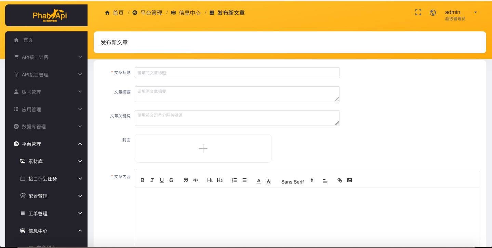  

> 温馨提示：发布时间为未来时，需要到点才会展示。即：支持提前录入文章，到指定发布时间时信息中心列表才会展示。但可以通过文章详情页进行访问，方便提前预览文章内容和排版。   

关于查看权限的说明：  

查看权限|信息中心列表展示|文章详情页访问  
---|---|---
游客|前台列表展示|任何人，都可以查看文章详情  
开发者|前台列表展示|开发者登录开放平台后，方可查看文章详情  
隐藏|前台列表不展示|任何人，都可以访问文章详情  
下架|前台列表不展示|任何人，不可访问文章详情  

### 前台文章列表展示和访问查看  

文章发布后，游客可以在前台的【信息中心】进行查看。  

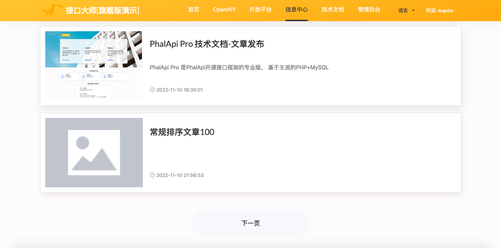  

点击查看文章详情。  

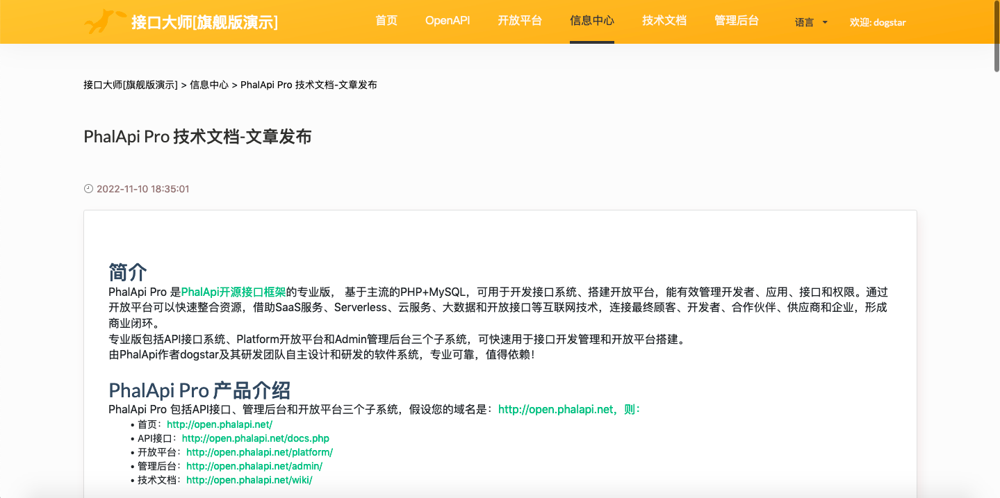  


> 温馨提示：信息中心的文章、在线接口文档、和技术文档的区别是什么？  

文档类型|由谁编写|阅读对象|保存方式  
---|---|---|---  
信息中心的文章|管理员|游客和平台的开发者用户|富文本、数据库  
在线接口文档|系统|开发者|PHP源代码  
技术文档|PhalApi Pro研发团队，或采购后自行修改|内部研发团队或开发者|基于markdown格式  


## 权限控制  

此模块主要提供了：  

 + **管理后台权限分配：**  
 Admin管理后台的权限分配、管理员角色等级、添加/删除新菜单操作、权限分配与取消；  

 + **开放平台权限分配：**  
 Platform开放平台的权限分配、管理员角色等级、添加/删除新菜单操作、权限分配与取消。  

### 管理后台权限分配 

点击【权限】-【管理后台权限分配】，可针对管理后台的功能操作，向管理员进行权限分配。  

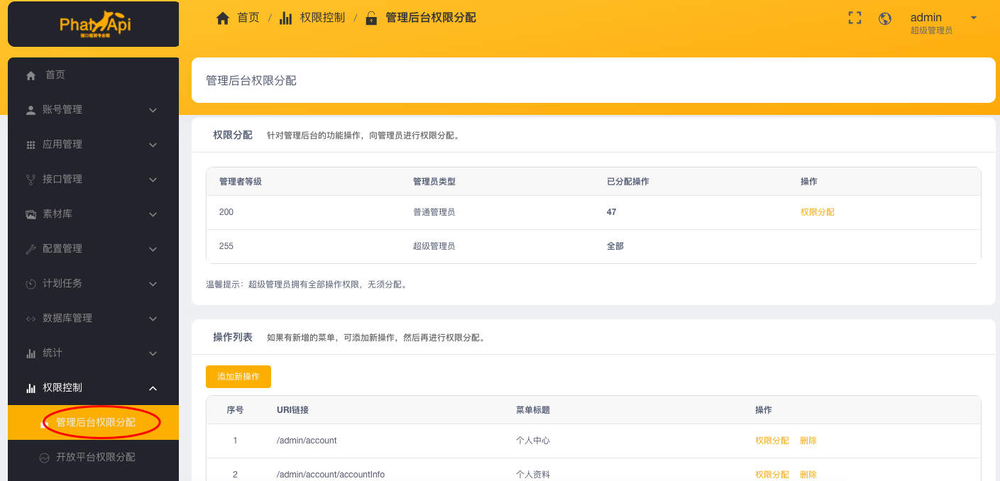  

> 温馨提示：只有超级管理员，才有权限进行权限分配。  

添加新操作，如果有新增的菜单，可添加新操作，然后再进行权限分配。  

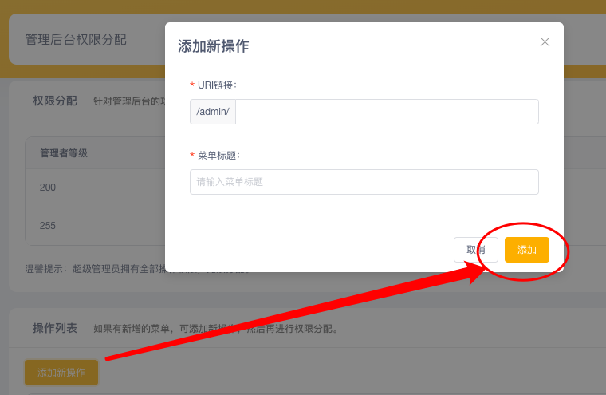  

其中，URI链接为管理后台的页面路径，不需要域名，不需要```/admin/```，对应页面后面的路径。  

针对管理员角色分配管理后台菜单操作权限：  

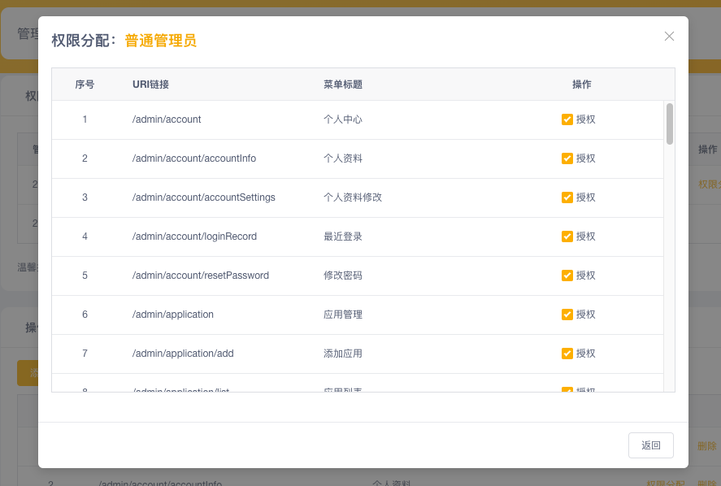  

> 温馨提示：超级管理员拥有全部管理后台的权限，无须分配。  

也可以针对个别的账号ID分配管理后台菜单权限：  

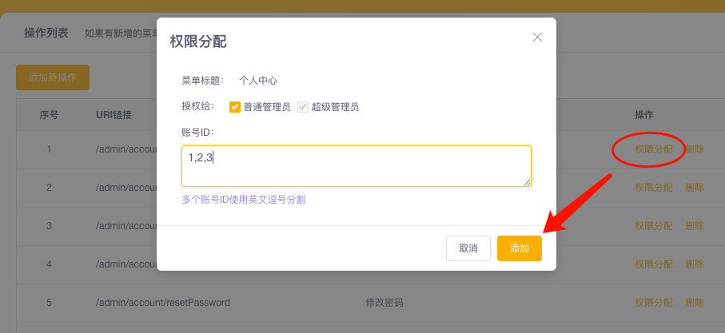  

### 开放平台权限分配 

可以针对开放平台操作，向开发者进行权限分配。  

> 温馨提示：只有超级管理员，才有权限进行权限分配。   

添加新操作，如果有新增的菜单，可添加新操作，然后再进行权限分配。  

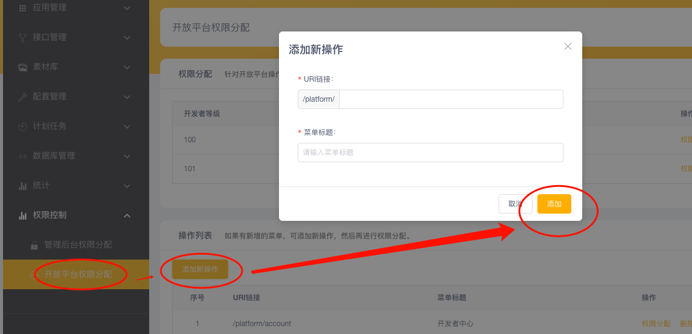  


针对开发者角色分配开放平台的菜单操作权限：  

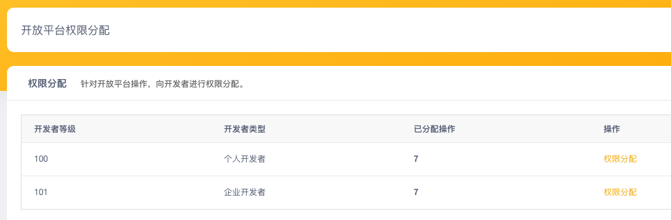  

> 温馨提示：管理员（包括普通管理员和超级管理员，以及新增的自定义管理员）拥有全部开放平台的权限，无须分配。  

也可以针对个别开发者账号ID，单独分配开放平台的操作权限。  

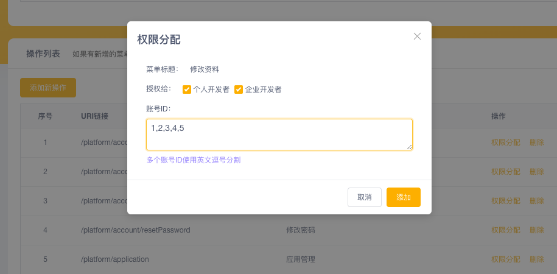  


# 报表统计 

报表统计，是针对开放平台，提供了核心的业务指标统计。此模块主要提供了：  

 + **应用历史统计：**  
 统计每个应用每日的汇总数据，支持查看付费接口、试用接口、普通接口、扣费失败接口请求统计；  

 + **每日注册统计：**  
 每日在开放平台账号注册人数统计及同比上个月，拆线图，支持日期范围搜索，统计表格；  

 + **每日登录统计：**  
 每日在开放平台及管理后台账号登录成功与失败的统计及同比上个月，拆线图，支持日期范围搜索，统计表格。  

## 应用历史统计

统计每个应用每日的汇总数据，支持查看付费接口、试用接口、普通接口、扣费失败接口请求统计。支持时间范围的统计，依赖于每日定时统计的报表数据。  

相关统计口径，前文有介绍，不再赘述。  

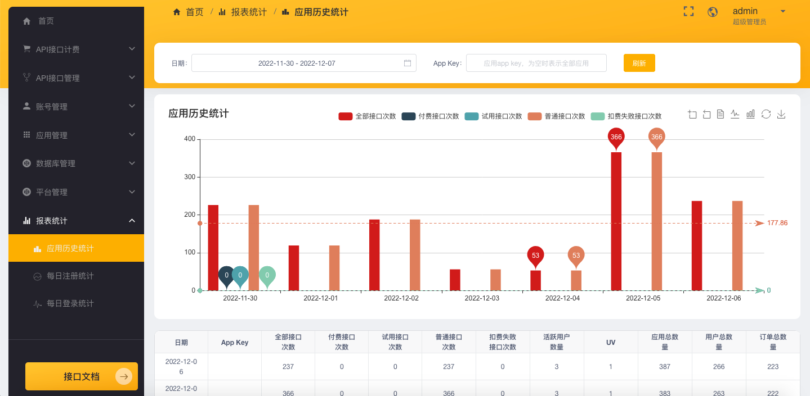  


## 每日注册统计

每日在开放平台账号注册人数统计及同比上个月，拆线图，支持日期范围搜索，统计表格。  

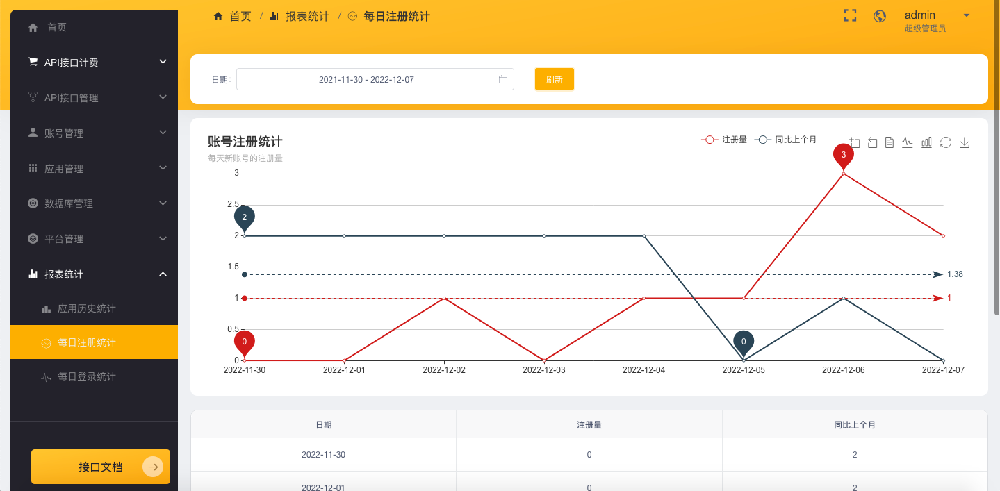  

默认查询最近7天，可以同比上个月。  


## 每日登录统计

每日在开放平台及管理后台账号登录成功与失败的统计及同比上个月，拆线图，支持日期范围搜索，统计表格。   

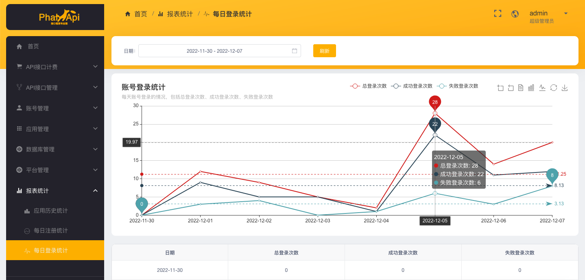  

统计字段口径说明：  

 + 总登录次数：计算公式 = 成功登录次数 + 失败登录次数  
 + 成功登录次数：成功登录开放平台、管理后台和开放平台，以及通过OpenAPI登录的成功人次；    
 + 失败登录次数：登录开放平台、管理后台和开放平台，以及通过OpenAPI登录的失败人次。    

> 温馨提示：如果在二次开发过程中，使用了```\Base\Domain\Login::addLoginLog('登录账号', \Base\Domain\Login::LOGIN_STATUS_SUCCESS);```，也会纳入图表统计。  

# 我的

作为管理员个人的管理功能，有：  

 + 个人资料（查看和个人资料修改）  
 + 最近登录（查看本账号最近登录时间和登录IP）  
 + 修改密码  
 + 退出登录  
 + 查看内部接口文档（为方便开发，管理员可以查看开放平台和管理后台和计划任务的API在线接口文档） 

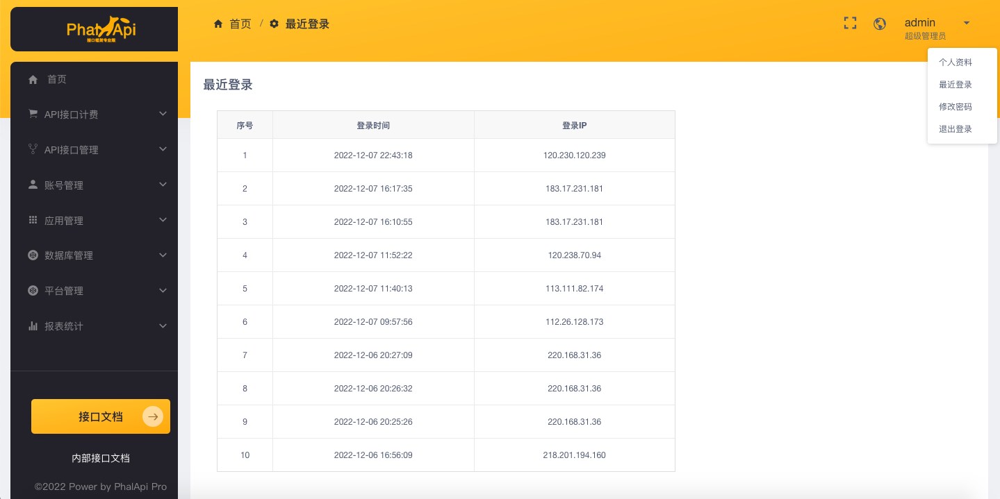  

# 英文版和国际版

你可以切换语言到英文版，也可以添加其他翻译语言。  

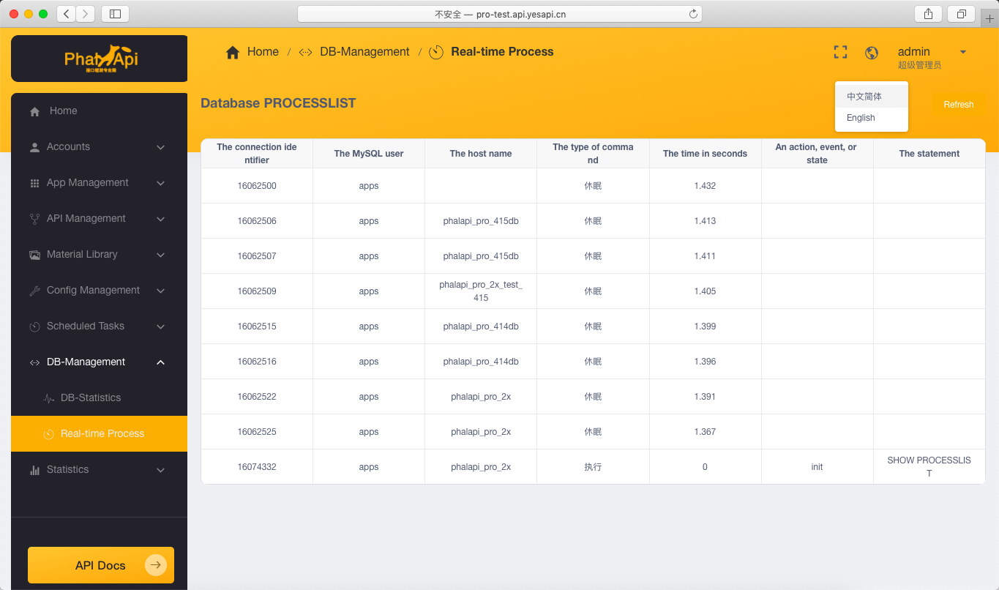  


