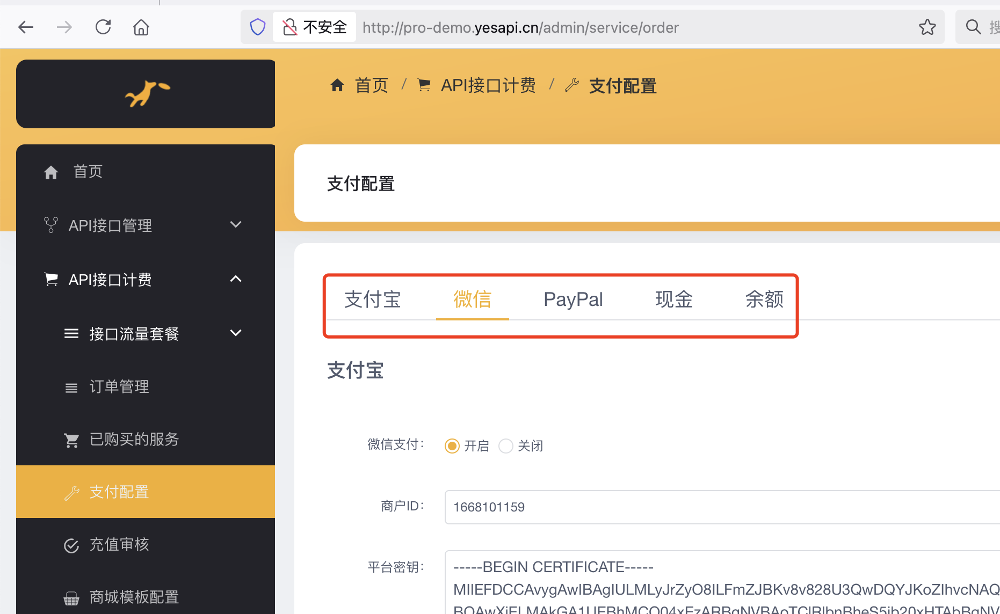

# 版本更新日记

> 温馨提示：如需补差价升级，或延长免费升级时间，可[联系我们](http://pro.phalapi.net/)。  
> 

## PhalApi专业版 5.9 （2025-04）
  + 1、新增：统一将微信支付配置，纳入管理后台进行可视化配置。当前支付方式有：支付宝、微信支付、Paypal、现金支付、余额支付。    
    


## PhalApi专业版 5.8 （2024-04）

  + 1、新增接口限流功能，可对单接口或者单应用配置接口限流
    
    
  + 2、管理后台低代码编辑器新增快速JSON参数解析
    
  + 3、接口文档的raw JSON数据，去掉service和access_token默认参数
 
## PhalApi专业版 5.7 （2024-03）
  + 1、新增支持Oracle、PostgreSQL、OpenGauss三种数据库适配
    
  + 2、新增支付方式 - 微信支付
    
  + 3、修复已知bug

## PhalApi专业版 5.6（2024-01）
  + 1、新增接口文档【尝试获取token】功能（用于登录开放平台的用户快速获取token进行接口调试）
    
  + 2、新增开发者可自行设置token令牌的过期时间功能
    
  + 3、新增开发者可自行管理申请的token令牌功能
    
  + 4、新增开发者可自行重置应用密钥功能
    
  + 5、新增开发者可用余额购买接口套餐功能
    
  + 6、新增管理后台账号管理用户token令牌统计数据
    

## PhalApi专业版 5.5（2023-10）
  + 1、管理后台接口编辑器全新改版（分步创建接口；网关类型接口新增上游请求地址和上游请求方式并直接生成到代码编辑器中）
    
  + 2、管理后台账号接口申请审核（开发者申请接口权限的审核） 
    
  + 3、开放平台新增账号接口申请（开发者未获得的接口可提交权限申请） 
     
## PhalApi专业版 5.4 (2023-08)
  + 1、新增消息队列功能（支持多种入队列的方式，支持PHP源代码接口入列、支持命令行脚本入列、支持异构系统调用API入列）
     
  + 2、管理后台新增消息主题订阅功能（支持：平台消息主题的发布和管理、统计；开发者应用订阅消息的审核；以及推送记录查看和重新发送）  
      
  + 3、开放平台新增我的消息订阅（支持平台消息主题的订阅申请、以及快速接入使用接收数据推送）  
    

## PhalApi专业版 5.3 (2023-07)
  + 1、低代码编辑器支持自定义提示词条
   
  + 2、低代码编辑器支持在线调试
   
  + 3、低代码编辑器支持简易模式和完整模式的双边代码同步
   
   
  + 4、管理后台接口开发新增接口分组
   
  + 5、解决接口编辑无法回显数据库bug
   
  + 6、解决选择数据库，但是生成代码没有选中数据库的bug
   

## PhalApi专业版 5.2 (2023-06)
  + 1、开放平台新增充值功能
     
  + 2、开放平台新增接口请求日志查看和导出功能
   
  + 3、管理后台接口计费套餐新增接口单价模式
   
  + 4、管理后台全新的首页
   
  + 5、管理后台新增充值审核功能，可以对账号进行后台充值
  
  
  + 6、管理后台低代码开发新增一条SQL生成接口
  
  + 7、管理后台低代码编辑器新增代码提示器（PHP代码编辑器、SQL编辑器、存储过程编辑器）
  
  
  

## PhalApi专业版 5.1 (2023-05)
 + 1、新增API服务平台模板
   
 + 2、接口请求日记，扩展新增表字段，记录本次接口执行的sql条数
 + 3、接口文档详情页，新增快速复制
    
 + 4、接口大师-在线接口详情页，接口测试，除表单外，继续支持json等参数传递请求，方便使用
     

## PhalApi专业版 5.0 (2023-01)
 + 1、全面升级为 v5.0 新版本，支持接口商城模板及自定义前台模板；  
   
 + 2、接口商城模板支持：商城首页配置、接口商城首页、接口分类展示、接口详情页等同步升级；  
   
   

 + 3、新增支持：全局配置、站点配置和接口图标库配置，提供更灵活的平台网站运营能力；  
   

 + 4、接口支持上传接口图标，以及从接口图标库快速选择；  
   

## PhalApi专业版 3.17.0（2022-11）
 + 1、数据库集成与存储过程，支持MySQL、SQL Server  
   
 + 2、新增：信息中心-文章信息发布，支持后台发布文章，前台访问查看，可以设置不同的访问类型  
   
 + 3、接口低代码开发，支持：简易代码模式/完整代码模式，简化接口开发  
  
 + 4、提供智能转换编码的字符串工具类```src/base/Common/StringUtil.php```，解决数据库中文乱码的问题  
 + 5、同步升级内核：PhalApi Kernal v2.18.9  
 + 6、编写新文档：《4.2 数据库存储过程》等  
 + 7、修复一些已知的问题和缺陷  
 
## PhalApi专业版 3.16.0（2022-10）
 + 1、MQ异步队列-Gearman集成支持（服务+示例+脚本+文档）  
 + 2、开放平台新用户注册时有带手机号或邮箱，进行群通知（钉钉或企业微信）  
   
 + 3、动态数据库配置连接，支持sql server
   
 + 4、管理后台首页，接口流量统计，统一排除掉 Admin.* 和 Platform.* 接口流量，只统计OpenAPI接口流量  
 + 5、内置企业微信和钉钉群机器人消息发送的内部API接口  
 + 6、新应用创建时，发送群通知，提醒管理员及时审核  
   
 + 7、一些已知的bugfixed，例如：开放平台注册时密码优化、前端页面logo全部可配置化、用ip+端口打开开放平台会提示token不通过、买套餐有效期更新了状态仍显示已过期、安装程序支持表前缀配置等  
 + 8、新增文档：MQ异步队列、钉钉宜搭远程API对接、docker 基础配置部署、docker 接口大师部署等

## PhalApi专业版 3.15.0 (2022-08)
 + 1、增加接口监控，可以追加查看API接口的响应时间和分析、监控
   
 + 2、首页UI微调整，更加简洁、美观、大气
   
 + 3、创建接口时，支持快速创建表
 + 4、Admin管理后台菜单结构调整，更加清晰明了
 + 5、新建接口时，也支持【保存并发布】
 + 6、修复 接口大师v3.13无法可视化安装，提示数据库错误
 + 7、在接口请求日记追加接口参数的记录，可选，默认开启
   
 + 8、接口计划任务更新：1）定时修复运行异常的任务；2）执行中的任务时间最大调整成10分钟；3）修复开启调试模式下接口结果写入过长问题；4）调整更新使用说明；5）去掉不必要的MQ分表；6）result字段改成text类型；   
   
 + 9、提供手动执行接口的命令方式，提供另一种直接、准确执行接口计划任务的原始方式，并更新技术文档 [3.6 接口计划任务](./2x-task.md)。  
 + 10、开发者用户新建工单后，支持通知推送（企业微信+钉钉）  
   

## PhalApi专业版 3.13.0 (2022-07)
 + 支持MySQL动态数据库源管理和配置、使用，DI数据库服务使用延时初始化，保证数据库连接性能
   
 + 完善管理后台的菜单权限配置
 + 开放平台接口权限状态同步与优化
   
 + 支持API接口版本```@version```配置和显示、以及请求方式的文档显示优化
   
 + 支持swaager批量导入，支持多个接口的勾选、覆盖导入和快速发布
   
 + 管理后台统计增加表格合计
 + api开发工具优化，生成数据API接口时可以选择数据库和数据库表
   
 + 一些已知的bugfixed和产品优化
   
   

## PhalApi专业版 3.12.0 (2022-06)
 + 1、生成数据接口Api时，支持驼峰类名与蛇形命名法的数据库表名关联
 + 2、低代码接口开发，文案调整，以及生成HTTP网关接口API时，微调生成的接口模板
 + 3、接口低代码开发，支持GET/POST方法设置
 + 4、接口套餐创建后，不可更改套餐类型
 + 5、支持Oracle数据库连接

## PhalApi专业版 3.11.0 (2022-05)
 + 1、管理后台添加：每日接口统计，支持日期范围、开发者账号、AppKey、API接口的搜索
 

 + 2、开放平台添加：每日接口统计，支持日期范围、API接口、AppKey的搜索（开发者只能查看自己账号的统计）


 + 3、管理后台应用管理，添加查看应用接口权限的快捷入口
 + 4、在线接口文档支持GET/POST的同步显示，包括接口文档详情页和列表页文档
 + 5、同步升级到phalapi/kernal 2.17.3 最新版本，新增.env文件
 + 6、应用编辑页面增加一个一键复制app_key和密钥的入口
 + 7、权限预览页面可以筛选全部、已获得和未获得权限的接口，默认筛选已获得权限的接口

## PhalApi专业版 3.10.1 (2022-04)
+ 1、修复管理后台修改密码不支持特殊符号
+ 2、修复开放平台修改密码不支持特殊符号
+ 3、修复管理后台修改应用时有效时间错误问题

## PhalApi专业版 3.10.0 (2022-04)
 + 1、注册时支持同时创建默认应用，可配置
 + 2、接口生成支持API对接模式 
 + 3、支持后台套餐的搜索账号和接口
 + 4、后台-订单管理，支持订单搜索和订单经营统计
 + 5、管理后台-工单列表，优化显示
 + 6、token支持唯一性的判断和配置
 + 7、修复接口编辑，保存并发布时使用最新手工编写的代码
 + 8、一些已知的bugfixed和细节优化

## PhalApi专业版 3.9.1 (2022-02)
+ 1、修复套餐有效日期修改后显示问题

## PhalApi专业版 3.9.0 (2022-02)
 + 1、开发者应用，支持设置有效日期，到期后API接口自动失效
 + 2、开放平台，首页统计优化，支持查看付费接口、试用接口、普通接口、扣费失败接口请求统计
 + 3、开放平台，开发者应用，支持显示可用应用数量，以及每个应用的接口统计及上限次数
 + 4、管理后台，接口统计、应用统计、访问日志升级优化，同时支持查看付费接口、试用接口、普通接口、扣费失败接口请求统计
 + 5、API生成的强化版，可视化接口设计升级，支持API接口的在线开发、查看发布记录、接口文档隐藏等，以及更多接口低代码开发能力
 + 6、一些已知的bugfixed和细节优化

## PhalApi专业版 3.8.1（2021-12）
 + 1、一些已知的bugfixed和细节优化

## PhalApi专业版 3.8.0（2021-07）
+ 1、开放平台，支持微信扫码授权登录和快速注册，并提供第三方登录开发文档
+ 2、商城，支持组合套餐，可以在后台配置组合套餐，前台进行展示、下单和购买
+ 3、5合1首页UI优化改版
+ 4、开放平台注册页优化升级改版
+ 5、开放平台，订单和支付优化，缩短支付成功的轮询时间和调整支付状态提示语  
+ 6、技术文档新增：《2.5 接口商城》、《3.9 新增接口目录教程》、《4.0 第三方登录接入流程》、《5.1 开发者App客户端使用手册》、《5.2 接口大师开发者App源码说明》、《6.1 PHP接口自动化测试》
+ 7、支持单独购买：【自动化单元测试包-PHPUnit】、【开发者App源代码-Flutter】 

## PhalApi专业版 3.7.4（2021-07）
+ 1、管理后台交互优化，重新打包编译

## PhalApi专业版 3.7.3（2021-06）
+ 1、阿里云OSS优化，支持自定义域名，和指定目录前缀
+ 2、一些客户反馈的问题Bugfixed  

## PhalApi专业版 3.7.0 (2021-05)
+ 1、Admin账号列表搜索优化
+ 2、Admin支持模拟登录，以及用户轨迹查看
+ 3、Admin首页添加常用的统计报表，增强运营能力
+ 4、Admin新增应用统计页面
+ 5、Platform开放平台调整，支持模拟登录


## PhalApi专业版 3.6.1 (2021-04)
+ 1、修改接口文档权限显示问题

## PhalApi专业版 3.6.0 (2021-03)
+ 1、一些已知bugfixed

## PhalApi专业版 3.5.0 (2021-02)
+ 1、添加开放平台首页，包含数据统计及仪表盘
+ 2、添加工单模块，方便处理开发者/客户提交的问题
+ 3、一些Bugfixed

## PhalApi专业版 3.4.2（2021-01）
+ 1、一些Bugfixed

## PhalApi专业版（含商城） 3.4.1（2020-12）
+ 1、商城套餐和接口流量套餐
+ 2、前台下单购买和在线支付

## PhalApi专业版 2.5.0 （2021-03）
+ 1、一些已知bugfixed  

## PhalApi专业版 2.4.0 （2020-09-14号）
+ 1、增加开放接口的IP白名单限制，同时支持全局和单个应用的IP白名单配置
+ 2、针对每日接口请求的次数限制，添加会员角色全局配置```app.project.member_level_map.{LEVEL}.app_limit```，优先级低于具体应用的配置
+ 3、一些bugfixed

## PhalApi专业版 2.3.1（2020-07-15）
+ 1、集成小白接口
+ 2、补充redis更多原生接口
+ 3、一些bugfixed
+ 4、管理后台Admin全面翻译

## PhalApi专业版 2.3.0（2020-07-14）
+ 1、新增微信快捷联登接口，支持微信公众号快捷登录和微信小程序快捷登录
+ 2、修复可视化接口设计需要点击两次才能保存到PHP文件
+ 3、文件上传支持上传到阿里云OSS对象存储
+ 4、客户端的接口参数支持加密传输，即encrypt_data参数，以及./config/phalapi_pro_rsa.*配置文件
+ 5、优化在线接口文档详情页加载速度，将代码高亮的js和css文件本地化
+ 6、添加开放接口：拼音、IP地址、条形码、二维码、文件上传等常用接口
+ 7、增加Redis服务模块接口
+ 8、一些已知的其他bugfixed

## PhalApi专业版 2.2.0 （2020-06-01）
+ 1、管理后台登录页面，添加验证码，支持开关配置
+ 2、开放平台登录和注册页面，添加验证码，支持开关配置
+ 3、管理后台添加运动管理后台以及开放平台的操作权限控制
+ 4、管理后台新增权限控制
+ 5、开放平台新增权限控制

## PhalApi专业版 2.1.1（2020-05-06）

+ 1、bugfixed：管理后台接口统计刷新后数据叠加问题
+ 2、bugfixed：开放平台登录页标题显示undefined问题
+ 3、bugfixed：PHP的```$isStopWhenNoApp```变量未定义  

## PhalApi专业版 2.1（2020-05-02）

 + 1、添加API命名空间配置```app.project.open_api_namespaces```，支持多个开放命名空间
 + 2、UI升级改版，包括但不限于：管理后台、开放平台、在线接口文档
 + 3、i18n国际化翻译支持，包括但不限于：管理后台、开放平台、在线接口文档、API接口
 + 4、修复开放平台登录页面首次无法显示注册入口的问题
 + 5、bugfixed：上传图片路径支持端口  
 + 6、bugfixed：分配接口权限时无法选择开发者账号类型
 + 7、bugfixed：修复接口请求响应时间为0的bug
 + 8、提供第二套接口验签方案，更自由的方案选择和切换  
 
## PhalApi专业版 2.0 全新版本（2020-04-15）

全新的Pro 2.0版本，搭建云平台的最佳选择。

 + 1、修改底层架构，向开放平台方向调整
 + 2、增加Platform开放平台项目，为开发者提供使用的系统
 + 3、API接口系统大调整，分为四大系列：开放接口、平台接口、后台接口、任务接口
 + 4、Admin管理后台大升级，全面支持开放平台、开发者账号管理、应用审核、接口权限分配
 + 5、移除开源版运营平台，专注商业平台的研发
 + 6、重写技术文档
 + 7、增加首页
 + 8、增加数据库管理
 + 9、修复1.x版本一些已知bug

## PhalApi专业版 1.40 （2020-04-05）

 + 1、同步升级开源PhalApi 2.13版本
 + 2、可视化接口设计，支持生成数据接口API代码以及创建MySQL数据库表

## PhalApi专业版 1.32（2020-03-04）

+ 1、同步升级开源PhalApi 2.12.2

## PhalApi专业版 1.30（2020-03-04）

 + 1、添加接口可视化设计模块
 + 2、添加接口测试模块，一体化测试体系
 + 3、添加虎皮椒支付
 + 4、在线接口文档的静态资源从不稳定的CDN调整为本地
 + 5、上传目录路径支持可配置
 + 6、添加计划任务模块
 + 7、修复一些已知的bug
 
## PhalApi专业版 1.20（2020-01-20）
主要更新如下：

 + 管理后台：添加应用管理、用户管理，配置管理，技术专区，支持分页查询和模糊搜索
 + PhalApi专业版接口进行内部优化和升级，并在Model基类添加获取分页列表的方法getList()
 + PhalApi Pro添加配置、日志查询等新接口
 + 全面兼容PHP 5.3和MySQL 5.5版本
 + 页面优化
 + 一些已知的bug fixed及优化

## PhalApi专业版 1.10（2020-01-10）

PhalApi专业版第一个正式版本，致力通过智慧编程，让接口开发更有趣！当前专业版为4合1，拥有比开源版本更强大且实用的贴心设计和功能。

 + 基于PhalApi，研发并上线接口系统（分前台接口和后台接口两大系列）
 + 基于iView-Admin，研发并上线管理后台
 + 基于docsify和markdown，编写完整开发手册
 + 采用MySQL数据库，设计并初始化数据库
 + 可视化安装向导
 + 精美在线接口文档，支持查看密码设置

