# PhalApi专业版安装教程

## 运行环境
PhalApi专业版的运行环境要求如下： 

 + 操作系统：Windows/Linux/Mac/Ubuntu/CentOS/docker等
 + 开发语言：PHP 7 及以上版本，**推荐使用PHP 7.4**
 + 数据库：MySQL 5.7 及以上版本
 + Web服务器：Nginx/Apache/IIS
 + 正式服务器配置最低配置：CPU 1核 / 内存 2G / 硬盘空间40G / 带宽1M

> 官方推荐使用：CentOS 7 + PHP 7.4 + MySQL 5.7 + Nginx  

## 安装视频

[点击查看安装视频(mp4格式)](http://pro.phalapi.net/phalapi-pro-install.mp4)，若不能在线播放，请先下载到本地再打开视频。   

如果浏览器无法播放，请换一个浏览器，或下载mp4到本地播放。或参考以下安装说明。  

安装步骤如下。

## 第1步、上传并解压

第1步、[购买授权](http://pro.yesapi.cn/index.php?r=site%2Forder)并获取源项目源代码后，将项目源代码包上传到服务器，并进行解压。假设解压目录为：/www/phalapi-pro。

### 专业版源代码目录
以专业版2.0为例，源代码压缩包解压后有：  
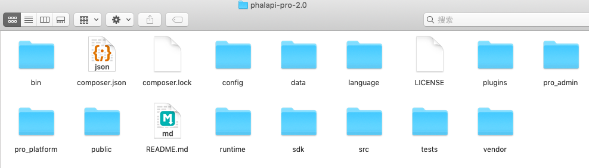  

其中，管理后台的源代码，基于vue，前后端分离。  
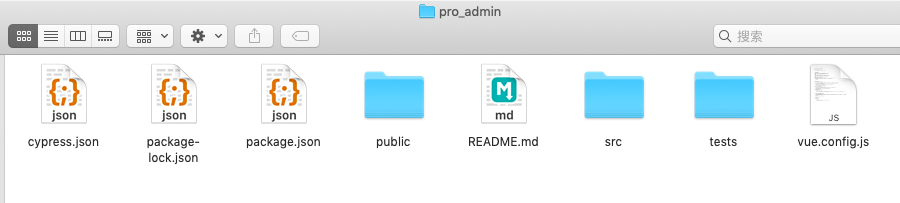  

另外，开放平台的源代码，也是基于vue，前后端分离。  
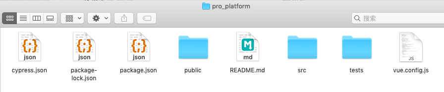  

> 温馨提示：标准版不含pro_admin和pro_platform前端源代码，旗舰版提供全部无加密源代码。  

## 第2步、配置Nginx/Apache/xampp/宝塔

第2步、进行Web服务器的配置。

### Nginx配置
如果使用的是Nginx，参考以下Nginx配置，配置好重启Nginx。
```
server
{
        listen 80;
        server_name open.phalapi.net;

        index index.html index.php;
        root /www/phalapi-pro/public;

        location ~ .*\.(php|php5)?$
        {
                # fastcgi_pass   127.0.0.1:9000;
                fastcgi_pass unix:/var/run/php-fpm/php-fpm.sock;
                fastcgi_index index.php;
                fastcgi_param SCRIPT_FILENAME $document_root$fastcgi_script_name;
                include fastcgi_params;
        }


        # 管理后台
        if (!-e $request_filename) {
            rewrite ^/admin/(.*) /admin/index.html;
        }
        # 开放平台
        if (!-e $request_filename) {
            rewrite ^/platform/(.*) /platform/index.html;
        }
        # 静态资源缓存
        location ~.*\.(js|css|html|png|jpg)$
        {
                expires    3d;
        }
        # 限制上传的PHP文件，都只能是下载，而非执行
        location ~* /uploads/.*\.(php|php5)?$
        {
        }
    
        access_log /var/log/nginx/open.phalapi.net.access.log;
        error_log /var/log/nginx/open.phalapi.net.error.log;
}
``` 

> 温馨提示：请把open.phalapi.net换成你自己的域名。  

### Apache配置
如果使用的是Apache，参考以下配置。目录结构： 

```
htdocs
├── phalapi-pro
└── .htaccess
```

.htaccess内容： 
```
<IfModule mod_rewrite.c>
    RewriteEngine on
    RewriteBase /
    
    RewriteCond %{REQUEST_FILENAME} !-f
    RewriteCond %{REQUEST_FILENAME} !-d
    
    RewriteCond %{REQUEST_URI} !^/phalapi-pro/public/
    RewriteCond ^/admin/(.*) /phalapi-pro/public/admin/index.html;
    RewriteCond ^/platform/(.*) /phalapi-pro/public/platform/index.html;
    RewriteRule ^(.*)$ /phalapi-pro/public/$1
    RewriteRule ^(/)?$ index.php [L]
</IfModule>
```
配置好后重启Apache。  

如果你是把网站根目录设置到```public```，httpd.conf中可以参考以下配置：  

```xml
<Directory "/path/to/phalapi-pro/public">
   Options Indexes FollowSymLinks MultiViews
    AllowOverride All
    Order allow,deny
    allow from all
</Directory>

```
配置好后重启Apache。   

同时，可以在```public```目录下再添加```.htaccess```文件，例如目录结构是：  


```
phalapi-pro
├── public
└── .htaccess
```

打开```.htaccess```文件，写入配置：  
```xml
<IfModule mod_rewrite.c>
    RewriteEngine on
    #RewriteBase /

    RewriteCond %{DOCUMENT_ROOT}%{REQUEST_FILENAME} !-d
    RewriteCond %{DOCUMENT_ROOT}%{REQUEST_FILENAME} !-f
    RewriteCond %{REQUEST_URI} !^/platform/js/(.*)
    RewriteCond %{REQUEST_URI} !^/platform/css/(.*)
    RewriteCond %{REQUEST_URI} !^/platform/fonts/(.*)
    RewriteCond %{REQUEST_URI} !^/platform/img/(.*)

    RewriteRule ^platform/(.*) platform/index.html [L]


    RewriteCond %{REQUEST_URI} !^/admin/js/(.*)
    RewriteCond %{REQUEST_URI} !^/admin/css/(.*)
    RewriteCond %{REQUEST_URI} !^/admin/fonts/(.*)
    RewriteCond %{REQUEST_URI} !^/admin/img/(.*)
    
    RewriteRule ^admin/(.*) admin/index.html [L]
</IfModule>
```
> 配置说明：主要是当文件不存在时，分别进行重定向，同时排除特定的静态资源文件。

此时，刷新Admin和Platform就不会再出现404问题。  

### xampp配置
如果本地使用的是xampp集成环境，可参考以下安装教程。  
> 假设xampp安装的目录是：D:\xampp。

首先，把项目压缩包复制到D:\xampp\htdocs，然后解压并把目录名称改为：phalapi-pro（目录名称可自行修改）。  
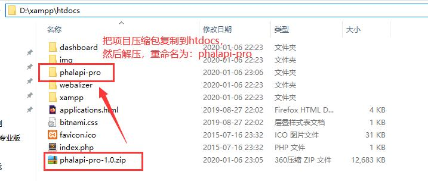  

配置域名，打开D:\xampp\apache\conf\extra\httpd-vhosts.conf配置文件，在最后添加：  
```
<VirtualHost *:80>
    DocumentRoot "D:\xampp\htdocs\phalapi-pro\public"
    ServerName open.phalapi.net
    ErrorLog "logs/open.phalapi.net-error.log"
    CustomLog "logs/open.phalapi.net-access.log" common
</VirtualHost>
```

> 域名open.phalapi.net，可自行修改。  

为Admin管理后台配置Rewrite规则，
修改..\xampp\apache\conf\httpd.conf ,在Apahce的配置文件httpd.conf中把  
```
#LoadModule rewrite_module modules/mod_rewrite.so
```
前的#去掉，修改为
```
LoadModule rewrite_module modules/mod_rewrite.so

<Directory />
    Options Indexes FollowSymLinks MultiViews
    AllowOverride All
    Order allow,deny
    allow from all
</Directory>

DocumentRoot "D:\xampp\htdocs\phalapi-pro\public"
<Directory "D:\xampp\htdocs\phalapi-pro\public">
    Options Indexes FollowSymLinks MultiViews
    AllowOverride All
    Order allow,deny
    allow from all
    
    RewriteEngine on
    RewriteBase /
    
    RewriteCond %{REQUEST_FILENAME} !-f
    RewriteCond %{REQUEST_FILENAME} !-d
    
    RewriteCond %{REQUEST_URI} !^/phalapi-pro/public/
    RewriteCond ^/admin/(.*) /phalapi-pro/public/admin/index.html;
    RewriteCond ^/platform/(.*) /phalapi-pro/public/platform/index.html;
    RewriteRule ^(.*)$ /phalapi-pro/public/$1
    RewriteRule ^(/)?$ index.php [L]
</Directory>
```


然后，配置本地host，打开C:\Windows\System32\drivers\etc\hosts文件，在最后添加：  
```
127.0.0.1 open.phalapi.net
```

> 如果提示hosts文件权限不足，可以使用Switch Hosts软件进行修改，或者参考[本地XAMPP虚拟域名配置（配合路由）](https://blog.csdn.net/qq_36652619/article/details/80295226)添加写入权限。  

最后，启动xampp里面的pache和MySQL，在浏览器访问安装向导：  
http://open.phalapi.net/install/


> xampp默认数据库账号是root，密码为空。  

### 宝塔配置

进入宝塔后，点击：【网站】-【添加站点】：   
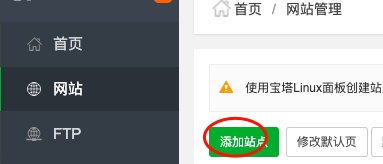  

在域名中输入自己的域名，例如：open.phalapi.net，然后点【提交】。  
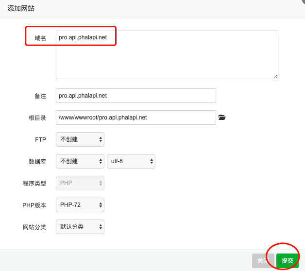

然后将项目压缩包（如phalapi-pro-1.0.zip）上传并解压到刚创建站点的根目录，例如：/www/wwwroot/open.phalapi.net。  
```
# cd /www/wwwroot/open.phalapi.net # 进入网站根目录
# unzip ./phalapi-pro-1.0.zip # 上传后解压
# mv ./phalapi-pro-1.0/* ./ # 把解压后的全部文件移到根目录
```
这时根目录的文件如下：  
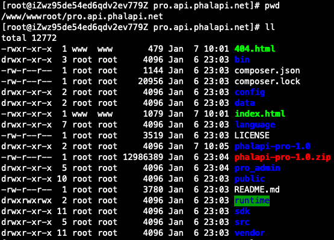

回到宝塔，修改open.phalapi.net站点的配置，在【网站目录】-【运行目录】下拉选择public目录，点击保存。  
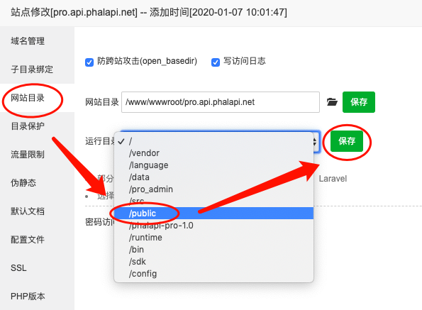

接着，在伪静态中，添加并保存：  
```
# 管理后台
if (!-e $request_filename) {
       rewrite ^/admin/(.*) /admin/index.html;
}
# 开放平台
if (!-e $request_filename) {
    rewrite ^/platform/(.*) /platform/index.html;
}
```
如图：  
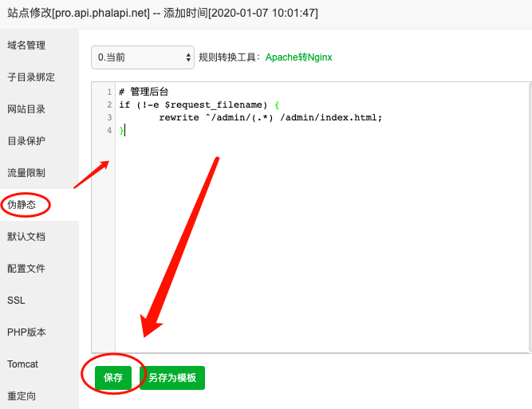

绑定域名后，即可访问，进入安装向导。

补充，如果宝塔使用的是Apache，可参考以下配置：  
```
<IfModule mod_rewrite.c>
RewriteEngine on
RewriteBase /

Rewritecond %{REQUEST_FILENAME} !-f
RewriteCond %{REQUEST_FILENAME} !-d

RewriteCond %{REQUEST_URI} ! ^/ phalapi-pro/ public/
Rewritecond ^ / admin/ ( .*) / phalapi-pro/public/admin/index.html;
Rewritecond ^/platform/ ( .*) /phalapi-pro/public/platform/index.html;
RewriteRule ^( .*)$ / phalapi-pro/public/$1
RewriteRule ^( / )?$ index.php[L]
</工fModule>

```

### IIS参考配置

为管理后台添加Rewirte规则，以便管理后台能正常访问。
```xml
<?xml version="1.0" encoding="UTF-8"?>
<configuration>
<system.webServer>
      <rewrite>
            <rules>
				 <rule name="Rewrite Rule 0">
					 <match url="^admin/(.*)" />
					 <action type="Rewrite" url="admin/index.html" />
					</rule>
					<rule name="Rewrite Rule 1">
					 <match url="^platform/(.*)" />
					 <action type="Rewrite" url="platform/index.html" />
				</rule>
            </rules>
        </rewrite>
        <defaultDocument>
            <files>
                <add value="index.php" />
            </files>
        </defaultDocument>
</system.webServer>
</configuration>
```


或在宝塔的ISS上使用以下 rewrite 规则：  
```
<rule name="Rewrite Rule 0">
 <match url="^admin/(.*)" />
 <action type="Rewrite" url="admin/index.html" />
</rule>
<rule name="Rewrite Rule 1">
 <match url="^platform/(.*)" />
 <action type="Rewrite" url="platform/index.html" />
</rule>
```

如果无法正常访问查看wiki技术文档，例如IIS出现 以下错误：  

```
HTTP 错误 404.3-Not Found
由于扩展配置问题而无法提供您请求的页面。如果该页面是脚本，请添加处理程序。如果应下载文件，请添加 MIME 映射.
```
需要在IIS管理器中，对网站IIS下MIME类型进行设置。  
添加文件扩展名为：```.md```  
添加MIME 类型为：```text/x-markdown```  

> 如果配置后，访问文档依然无法正常查看（例如重定向到首页），则推荐为文档单独配置一个站点。  


## 第3步、安装向导

> 安装地址：http://你的域名/install  

或者打开首页：```http://你的域名/```，点击进入安装向导。  


第3步、在安装之前，先手动执行以下脚本添加必要的文件和目录权限。  
```
$ ./bin/install_check.sh
start to check ...
check ok!
```
如果无法在Windows环境上执行此脚本，影响不大，可以在安装向导的引导下手动添加目录权限。

在浏览器访问（注意，域名需要更换成自己的域名或IP地址）：  
[http://open.phalapi.net/install/](http://open.phalapi.net/install/)  

进入安装向导后，同意安装。  
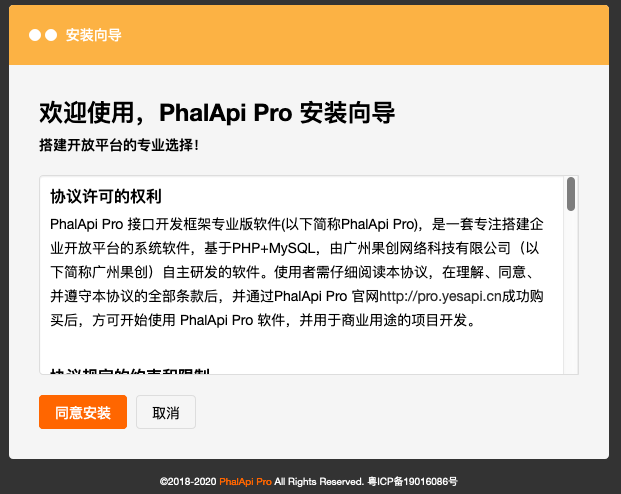

检测通过后，下一步。  
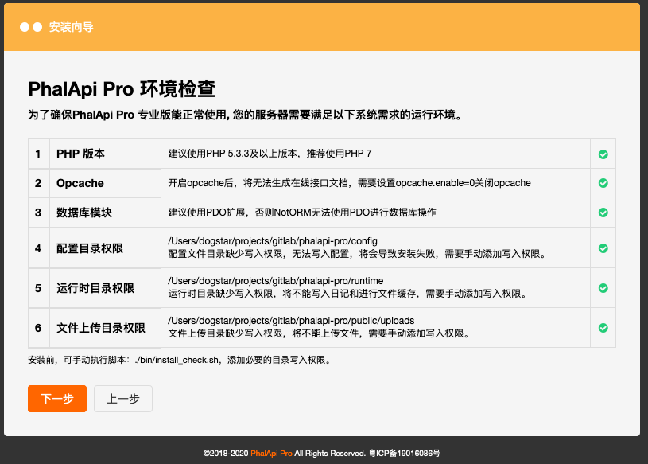

根据表单，填写数据库的相关配置，以及管理员的账号和密码。下一步。  

> 温馨提示：重点修改你的项目名称、你的数据库连接、管理员登录密码。  

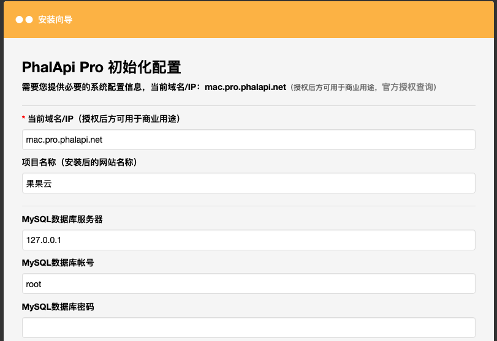


安装成功。  
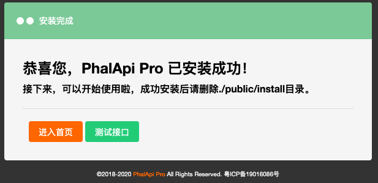

如果安装失败，请留意错误提示信息。通常是数据库账号密码错误，或者缺少目录写入权限，此时可尝试重新安装。如果问题尚未解决，可联系我们。    

如果重复安装，会看到以下提示：  
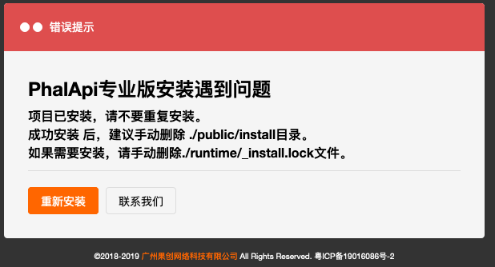

若需要重新安装，请手动删除./runtime/_install.lock文件。

## 第4步、计划任务配置
通过```crontab -e```，添加以下计划任务：  

```
# PhalApi Pro 接口测试
*/1 * * * * php /path/to/phalapi-pro/bin/test/run_test_sample.php > /dev/null

# PhalApi Pro 计划任务
*/1 * * * * php /path/to/phalapi-pro/bin/run_task.php > /dev/null

# PhalApi Pro 应用统计
10 0 * * * php /path/to/phalapi-pro/bin/admin/run_app_daily_stat.php >> /dev/null

# PhalApi Pro 每日接口统计
20 0 * * * php /path/to/phalapi-pro/bin/admin/run_service_daily_stat.php >> /dev/null
```

其中，需要把```/path/to/phalapi-pro```换成你当前的服务器路径。

## 第5步、安装后请记得

安装后，请记得把install安装程序删除，避免被重复或恶意重装。  
安装后，请确保./runtime目录有写入权限，以便可以纪录和查看文件日志。  


## 第6步、开始使用

成功安装后，便可开始使用和进行项目开发。
