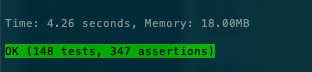
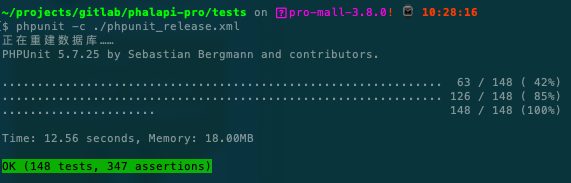

# PHP接口自动化测试（单独购买）

通过白盒测试，可以对PHP编写的API接口进行自动化测试。这部分需要单独购买。  

目前，配套接口大师的单元测试，共有148个测试用例, 347个断言，总执行时间约3秒，100%测试通过率。  

## 自动化测试的好处
学会和使用自动化测试有非常明显的好处，例如：  

 + 1、节省测试成本，基本可以不需要人工进行接口测试，做到自动化测试和验证  
 + 2、提高API接口质量，通过360度全方位的测试和断言，时刻测试，让代码调试更简单，让Bug重现更轻松  
 + 3、加强发布质量，每次发布前，执行一次单元测试，做最后一公里全面的接口回归测试  
 + 4、改善代码规范，容易测试的代码更优雅、更灵活、更有活力
 + 5、可以和CICD进行集成，构建持续交付的工作流

## 安装PHPUnit

PHP单元测试，使用的是主流的PHPUnit单元测试，使用前，请先安装PHPUnit。  
> 安装PHPUNit： http://phpunit.cn/manual/5.7/zh_cn/installation.html  

## 配置单元测试数据库
复制./tests/config/dbs.php.sample一份到./tests/config/dbs.php，并修改。为单元测试单独创建一个专业的数据库，并调整里的数据库对应的配置。  

```php
    'servers' => array(
        'db_master' => array(                   //服务器标记
            'host'      => '127.0.0.1',               //数据库域名
            'name'      => 'phalapi_pro_test',               //数据库名字
            'user'      => 'root',               //数据库用户名
            'password'  => '123456',           //数据库密码
            'port'      => '3306',               //数据库端口
            'charset'   => 'utf8mb4',            //数据库字符集
            'pdo_attr_string'   => false,           // 数据库查询结果统一使用字符串，true是，false否
            'driver_options' => array(              // PDO初始化时的连接选项配置
                // 若需要更多配置，请参考官方文档：https://www.php.net/manual/zh/pdo.constants.php
            ),
        ),
    ),

```

## 一键执行单元测试
进入到tests目录，执行命令：  
```
$ phpunit
```
就可以进行一键测试，执行全部的单元测试用例，并且重建数据库。  

单元测试的运行结果：  
  

### 发布时的单元测试
如果需要和发布系统集成，或者在测试时不需要查看输入SQL语句、不需要打印日志，可以执行命令：  
```
$ cd tests
$ phpunit -c ./phpunit_release.xml
```

执行结果类似：  
```
$ phpunit -c ./phpunit_release.xml
正在重建数据库……
PHPUnit 5.7.25 by Sebastian Bergmann and contributors.

...............................................................  63 / 148 ( 42%)
............................................................... 126 / 148 ( 85%)
......................                                          148 / 148 (100%)

Time: 12.56 seconds, Memory: 18.00MB

OK (148 tests, 347 assertions)
```

结果截图：  
  

### 测试时不重建数据库

如果不需要每次测试都重新创建数据库，可以执行命令：  
```
$ cd tests
$ phpunit -c ./phpunit_not_sql.xml
```
此时，不会删除原来的测试数据库表和数据，但要注意测试用例是否可以重复执行。对于查询类的测试是适用的。  


## 自动生成测试用例

参考PhalApi开源框架官方文档，[phalapi-buildtest命令](http://docs.phalapi.net/#/v2.0/shell?id=phalapi-buildtest%e5%91%bd%e4%bb%a4)，可以使用脚本自动给API接口和PHP类生成对应的单元测试骨架代码，减少人工重复编写代码的时间和成本。  


